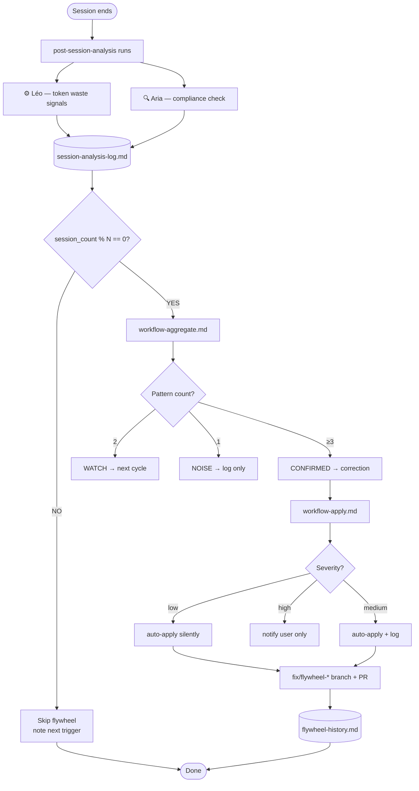

# Cognitive Flywheel

The Cognitive Flywheel is GSANE's self-improvement engine. Every session generates data. Every N sessions, the flywheel fires and applies corrections automatically.

## The Loop



## Configuration

In `_gsane/core/config.yaml`:
```yaml
flywheel:
  enabled: true
  trigger_every_n_sessions: 5
  max_auto_corrections_per_cycle: 5
```

## Pattern Threshold

| Occurrences | Status | Action |
|---|---|---|
| 1 | NOISE | Log only |
| 2 | WATCH | Flag for next cycle |
| ≥3 | CONFIRMED | Auto-apply correction |

## Severity Gates (Murat's Rules)

- **Gate 1**: Max 5 corrections per cycle
- **Gate 2**: If same file gets 2 medium corrections → elevate both to high (notify user)
- **Gate 3**: Revalidate all corrections before committing — if Gate 1 or 2 triggers, abort and log

## Memory Files

| File | Purpose |
|---|---|
| `_gsane/_memory/session-analysis-log.md` | Persistent log of all session findings |
| `_gsane/_memory/flywheel-report.md` | Latest flywheel cycle report |
| `_gsane/_memory/flywheel-history.md` | All past cycles with corrections applied |

## Workflow Files

| File | Purpose |
|---|---|
| `_gsane/core/workflows/post-session-analysis/workflow.md` | Session hook — runs after every session |
| `_gsane/core/workflows/flywheel/workflow-aggregate.md` | Aggregation — extracts patterns, calculates score |
| `_gsane/core/workflows/flywheel/workflow-apply.md` | Application — applies corrections, creates branch + PR |

## Universal Activation

Every agent has `exec="{project-root}/_gsane/core/workflows/post-session-analysis/workflow.md"` wired
to its `[DA]` dismiss item. The global fallback in `.github/copilot-instructions.md` covers sessions
where `[DA]` is never explicitly issued.

The flywheel fires regardless of which agent the user was working with.
