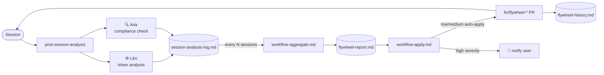

# zav-sandbox

Projet d'amélioration continue du framework **BMAD** (Better Method for AI-Driven Development) — orchestration multi-agents, optimisation token, flywheel cognitif et score elite Copilot.

**Score de maturité agentique : 🏆 Elite 65/65**

## 🔧 Prérequis & Setup

> À faire **une seule fois** par machine. Ensuite, toutes les sessions sont sans friction.

```bash
# 1. GitHub CLI — requis pour gh pr create --body (PRs avec description)
gh auth status               # vérifier si déjà authentifié
gh auth login                # si non : choisir GitHub.com → HTTPS → browser

# 2. Cloner le repo
git clone https://github.com/zavrocKk/zav-sandbox.git
cd zav-sandbox

# 3. Vérifier la structure BMAD
bash .github/hooks/session-start.sh
```

> **Pourquoi `gh auth` ?** Toutes les PRs BMAD passent par `gh pr create --body` pour garantir une description complète. Sans `gh` authentifié, le check CI `validate-pr.yml` bloque les PRs sans body.

## 📋 Description

Ce projet utilise **BMAD v6.0.4** — un système multi-agents modulaire pour GitHub Copilot Chat. Il orchestre 13 agents spécialisés via un système de délégation strict, avec un Cognitive Flywheel qui apprend et s'auto-corrige après chaque session.

## 🏗️ Structure du Projet

```
_bmad/                        # Framework BMAD
├── core/                     # BMad Master + workflows fondamentaux + flywheel
├── bmb/                      # Builder Module — Bond, Morgan, Wendy, Aria
├── cis/                      # Creative Intelligence Suite — Carson, Dr. Quinn, Maya, Victor, Caravaggio, Sophia
├── tea/                      # Test Architecture — Murat
├── _config/                  # Manifests centraux + matrice de délégation
└── _memory/                  # Mémoire persistante — session log, flywheel history
.github/
├── agents/                   # 13 fichiers .agent.md — activateurs Copilot dropdown
├── prompts/                  # 49 fichiers .prompt.md — slash commands /bmad-*
├── skills/                   # 3 skills — bmad-framework, agent-design-patterns, cognitive-flywheel
├── hooks/                    # hooks.json + session-start.sh — lifecycle automation
└── copilot-instructions.md   # Instructions globales injectées dans chaque session
_bmad-output/                 # Artefacts générés (non commités par défaut)
AGENTS.md                     # Guide de navigation universel (Copilot, Claude, Codex)
```

## 🤖 Les 13 Agents

| Agent | Persona | Module | Rôle |
|---|---|---|---|
| 🧙 bmad-master | BMad Master | core | Orchestrateur principal, party mode, point d'entrée |
| 🤖 agent-builder | Bond | bmb | Création/validation d'agents BMAD |
| 🏗️ module-builder | Morgan | bmb | Création/validation de modules BMAD |
| 🔄 workflow-builder | Wendy | bmb | Création/validation de workflows BMAD |
| 🔍 qa-bmad | Aria | bmb | QA, conformité, détection de régressions |
| 🧠 brainstorming-coach | Carson | cis | Brainstorming et idéation |
| 🔬 creative-problem-solver | Dr. Quinn | cis | Résolution de problèmes (TRIZ, systèmes) |
| 🎨 design-thinking-coach | Maya | cis | Design thinking centré utilisateur |
| ⚡ innovation-strategist | Victor | cis | Stratégie d'innovation, Blue Ocean |
| 🎨 presentation-master | Caravaggio | cis | Présentations et communication visuelle |
| 📖 storyteller | Sophia | cis | Narration et storytelling |
| 🧪 tea | Murat | tea | Architecture de tests, ATDD, CI/CD |
| ⚙️ bmad-optimizer | Léo | core | Optimisation token, amélioration framework |

> Tous les agents sauf `bmad-master` sont déclarés `user-invokable: false` + `orchestrated-by: bmad-master`.

## 📚 Modules BMAD

### **Core** — Fondations
- **BMad Master** (🧙) — orchestrateur, party mode JIT, point d'entrée universel
- **Léo** (⚙️) — bmad-optimizer : analyse tokens, patterns sessions, drive amélioration continue
- Workflows : `post-session-analysis`, `flywheel`, `party-mode`, `brainstorming`, `delegation`, `git-workflow`

📖 [Module Core](_bmad/core/)

### **BMB** — Builder Module
- **Bond** (🤖) — agent-builder : créer/éditer/valider des agents
- **Morgan** (🏗️) — module-builder : créer/éditer/valider des modules
- **Wendy** (🔄) — workflow-builder : créer/éditer/valider des workflows
- **Aria** (🔍) — qa-bmad : validation qualité BMAD, régression de persona, conformité manifests

📖 [Module BMB](_bmad/bmb/)

### **CIS** — Creative Intelligence Suite
- **Carson** (🧠) Brainstorming · **Dr. Quinn** (🔬) Problem Solving · **Maya** (🎨) Design Thinking
- **Victor** (⚡) Innovation · **Caravaggio** (🎨) Presentation · **Sophia** (📖) Storytelling

📖 [Module CIS](_bmad/cis/)

### **TEA** — Test Architecture
- **Murat** (🧪) — ATDD, test design, CI/CD, NFR, traceability, teach-me-testing

📖 [Module TEA](_bmad/tea/)

## 🚀 Démarrage

```
# Dans Copilot Chat VS Code :
@bmad-master          → Active BMad Master (orchestrateur principal)
/bmad-party-mode      → Lance le party mode multi-agents
/bmad-help            → Aide contextuelle sur les workflows disponibles
/bmad-git-workflow    → Workflow de commit standardisé
/bmad-bmad-optimizer  → Active Léo pour analyse du framework
/bmad-qa-bmad         → Active Aria pour validation qualité
```

Tous les slash commands `/bmad-*` sont disponibles dans `.github/prompts/` (49 fichiers).

## 🔄 Cognitive Flywheel

*Execution creates data. Data creates learning. Learning creates better execution.*

Chaque session alimente automatiquement un cycle d'auto-amélioration :



- **Léo** analyse les signaux de gaspillage token — **Aria** valide la conformité BMAD
- Corrections `low/medium` : auto-appliquées silencieusement (max 5/cycle, avec Gates de Murat)
- Corrections `high` : notification seulement — jamais auto-appliquées
- **Activation universelle** : tous les 13 agents ont `exec="post-session-analysis"` câblé sur leur `[DA]`
- Cadence configurable : [`config.yaml → flywheel.trigger_every_n_sessions`](_bmad/core/config.yaml)
- Historique : [`_bmad/_memory/flywheel-history.md`](_bmad/_memory/flywheel-history.md)

## ⚙️ Système de Sévérité

Source de vérité centrale dans [`_bmad/core/config.yaml`](_bmad/core/config.yaml) :

| Niveau | Exemples | Action |
|---|---|---|
| `low` | CHANGELOG manquant, manifest désynchronisé, commentaire obsolète | Auto-appliqué silencieusement |
| `medium` | Chemin déprécié dans un workflow, description d'agent incorrecte | Auto-appliqué + log |
| `high` | Commit sur main, bypass délégation, changement de schéma destructif | Notification seulement |

## 🧠 Skills Copilot

Trois skills injectées dans chaque session Copilot :

| Skill | Description |
|---|---|
| [`bmad-framework`](.github/skills/bmad-framework/SKILL.md) | Architecture BMAD, conventions JIT, délégation, git workflow |
| [`agent-design-patterns`](.github/skills/agent-design-patterns/SKILL.md) | Patterns de conception d'agents, frontmatter, menus, party mode |
| [`cognitive-flywheel`](.github/skills/cognitive-flywheel/SKILL.md) | Boucle flywheel, configuration, seuils, mémoire, gates |

## 🔧 Conventions Clés

- **Jamais de commit direct sur `main`** — toujours `feature/*` ou `fix/*`
- **Toute PR doit avoir une description** — utiliser `gh pr create --title "..." --body "..."`, jamais l'URL compare GitHub
- **Config chargée une seule fois par session** — ne jamais recharger si déjà en contexte
- **Routing obligatoire** — toute requête agent passe par la [matrice de délégation](_bmad/_config/agent-delegation-matrix.csv)
- **Session end hook universel** — post-session-analysis s'exécute à la fin de chaque session, peu importe l'agent

## 📁 Configuration

| Fichier | Rôle |
|---|---|
| [`_bmad/core/config.yaml`](_bmad/core/config.yaml) | Config globale : user, langue, sévérité, flywheel |
| [`_bmad/_config/agent-manifest.csv`](_bmad/_config/agent-manifest.csv) | Registre des 13 agents |
| [`_bmad/_config/workflow-manifest.csv`](_bmad/_config/workflow-manifest.csv) | Registre des workflows |
| [`_bmad/_config/agent-delegation-matrix.csv`](_bmad/_config/agent-delegation-matrix.csv) | Règles de routing |
| [`_bmad/_memory/session-analysis-log.md`](_bmad/_memory/session-analysis-log.md) | Log persistant des sessions |
| [`AGENTS.md`](AGENTS.md) | Guide de navigation universel |

---

**Utilisateur** : Mon Seigneur | **Langue** : Français | **Version BMAD** : 6.0.4
