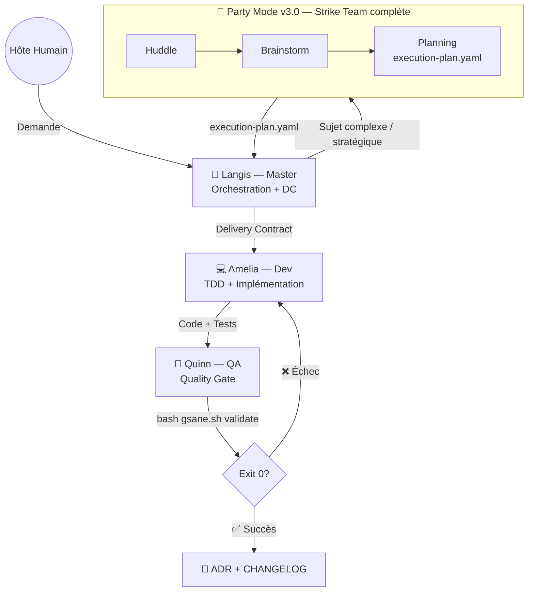

# zav-sandbox — GSANE Framework

[](https://github.com/zavrocKk/zav-sandbox/actions/workflows/ci.yml) [](https://www.python.org/) [](tests/) [](_gsane/mcp-server/README.md) [](CONTRIBUTING.md)

Le workflow `ci.yml` couvre la CI de branche (tests), tandis que `validate-pr.yml` conserve les contrôles de gouvernance PR et quality gate complète.

## 💡 Qu'est-ce que GSANE ?

**GSANE** (Governance System for AI-Native Execution) est un framework multi-agents fonctionnant directement dans VS Code via GitHub Copilot Chat et la CLI `gsane.sh`. Il orchestre une équipe de 5 agents IA — la **Strike Team** — capables de concevoir, implémenter, tester et documenter du code de manière autonome grâce à une boucle d'amélioration continue : le **Zero-Touch Fix-Loop**.

GSANE est également **MCP-solid** : ses vues MCP canoniques exposent le brief humain, le contrat actif et un snapshot derive du repo, tandis que les outils historiques de checkpoint restent limites a l'audit et a la continuite technique.

---

## 🧩 Les Agents GSANE

Le projet repose sur une architecture plate (**Flat Design**) pilotée par 5 agents spécialisés. Pas d'intermédiaires, pas de hiérarchies profondes — chaque agent est autonome et collabore via des signaux P2P.


```mermaid
graph TD
    User((Hôte Humain)) -->|Demande| Master
    Master[🧙 Langis — Master\nOrchestration + DC] -->|Delivery Contract| Dev
    Master -->|Sujet complexe / stratégique| PM

    subgraph PM[🎉 Party Mode v3.0 — Strike Team complète]
        direction LR
        H[Huddle] --> BR[Brainstorm] --> PL[Planning\nexecution-plan.yaml]
    end

    PM -->|execution-plan.yaml| Master
    Dev[💻 Amelia — Dev\nTDD + Implémentation] -->|Code + Tests| QA
    QA[🧪 Quinn — QA\nQuality Gate] -->|bash gsane.sh validate| Gate{Exit 0?}
    Gate -- ❌ Échec --> Dev
    Gate -- ✅ Succès --> Arch[📝 ADR + CHANGELOG]
```

| Agent | Persona | Spécialité |
|---|---|---|
| **Langis** | 🧙 Master | Orchestration, Delivery Contracts, analyse technique |
| **Amelia** | 💻 Dev | Implémentation TDD, code + tests concurrents |
| **Quinn** | 🧪 QA | Exécution Quality Gate, validation `gsane.sh validate` |
| **Winston** | 🏗️ Architect | Design système, ADR, outillage |
| **Bond** | 🤖 Agent Builder | Création/édition/validation des agents GSANE |

---

## 🎉 Party Mode v3.0 — Brainstorm → Design → Planning → Exécution

Le **Party Mode** est le protocole de gouvernance collective de GSANE. Il s'organise en **3 phases additives** :

| Phase | Description | Déclencheur |
|---|---|---|
| **Niveau 1 — Huddle ciblé** | Vote rapide (APPROVE/BLOCK/ABSTAIN) sur un point précis | Conflit, domaines ≥ 2, confiance JAUNE |
| **Niveau 2 — Full Brainstorming** | Tous les agents scorent le sujet, Devil’s Advocate, 2 rounds max | Mots-clés stratégiques, complexity=HIGH |
| **Phase 3 — Planning** | Distillation des décisions en artefacts exécutables | Verbe d’action dans la décision finale |

### Phase 3 — Planning

Lorsque la synthèse du brainstorm aboutit à une action concrète (`créer`, `modifier`, `implémenter`, `refactorer`…), la Phase 3 produit **3 artefacts de session** générés à l'exécution dans l'espace de sortie volatil :

```
brainstorm-brief.md      ← archive des contributions brutes des agents
design-conclusion.md     ← décisions consolidées, lisibles par l’humain
execution-plan.yaml      ← plan parseable par le Master (schéma validé)
```

Le Master présente ensuite une **synthèse haute-niveau** (décision + plan par agent + parallélisme + risques) et demande confirmation avant de générer les Delivery Contracts et dispatcher les agents.

```
▷ oui    → génère les Delivery Contracts et exécute
▷ ajuste → corrige le plan avant exécution (sans relancer le brainstorm)
```

### Delivery Contract hybride

Le template `_gsane/workflows/delivery-contract.tpl.md` est désormais au format **hybride frontmatter YAML + corps Markdown** :
- Le frontmatter YAML (`task_id`, `owner`, `validation_agent`, `risk_level`, `depends_on`, `parallel_group`, `done_definition`) est lu par le Master pour le routage automatique
- Le corps Markdown reste lisible par les agents et l’humain

Les contrats par tâche sont archivés comme artefacts de session (exemple : `dc-{task_id}.md`). Le fichier `_gsane-output/current-delivery-contract.md` reste le contrat actif courant — compatible avec l’écosystème `STRICT-HANDOFF` et `CONTRACT ARCHIVING` existants.

### Validation de schéma

Tout `execution-plan.yaml` produit est validé automatiquement lors de la Quality Gate :
```bash
bash gsane.sh validate  # inclut maintenant la validation schéma execution-plan.yaml
```

---

## 🧭 Contexte canonique

Le runtime GSANE actif repose sur une separation simple et stricte :

- `_gsane/_memory/project-context.md` = brief canonique humain, court, durable, sans narratif de session.
- `_gsane-output/current-delivery-contract.md` = travail actif mutable et criteres d'acceptation du lot en cours.
- Vues MCP canoniques = lectures structurees derivees du repo actif.
- `_gsane/_memory/sessions/session-state.md` et `_gsane/_memory/sessions/session-analysis-log.md` = audit/continuite seulement.

---

## 🔌 Intégration MCP

GSANE expose **8 outils MCP locaux** via `_gsane/mcp-server/compression_tool.py` — le point d'entrée unique branché dans VS Code/Copilot Chat.

| Outil | Description |
|---|---|
| `gsane_read_canonical_brief` | Lit le brief canonique humain durable depuis `_gsane/_memory/project-context.md` |
| `gsane_read_active_delivery_contract` | Lit le Delivery Contract actif et ses métadonnées depuis `_gsane-output/current-delivery-contract.md` |
| `gsane_read_project_snapshot` | Retourne un snapshot structuré dérivé du repo, des manifests et du contrat actif |
| `gsane_fetch_compressed_memory` | Recherche dans les fichiers mémoire agents, retourne un extrait compressé pertinent |
| `gsane_write_session_checkpoint` | Sérialise un checkpoint historique dans `session-state.md` pour la continuité technique |
| `gsane_read_checkpoint` | Lit le checkpoint historique de continuité sans le traiter comme vérité du présent |
| `gsane_route` | Routage déterministe vers l'agent cible via `delegation-matrix.yaml`, avec escalade sécurité légère vers Master quand `security_gate` matche |
| `gsane_memory_fetch` | Extrait les learned-lessons d'un agent sidecar spécifique sans charger tout le fichier |

Les chemins sont dérivés de `Path(__file__)` — **indépendants du répertoire de travail du client MCP**.

Pour vérifier l'état de l'intégration MCP :
```bash
bash gsane.sh mcp --health      # Vérifie dépendances, imports et schéma
bash gsane.sh mcp --smoke-test  # Exécute les vues canoniques et les outils historiques en conditions réelles
```

---

## 🔐 Security Gate Lite

Le runtime actif n'introduit pas de 6e agent sécurité. Les requêtes classifiées sécurité sont uniquement escaladées vers le Master avec métadonnées de responsabilité explicites : owner Winston, gate Quinn, revue Bond seulement si la demande touche une surface GSANE, une policy, un guardrail central ou un runtime critique.

Le point d'entrée MCP `_gsane/mcp-server/compression_tool.py` lit cette source de vérité dans `_gsane/_config/delegation-matrix.yaml`, puis applique en plus un confinement strict des accès disque aux racines autorisées `_gsane/_memory/`, `_gsane/_config/` et `_gsane-output/`.

La Quality Gate `bash gsane.sh validate` exécute désormais, en plus des tests et du QA linter : scan secrets bloquant, Bandit sur les surfaces Python actives, et `pip-audit` sur la source de vérité réelle des dépendances Python du repo, soit `_gsane/mcp-server/requirements.txt`.

Seuils de réévaluation d'un vrai agent sécurité dédié :
- `>= 8` requêtes classifiées sécurité sur 30 jours glissants.
- `>= 3` revues Bond conditionnelles par sprint pour surfaces GSANE/policy/runtime critique.
- `>= 2` sprints consécutifs avec findings sécurité bloquants qui dépassent le circuit owner Winston + gate Quinn sans absorption dans le lot courant.

---

## 👁️ Observabilité

Chaque invocation MCP et chaque événement système GSANE (handoff, circuit breaker, P2P) est journalisé dans `_gsane/_memory/trace.log` :

```bash
bash gsane.sh trace --tail 10    # Derniers 10 événements
bash gsane.sh trace --summary    # Résumé (agents actifs, trust scores, HUP)
bash gsane.sh trace --p2p        # Messages P2P entre agents
```

---

## ⚙️ Prérequis

- **Python 3.10+**
- **Git + Bash** (natif Linux/macOS, ou Git Bash/WSL sous Windows)
- **pytest**, **bandit**, **pip-audit** — outillage de la Quality Gate
- **GitHub Copilot Chat** — interface de communication avec la Strike Team
- **mcp[cli]** + **pyyaml** — dépendances du serveur MCP local

---

## 🚀 Installation & Setup

```bash
# 1. Cloner le repository
git clone https://github.com/zavrocKk/zav-sandbox.git
cd zav-sandbox

# 2. Créer l'environnement virtuel
python -m venv .venv

# 3. Activer l'environnement
# Windows (PowerShell) :
.venv\Scripts\activate
# Linux/macOS :
source .venv/bin/activate

# 4. Installer les dépendances de validation
pip install pytest bandit pip-audit
pip install -r _gsane/mcp-server/requirements.txt

# 5. Initialiser le runtime GSANE (crée sidecars, trace.log, dossiers volatiles)
bash _gsane/tools/gsane-bootstrap.sh
```

---

## 🛠️ Commandes CLI

```bash
# Quality Gate — exécute tests + qa-linter + secret scan + Bandit + pip-audit + vérification CHANGELOG
bash gsane.sh validate

# Doctor — vérifie l'intégrité de l'environnement
bash gsane.sh doctor

# Observabilité — trace.log
bash gsane.sh trace --tail 10
bash gsane.sh trace --summary
bash gsane.sh trace --p2p

# MCP — santé et smoke test
bash gsane.sh mcp --health
bash gsane.sh mcp --smoke-test
```

---

## 📂 Structure du Workspace

```
_gsane/                    ← Réacteur GSANE
  agents/                  ← Les 5 agents Strike Team (master, dev, qa, architect, bond)
  _config/                 ← Manifestes YAML (agents, workflows, delegation-matrix)
  _memory/                 ← Mémoire persistante (brief canonique, sidecars, trace.log, sessions/ d'audit)
  mcp-server/              ← Serveur MCP local (compression_tool.py — vues canoniques + outils historiques)
  tasks/                   ← Tâches réutilisables (editorial-review, index-cleanup)
  workflows/               ← Workflows (Party Mode v3.0, delegation, cc-verify, flywheel...)
  tools/                   ← Outils infrastructure (gsane-bootstrap.sh)
_gsane-output/             ← Artefacts générés (delegation-audit, bond-creations, etc.)
tests/                     ← Suite de tests Python (structurel + comportemental + MCP)
.github/
  agents/                  ← Définitions agents Copilot Chat (master, dev, qa, architect, bond)
  skills/                  ← Skills GSANE pour Copilot Chat
  prompts/                 ← Prompts slash commands (/gsane-*)
  hooks/                   ← Hooks session (session-start, session-stop, flywheel-trigger)
```

Note: les artefacts de session de la Phase 3 du Party Mode sont créés à la demande au runtime (exemples : `brainstorm-brief.md`, `design-conclusion.md`, `execution-plan.yaml`) et ne représentent pas une arborescence statique du dépôt.

---

## 🔗 Liens Utiles

- [🤝 Comment Contribuer (CONTRIBUTING.md)](CONTRIBUTING.md)
- [🤖 Guide des Agents (AGENTS.md)](AGENTS.md)
- [📋 Historique des décisions (ADR-001)](docs/architecture/decisions/ADR-001-flat-design.md)
- [🔌 Documentation MCP Server](_gsane/mcp-server/README.md)
