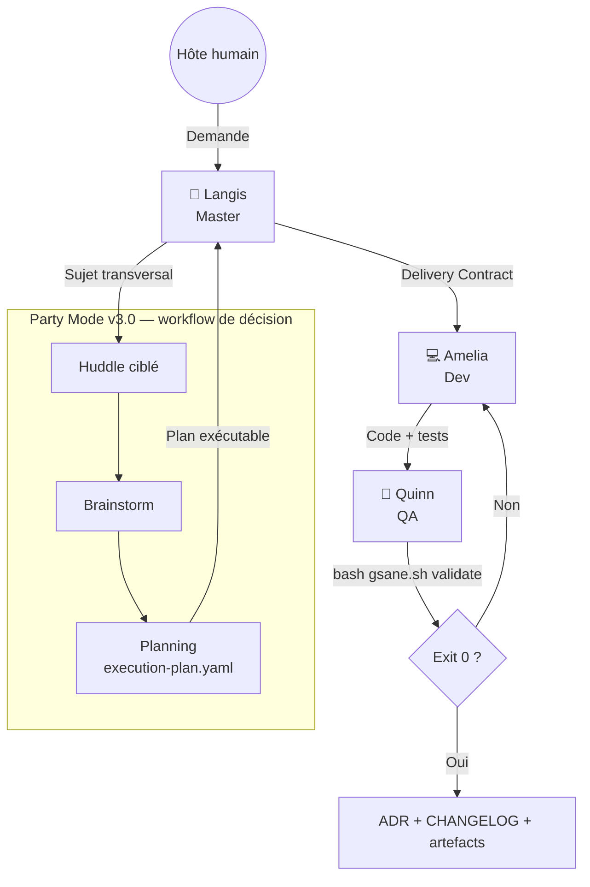

# zav-sandbox — GSANE Framework

[](https://github.com/zavrocKk/zav-sandbox/actions/workflows/ci.yml) [](https://www.python.org/) [](tests/) [](_gsane/mcp-server/README.md) [](_gsane/_config/agent-manifest.yaml) [](#licence-et-usage)

`ci.yml` couvre la validation continue de branche. Les contrôles de gouvernance et la quality gate complète restent portés par les workflows et scripts GSANE du dépôt.

## Une équipe d'agents, mais avec de vraies règles

zav-sandbox documente un pari très concret : faire travailler une petite équipe d'agents IA comme une équipe logicielle réelle, avec des contrats de livraison, des rôles distincts, une mémoire utile, des traces d'exécution et une quality gate qui arbitre ce qui peut réellement sortir.

GSANE, pour `Governance System for AI-Native Execution`, n'est donc pas une simple collection de prompts. Le dépôt assemble un runtime local pour VS Code et GitHub Copilot Chat, une CLI de gouvernance (`gsane.sh`), des manifests YAML, des workflows d'orchestration et un serveur MCP qui expose l'état utile du projet sans confondre mémoire, audit et travail actif.

Le cœur de l'exécution tient en une phrase : un humain formule une demande, Langis l'oriente, Amelia implémente, Quinn valide, Winston cadre les décisions de structure, Bond garde les surfaces GSANE cohérentes, et deux subagents complètent le runtime sur des tâches de surveillance ciblées.

## Architecture active

L'architecture active repose sur **5 agents core** qui portent l'exécution, et **2 subagents** qui complètent le runtime sans se substituer à la Strike Team. Cette distinction est importante : les subagents existent dans le manifest et dans le runtime, mais ils ne deviennent pas pour autant des agents généralistes supplémentaires.


```mermaid
graph TD
    User((Hôte humain)) -->|Demande| Master
    Master[🧙 Langis\nMaster] -->|Delivery Contract| Dev
    Master -->|Sujet transversal| H

    subgraph PartyWorkflow[Party Mode v3.0 — workflow de décision]
        direction LR
        H[Huddle ciblé] --> BR[Brainstorm]
        BR --> PL[Planning\nexecution-plan.yaml]
    end

    PL -->|Plan exécutable| Master
    Dev[💻 Amelia\nDev] -->|Code + tests| QA
    QA[🧪 Quinn\nQA] -->|bash gsane.sh validate| Gate{Exit 0 ?}
    Gate -- Non --> Dev
    Gate -- Oui --> Docs[ADR + CHANGELOG + artefacts]
```

| Entrée runtime | Statut | Version | Rôle principal |
|---|---|---|---|
| **Langis (Master)** | `active` | 2.1.1 | Orchestration, Delivery Contracts, analyse technique |
| **Amelia (Dev)** | `active` | 2.1.1 | Implémentation TDD, code et tests |
| **Quinn (QA)** | `active` | 2.1.1 | Quality gate, validation `gsane.sh validate` |
| **Winston (Architect)** | `active` | 2.1.1 | Design système, ADR, outillage |
| **Bond** | `active` | 2.1.1 | Création et validation des agents GSANE |

## Party Mode : un workflow, pas un agent

Le **Party Mode** est un protocole de décision collectif. Ce n'est ni une persona supplémentaire, ni un pseudo-agent caché dans l'organigramme. Quand un sujet devient transversal ou incertain, Langis active ce workflow pour faire converger l'équipe avant de revenir à un plan exécutable.

| Phase | Fonction | Déclencheurs typiques |
|---|---|---|
| **Niveau 1 — Huddle ciblé** | Vote rapide sur un point précis | Conflit, domaines multiples, confiance JAUNE |
| **Niveau 2 — Brainstorm complet** | Exploration bornée, scoring, objection structurée | Sujet stratégique, complexité élevée |
| **Phase 3 — Planning** | Production d'un plan exécutable et vérifiable | Décision actée avec verbe d'action |

Quand la phase de planning aboutit, le runtime peut produire des artefacts de session comme `brainstorm-brief.md`, `design-conclusion.md` et `execution-plan.yaml`, puis générer les Delivery Contracts nécessaires pour l'exécution effective.

## Contexte canonique

Le runtime actif garde volontairement une séparation stricte entre ce qui décrit le projet, ce qui décrit le travail en cours et ce qui sert uniquement à l'audit :

- `_gsane/_memory/project-context.md` contient le brief humain canonique, durable et volontairement court.
- `_gsane-output/current-delivery-contract.md` contient le contrat actif et les critères d'acceptation du lot courant.
- Les vues MCP canoniques exposent des lectures structurées dérivées de ces sources de vérité.
- `_gsane/_memory/sessions/session-state.md` et `_gsane/_memory/sessions/session-analysis-log.md` servent à la continuité et à l'audit, pas à redéfinir le présent.

## Intégration MCP

Le runtime expose **12 outils MCP locaux** via `_gsane/mcp-server/compression_tool.py`. Ils servent à lire le contexte utile, consulter la mémoire, router une demande et journaliser l'exécution, tout en gardant les accès disque confinés aux racines autorisées.

| Outil | Description |
|---|---|
| `gsane_read_canonical_brief` | Lit le brief canonique humain durable depuis `_gsane/_memory/project-context.md` |
| `gsane_read_active_delivery_contract` | Lit le Delivery Contract actif et ses métadonnées depuis `_gsane-output/current-delivery-contract.md` |
| `gsane_read_project_snapshot` | Retourne un snapshot structuré dérivé du repo, des manifests et du contrat actif |
| `gsane_fetch_compressed_memory` | Recherche dans les fichiers mémoire agents et retourne un extrait compressé pertinent |
| `gsane_write_session_checkpoint` | Sérialise un checkpoint historique dans `session-state.md` pour la continuité technique |
| `gsane_read_checkpoint` | Lit le checkpoint historique sans le traiter comme vérité du présent |
| `gsane_route` | Route une demande vers l'agent cible via `delegation-matrix.yaml`, avec prise en compte du `security_gate` |
| `gsane_memory_fetch` | Extrait les learned-lessons d'un sidecar agent sans charger tout le fichier |
| `gsane_search_memory` | Recherche par mot-clé dans les fichiers mémoire avec contexte local et filtrage par scope |
| `gsane_list_agents` | Retourne les agents exposés par le manifest, avec filtrage facultatif par capacité |
| `gsane_emit_event` | Émet un événement structuré dans `trace.log` avec validation du type et horodatage |
| `gsane_trace_report` | Génère un rapport HTML de trace dans `_gsane-output/` |

Les chemins sont dérivés de `Path(__file__)`, ce qui rend l'intégration indépendante du répertoire de travail du client MCP.

Pour vérifier l'état de l'intégration :

```bash
bash gsane.sh mcp --health
bash gsane.sh mcp --smoke-test
```

## Security Gate Lite

Le runtime actif n'ajoute pas un sixième agent sécurité généraliste. Les requêtes classifiées sécurité sont escaladées vers le Master avec une responsabilité explicitée dans la matrice de délégation : owner Winston, validation Quinn, revue Bond seulement si la demande touche une surface GSANE, une policy, un guardrail ou un runtime critique.

Le point d'entrée MCP lit cette politique dans `_gsane/_config/delegation-matrix.yaml`, puis applique en plus un confinement strict des accès disque aux racines autorisées `_gsane/_memory/`, `_gsane/_config/` et `_gsane-output/`.

La quality gate `bash gsane.sh validate` exécute en complément des tests et du QA linter : scan de secrets, Bandit sur les surfaces Python actives et `pip-audit` sur `_gsane/mcp-server/requirements.txt`.

## Observabilité

Chaque invocation MCP et chaque événement système important peut être journalisé dans `_gsane/_memory/trace.log`.

```bash
bash gsane.sh trace --tail 10
bash gsane.sh trace --summary
bash gsane.sh trace --p2p
bash gsane.sh trace --report
```

## Budget contexte

Le fichier `_gsane/config.yaml` définit un budget de tokens par session :

| Paramètre | Valeur |
|---|---|
| `max_tokens_per_session` | 8000 |
| `warning_threshold` | 75% |
| `critical_threshold` | 90% |

Au-delà du seuil d'alerte, le runtime peut recommander de décharger certaines surfaces ou d'activer les mécanismes de compression mémoire.

## Prérequis

- **Python 3.11+**
- **Git + Bash** (natif Linux/macOS, ou WSL/Git Bash sous Windows)
- **GitHub Copilot Chat** pour piloter les agents depuis VS Code
- Installation des dépendances via `pip install -e ".[mcp,test]"`

## Installation rapide

```bash
git clone https://github.com/zavrocKk/zav-sandbox.git
cd zav-sandbox

python -m venv .venv

# Windows PowerShell
.venv\Scripts\activate

# Linux / macOS
source .venv/bin/activate

pip install -e ".[mcp,test]"
bash gsane.sh doctor
```

Sous Windows, `bash gsane.sh` requiert WSL ou Git Bash. Sans Bash, `pytest` reste utilisable en direct, mais la validation de référence demeure le CI Ubuntu.

## Commandes utiles

```bash
# Quality gate complète
bash gsane.sh validate

# Diagnostic environnement
bash gsane.sh doctor

# Santé MCP
bash gsane.sh mcp --health
bash gsane.sh mcp --smoke-test

# Reprise de session
bash gsane.sh session --resume

# Validation Delivery Contract
bash gsane.sh dc --validate <fichier.md>

# Rollback flywheel
bash gsane.sh flywheel --rollback <tag>
```

## Structure du dépôt

```text
_gsane/                    # Runtime GSANE
  agents/                  # 5 agents core + 2 subagents
  _config/                 # Manifestes YAML et matrice de délégation
  _memory/                 # Mémoire durable, sidecars, trace, sessions
  mcp-server/              # Serveur MCP local et outils exposés
  tasks/                   # Tâches réutilisables
  workflows/               # Workflows d'orchestration et de validation
  tools/                   # Outils de support (dc-validator, trace-report, etc.)
_gsane-output/             # Artefacts générés à l'exécution
tests/                     # Tests Python et vérifications de structure
.github/                   # Skills, prompts, hooks et workflows GitHub
```

Les artefacts de session produits par Party Mode sont générés à la demande dans `_gsane-output/` et ne font pas partie d'une arborescence statique du dépôt.

## Licence et usage

Ce dépôt ne publie pas, à ce jour, de licence open source explicite. En pratique, cela signifie qu'aucun droit de réutilisation large n'est accordé tant qu'un fichier de licence n'a pas été ajouté au dépôt. Le README préfère l'indiquer clairement plutôt que d'afficher un badge ambigu.

## Liens utiles

- [Comment contribuer](CONTRIBUTING.md)
- [Guide des agents](AGENTS.md)
- [ADR-001 Flat Design](docs/architecture/decisions/ADR-001-flat-design.md)
- [Documentation du serveur MCP](_gsane/mcp-server/README.md)
