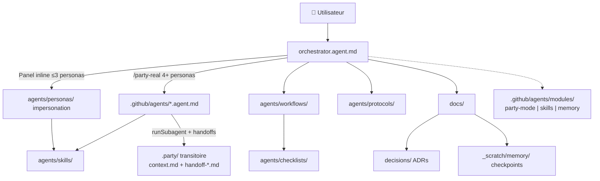

# zav-sandbox — Système d'agents virtuels mono-session

[](https://github.com/zavrocKk/zav-sandbox/releases)

Un orchestrateur unique (custom chat mode VS Code) qui simule une **équipe d'experts virtuels** — DevOps, Developer, QA, Security, Architect, Product Analyst, Data Engineer, Scribe — au sein d'**une seule conversation**.

## Philosophie : mono-session par défaut, sous-agents réels sur demande

L'idée : conserver le **bénéfice cognitif** de la multiplicité des perspectives (chaque persona apporte son angle) sans la complexité opérationnelle du multi-agent.

- **Sessions courtes (≤ 3 personas)** : impersonation inline — un seul orchestrateur, une seule conversation, zéro infrastructure supplémentaire.
- **Sessions longues (4+ personas, workflow complet)** : `/party-real` — chaque persona est invoqué comme **sous-agent réel** avec une fenêtre de contexte fraîche. Réduction estimée ~80 % des tokens input (contexte linéaire au lieu de quadratique). Voir [ADR-0008](docs/decisions/0008-subagents-party-real.md).

## Modes multi-personas

Trois modes, un même principe de sélection intelligente par l'orchestrateur :

| | **Panel inline** (défaut, ≤ 3 personas) | **`/party-real`** (4+ personas) | **Débat** (`/debate`) |
|---|---|---|---|
| Quand | Problème **fermé**, session courte | Workflow complet bout-en-bout | Problème **ouvert** |
| Travail type | Incident, analyse, doc, design | Feature complète, audit complet | Brainstorming, arbitrage |
| Mécanique | Impersonation inline, une passe | `runSubagent` + `.party/` handoffs | N rounds inter-persona |
| Tokens | Borné par construction | ~80 % moins que Panel inline sur 4+ personas | Volontairement plus élevé |
| Déclenchement | Automatique | `/party-real` explicite | `/debate` explicite |

Référence : [docs/architecture/2026-05-30-party-mode-panel-vs-debate.md](docs/architecture/2026-05-30-party-mode-panel-vs-debate.md), [agents/protocols/light-panel.md](agents/protocols/light-panel.md), [agents/protocols/debate.md](agents/protocols/debate.md).

> **Règle tiebreaker** — Panel : aucun persona ne réagit à un autre. `/party-real` : chaque agent reçoit uniquement `context.md` + les handoffs précédents (≤ 500 tokens chacun). Dans tous les cas, le **Scribe ferme toujours** par un livrable.

## Structure du dépôt

```
.
├── .github/
│   ├── agents/
│   │   ├── orchestrator.agent.md        # 🎼 Orchestrateur — custom agent principal
│   │   ├── devops.agent.md              # 🛠️ Sous-agent DevOps (/party-real)
│   │   ├── developer.agent.md           # 💻 Sous-agent Developer (/party-real)
│   │   ├── security.agent.md            # 🔒 Sous-agent Security (/party-real)
│   │   ├── architect.agent.md           # 🏗️ Sous-agent Architect (/party-real)
│   │   ├── qa.agent.md                  # 🧪 Sous-agent QA (/party-real)
│   │   ├── product-analyst.agent.md     # 📊 Sous-agent Product Analyst (/party-real)
│   │   └── scribe.agent.md              # 📝 Sous-agent Scribe (/party-real)
│   └── copilot-instructions.md          # Instructions globales (français, livrables, sécu)
├── agents/
│   ├── personas/
│   │   ├── orchestrator.md              # 🎼 Meta-agent
│   │   ├── devops.md                    # 🛠️ Infra, CI/CD, monitoring
│   │   ├── developer.md                 # 💻 Code, tests, debug
│   │   ├── qa.md                        # 🧪 Stratégie tests, edge cases, couverture
│   │   ├── security.md                  # 🔒 OWASP, secrets, threat modeling
│   │   ├── architect.md                 # 🏗️ Patterns, ADR, diagrammes
│   │   ├── product-analyst.md           # 📊 User stories, critères d'acceptation, métriques
│   │   ├── data-engineer.md             # 🗄️ Schémas, pipelines, ETL/ELT, qualité data
│   │   └── scribe.md                    # 📝 Synthèse, doc, post-mortems
│   ├── workflows/
│   │   ├── incident-response.md         # Panne / alerte production
│   │   ├── code-analysis.md             # Audit / review d'un module
│   │   ├── feature-development.md       # Nouvelle fonctionnalité
│   │   ├── architecture-design.md       # Choix techno, refonte
│   │   ├── data-pipeline.md             # ETL, migration, modélisation BI
│   │   └── onboarding.md                # 👋 Guide 5 minutes — premier démarrage
│   ├── templates/
│   │   ├── incident-report.md           # Post-mortem blameless
│   │   ├── adr.md                       # Architecture Decision Record (Nygard)
│   │   ├── memory-checkpoint.md         # Checkpoint de mémoire inter-sessions
│   │   ├── prd.md                       # Product Requirements Document léger
│   │   ├── party-context.md             # Template context.md pour /party-real
│   │   └── party-handoff.md             # Template handoff-{agent}.md pour /party-real
│   ├── skills/                          # Skills techniques invocables (format Agent Skills)
│   │   ├── root-cause-analysis/SKILL.md # 🔍 RCA : 5 Pourquoi / Ishikawa
│   │   └── party-mode/SKILL.md          # 🎉 Ancre protocole Panel/Débat//party-real (v1.1.0)
│   └── hooks/                           # Agent hooks VS Code (opt-in, OFF par défaut)
│       ├── security-guard.ps1/.sh       # PreToolUse : confirmation sur commandes destructives
│       ├── memory-nudge.ps1/.sh         # PreCompact/Stop : rappel /checkpoint
│       └── hooks.json                   # Config (activation manuelle via settings)
├── docs/                                # Tous les livrables produits par le Scribe
│   ├── incidents/                       # Post-mortems
│   ├── architecture/                    # Notes d'architecture
│   ├── decisions/                       # ADRs (NNNN-slug.md)
│   └── _scratch/memory/                 # Checkpoints de mémoire inter-sessions
└── README.md
```

> **Note `.party/`** : lors d'une session `/party-real`, l'orchestrateur crée un dossier `.party/` transitoire à la racine (gitignore-d) pour les échanges inter-agents (`context.md` + `handoff-{agent}.md`). Ce dossier est **supprimé à la clôture** de chaque session.
## Activer l'agent Orchestrator dans VS Code

> **Nouveau ?** Commence par le guide 5 minutes : [`agents/workflows/onboarding.md`](agents/workflows/onboarding.md).

1. Ouvre le workspace `zav-sandbox` dans VS Code (avec l'extension **GitHub Copilot Chat**).
2. Ouvre la vue **Chat** (raccourci : `Ctrl+Alt+I` sur Windows/Linux, `⌃⌘I` sur macOS).
3. En haut de la vue Chat, ouvre le **dropdown des agents** (à côté du champ de saisie, là où il est écrit « Ask », « Edit » ou « Agent » par défaut).
4. Sélectionne l'**agent Orchestrator** dans le dropdown (Configure Custom Agents). VS Code détecte automatiquement les `.agent.md` sous `.github/agents/`.
5. (Optionnel) Vérifie via la palette de commandes (`Ctrl+Shift+P`) → `Chat: Configure Custom Agents` que `orchestrator` est bien listé.

> Si `orchestrator` n'apparaît pas : recharge la fenêtre (`Developer: Reload Window`), vérifie que le fichier est bien à `.github/agents/orchestrator.agent.md` et que son frontmatter YAML est valide.

## Test rapide — 2 minutes

1. Active l'agent Orchestrator (voir ci-dessus).
2. Envoie ce prompt minimal :

   ```
   Mon API /checkout renvoie du 502 depuis 10 min. /quick
   ```

3. **Résultat attendu** : l'orchestrateur produit un PLAN incident (persona DevOps en tête), enchaîne les personas avec leurs en-têtes `─── emoji nom — titre ───`, et le Scribe ferme avec un post-mortem dans `docs/incidents/`.

Si ce cycle s'exécute correctement, le framework est opérationnel.

## Commandes disponibles

| Commande | Effet |
|---|---|
| `/quick` | Saute la confirmation PLAN (étape CONFIRM) — exécution directe |
| `/light` | Mode format allégé (en-têtes compacts, tables réserrées) — les règles restent actives |
| `/debate` | Bascule en mode Débat (N rounds, défaut 3) |
| `/debate max=N` | Débat avec N rounds maximum (ex. `/debate max=5`) |
| `/checkpoint` | Le Scribe crée un checkpoint de mémoire dans `docs/_scratch/memory/` |
| `/pre-pr` | Lance les garde-fous pré-PR (qualité, sécurité, conventions) |
| `/reset` | Recalibration LLM — voir ci-dessous |

## Recalibration LLM drift (`/reset`)

Après une longue session ou plusieurs échanges, le modèle peut dériver (oublier des règles, mélanger les rôles, produire de la prose au lieu d'un plan). Utilise `/reset` pour forcer une recalibration :

```
/reset
```

L'orchestrateur relèse les 4 invariants du PRE-FLIGHT, réaffiche les règles binaires (délégation, ordre ANALYSE→PLAN→CONFIRM→EXECUTE→SYNTHESIS, Scribe en dernier) et redémarre le cycle sur la demande courante.

**Signaux de dérive** à surveiller : réponse technique sans plan, Scribe absent, personas mélangés, oubli des en-têtes `───`. Si tu détectes l'un de ces signaux, envoie `/reset` avant de continuer.

**Demande utilisateur :**
> « L'API `/checkout` renvoie du 502 depuis 10 minutes, le dashboard montre une explosion de la latence. Help. »

**Réponse de l'orchestrateur :**

```
## 🎼 Analyse
Incident production — API checkout, 502 + latence anormale, depuis ~10 min. Workflow : incident-response.

## 🎼 Plan
| # | Persona      | Tâche                                          | Livrable                              |
|---|--------------|------------------------------------------------|---------------------------------------|
| 1 | 🛠️ DevOps    | Triage : sévérité, périmètre, changements récents | Observation + hypothèses             |
| 2 | 🛠️ DevOps    | Mitigation candidate (rollback ?)              | Plan d'action — confirmation requise  |
| 3 | 💻 Developer | Si cause applicative : analyse code + patch    | Diff + tests                          |
| 4 | 🏗️ Architect | Durcissement (circuit breaker ? timeout ?)     | Reco + ADR si structurant             |
| 5 | 📝 Scribe    | Post-mortem blameless                          | docs/incidents/2026-05-02-checkout-502.md |

Confirmes-tu ce plan ? (oui / ajuste / `/quick`)
```

→ Après confirmation utilisateur, l'orchestrateur enchaîne les personas avec leurs en-têtes visuels, puis le **Scribe ferme** avec bilan + livrable créé dans `docs/incidents/`.
## Exemple rapide — Cadrage d'une feature

**Demande utilisateur :**
> « Je veux ajouter un système de notifications push pour les utilisateurs mobile. »

**Réponse de l'orchestrateur :**

```
## 🎼 Analyse
Nouvelle feature. Besoin à cadrer avant tout design. Workflow : feature-development.

## 🎼 Plan
| # | Persona            | Tâche                                               | Livrable                                  |
|---|--------------------|-----------------------------------------------------|-------------------------------------------|
| 1 | 📊 Product Analyst  | Problème, segments, user stories, critères accept.  | PRD léger                                 |
| 2 | 🏗️ Architect       | Options d'implémentation (FCM, SSE, WebPush...)      | Reco + diagramme séquence                 |
| 3 | 🔒 Security        | Threat model : tokens de device, opt-in, permissions | Contrôles à intégrer                       |
| 4 | 💻 Developer        | Implémentation + tests unitaires                    | Diff + tests                              |
| 5 | 🧪 QA             | Matrix de tests : permission rejetée, token expiré  | Gaps + tests E2E                          |
| 6 | 🛠️ DevOps          | Config infra push service, alertes taux délivraison  | IaC + pipeline                            |
| 7 | 📝 Scribe          | PRD final + ADR si décision structurante              | docs/2026-05-02-feature-push-notifs.md    |

Confirmes-tu ce plan ? (oui / ajuste / `/quick`)
```
## Architecture du framework


```mermaid
flowchart TD
    U[👤 Utilisateur] --> O[orchestrator.agent.md]
    O -->|Panel inline ≤3 personas| P[agents/personas/ impersonation]
    O -->|/party-real 4+ personas| SA[.github/agents/*.agent.md]
    SA -->|runSubagent + handoffs| PARTY[".party/ transitoire\ncontext.md + handoff-*.md"]
    O --> W[agents/workflows/]
    O --> PR[agents/protocols/]
    P --> S[agents/skills/]
    SA --> S
    O --> D[docs/]
    D --> DEC[decisions/ ADRs]
    D --> SCR[_scratch/memory/ checkpoints]
    W --> CHKL[agents/checklists/]
    O -.-> MOD[".github/agents/modules/\nparty-mode | skills | memory"]
```

## Fonctionnalités optionnelles

Le framework fonctionne sans rien activer. Ces fonctionnalités sont opt-in :

| Fonctionnalité | Description | Activation |
|---|---|---|
| **Security guard** | Bloque les commandes destructives de l'IA (rm -rf, DROP, force push…) en demandant une confirmation | Voir [`agents/hooks/README.md`](agents/hooks/README.md) |
| **Memory nudge** | Rappelle de lancer `/checkpoint` avant compaction ou fin de session | Voir [`agents/hooks/README.md`](agents/hooks/README.md) |
| **Git hook pre-push** | Bloque les push directs sur `main` | `bash scripts/install-hooks.sh` |

## Usage en équipe

Le framework est conçu pour une session 1:1. En équipe, suivre ces conventions
pour éviter les conflits :

| Risque | Convention |
|---|---|
| Checkpoints conflictuels | Nommer les checkpoints avec tes initiales : `phase-9-<initiales>.md` |
| ADRs aux mêmes numéros | Réserver une plage : ex. Zav = 0001–0099, contributeur A = 0100–0199 |
| ROADMAP.md divergent | Un seul éditeur à la fois, commits fréquents sur `main` |
| Checkpoints `closed` qui s'accumulent | `/memory-list` + nettoyage trimestriel (politique dans `docs/_scratch/memory/README.md`) |

## Comment ajouter un persona

1. Crée `agents/personas/<nom>.md` avec les sections : `Identité`, `Ton`, `Domaines`, `Quand intervenir`, `Output type`, `Handoffs`, `Anti-patterns`.
2. Ajoute son emoji et sa ligne dans la table des personas de l'agent (`.github/agents/orchestrator.agent.md`).
3. Mets à jour le mapping `demande → workflow → personas` de l'agent si ce persona ouvre de nouveaux types de demandes.

## Comment ajouter un workflow

1. Crée `agents/workflows/<nom>.md` avec : un **diagramme Mermaid** des phases, une **table persona par étape**, des **règles spécifiques**, des **anti-patterns**, un **livrable final**.
2. Ajoute une ligne dans le mapping de l'agent reliant un type de demande à ce workflow.

## Comment ajouter un template

1. Crée `agents/templates/<nom>.md` avec une structure prête à remplir (placeholders entre `<…>`).
2. Référence-le dans le persona Scribe ou dans le workflow concerné.

## Conventions transversales

- Tous les `.md` sont en **français**, le code et les identifiants en **anglais**.
- Diagrammes : **Mermaid uniquement**.
- Citations de fichier : `chemin/relatif.ext:ligne`.
- Aucun secret en clair.
- Confirmation utilisateur obligatoire pour toute action destructive.
- Le **Scribe ferme toujours** le cycle.

Voir [.github/copilot-instructions.md](.github/copilot-instructions.md) pour les règles globales détaillées.
