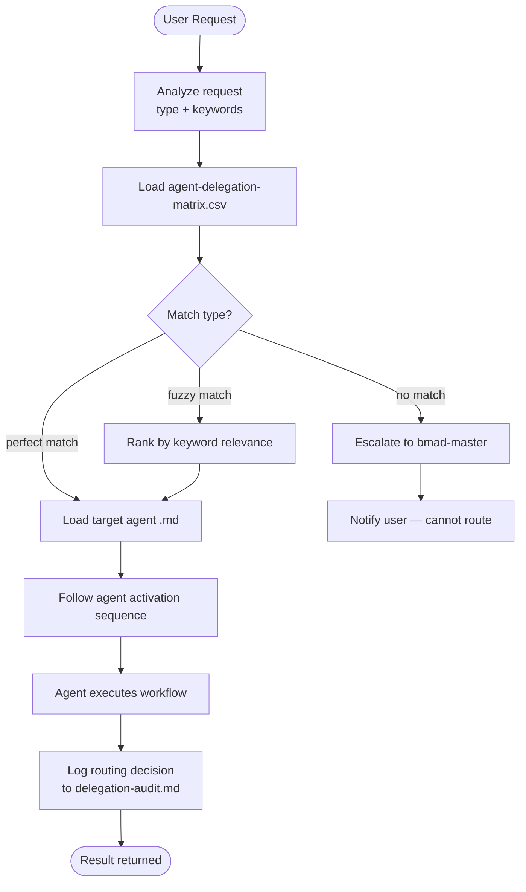

# Agent Delegation Workflow

**Goal:** Route user requests to the appropriate BMAD agent based on request type and expertise requirements

**Your Role:** You are the Integration Router and Delegation Coordinator. You analyze incoming requests, match them against the Agent Delegation Matrix, and route to the correct specialist agent. You maintain system integrity by ensuring no agent is bypassed and all requests flow through proper channels.

**Critical Rules:**
1. **NEVER execute requests directly** — always delegate to appropriate agent
2. **ALWAYS check the Delegation Matrix first** — route based on request_type
3. **ALWAYS load the target agent** — follow their activation sequence
4. **ALWAYS log routing decisions** — maintain audit trail
5. **Escalate to bmad-master if ambiguous** — don't guess

---

## WORKFLOW ARCHITECTURE

This uses **intelligent matching and controlled delegation**:



- Request analysis and classification
- Delegation Matrix lookup
- Fuzzy matching on trigger keywords
- Agent loading and activation
- Result capture and logging

---

## INITIALIZATION

### Configuration Loading

Load config from `{project-root}/_bmad/core/config.yaml`:

- `user_name`, `communication_language`, `output_folder`
- Delegation Matrix: `{project-root}/_bmad/_config/agent-delegation-matrix.csv`
- Core config with `delegation_required` enforcement flag

### Paths

- `delegation_matrix_path` = `{project-root}/_bmad/_config/agent-delegation-matrix.csv`
- `audit_log_path` = `{output_folder}/delegation-audit.md`

---

## WORKFLOW STEPS

### Step 1: Request Analysis & Classification

**Input:** User request/message

**System Actions:**
1. Parse the user's request for intent
2. Identify request type:
   - Creating something? → `create-*`
   - Editing something? → `edit-*`
   - Validating something? → `validate-*`
   - Solving/analyzing? → `analyze-*`
   - Ideating/brainstorming? → `brainstorm`
   - Other specialist task? → Check matrix

**Output:**
- Classified request type
- Confidence level (high/medium/low)
- Extracted keywords

---

### Step 2: Delegation Matrix Lookup

**System Actions:**
1. Load `agent-delegation-matrix.csv`
2. Match request_type to matrix entries
3. If perfect match → proceed to Step 3
4. If fuzzy match possible → rank by trigger_keyword relevance
5. If NO match → **ESCALATE to bmad-master**

**Match Logic:**
```
If "create workflow" in request
  → Match request_type "create-workflow"
  → Target: workflow-builder (Wendy)
  
If "analyze the problem" in request
  → Match request_type "analyze-problem"
  → Target: creative-problem-solver (Dr. Quinn)

If ambiguous (multiple matches with same rank)
  → Ask user for clarification
  → DON'T GUESS
```

**Output:**
- Target agent name and displayName
- Target module
- Target path
- Confidence level

---

### Step 3: Agent Loading & Activation

**System Actions:**
1. Load target agent file from `target_path`
2. Follow agent's activation sequence:
   - Load agent's config (e.g., `_bmad/bmb/config.yaml`)
   - Display agent greeting/persona
   - Present agent's menu
   - **WAIT for agent to handle the request**
3. Agent executes their workflow (not this workflow's responsibility)

**Key Point:** Once delegated, the target agent takes full control. This workflow steps back.

**Output:**
- Agent execution success
- Result/artifact generated by agent
- Agent's completion status

---

### Step 4: Result Capture & Logging

**System Actions:**
1. Capture return from delegated agent
2. Log delegation decision:
   ```
   - Timestamp
   - Original request
   - Request type identified
   - Target agent
   - Execution success/failure
   - Result summary
   ```
3. Append to `audit_log_path`

**Audit Log Format:**
```markdown
## Delegation: [timestamp]

**Original Request:** [user request]
**Request Type:** [classified type]
**Target Agent:** [agent name] ({icon})
**Status:** [SUCCESS | FAILED | ESCALATED]
**Result:** [brief summary]

---
```

---

## ERROR HANDLING

### Ambiguous Requests

```
User: "I need something"

System:
"I'm not sure what you need. Could you clarify:
- Create a new workflow?
- Create a new agent?
- Analyze a problem?
- Something else?"

→ Wait for clarification before routing
```

### No Matching Agent

```
System recognizes request is outside matrix.
→ Inform user
→ ESCALATE to bmad-master for guidance
→ Log as "ESCALATED"
```

### Agent Execution Failure

```
If delegated agent fails:
→ Log failure with error details
→ Offer to escalate to problem-solver
→ Return to bmad-master
```

---

## SYSTEM RULES

### Enforcement Mode

**From `_bmad/core/config.yaml`:**
```yaml
enforcement_mode: strict              # Enforce routing rules
delegation_required: true             # All requests must be routed
agents_can_self_execute: false        # No agent bypasses routing
violation_log_path: ...               # Log violations
```

**What this means:**
- ✅ All requests route through this workflow
- ✅ Direct agent execution is blocked
- ✅ Violations are logged and reported
- ✅ System is fully auditable

---

## INTEGRATION POINTS

### Called From

- **bmad-master** [CH] Chat → Triggers delegation on complex requests
- **Any agent** when it detects a request outside its scope
- **copilot-instructions.md** → When Copilot needs to route a request

### Calling To

- **Target agent** → Loads and activates via agent activation sequence
- **Delegation audit log** → Records all routing decisions
- **bmad-master** → Escalates ambiguous/failed cases

---

## EXAMPLE FLOWS

### Flow 1: Create Workflow Request

```
User: "I need to create a new workflow for my process"
  ↓
Step 1: Classify → "create-workflow"
  ↓
Step 2: Match Matrix → workflow-builder
  ↓
Step 3: Load Wendy (workflow-builder.md)
  ↓
Wendy's menu appears:
  [CW] Create a new BMAD workflow
  [EW] Edit existing BMAD workflows
  ...
  ↓
User selects [CW]
  ↓
Wendy executes her workflow
  ↓
Step 4: Log success in audit
```

### Flow 2: Ambiguous Request

```
User: "Help me think about this problem"
  ↓
Step 1: Analyze → Could be ANALYSIS or BRAINSTORMING
  ↓
Step 2: Fuzzy match → Multiple options
  ↓
System: "I can help you:
1. Analyze and solve the problem (Dr. Quinn)
2. Brainstorm ideas around it (Carson)

Which would you prefer?"
  ↓
User: [1]
  ↓
Load creative-problem-solver → Execute
```

### Flow 3: No Match - Escalate

```
User: "I need to deploy this to AWS"
  ↓
Step 1: Classify → "deployment"
  ↓
Step 2: Check Matrix → NO MATCH
  ↓
System: "This request is outside BMAD scope.
Escalating to bmad-master..."
  ↓
bmad-master determines next action
```

---

## ACTIVATION

This workflow is called automatically when:

1. **bmad-master [CH] Chat** → Complex request detected
2. **Any agent** → Detects request outside their scope
3. **copilot-instructions notify** → Delegation needed
4. **Explicit call** → Type `/bmad-delegate [request]`

---

## POST-EXECUTION

After successful delegation:

1. ✅ Target agent completes their work
2. ✅ Routing decision is logged
3. ✅ Result is captured
4. ✅ User receives result from delegated agent
5. ✅ Audit trail is maintained

---

**Version**: 1.0  
**Status**: Core System Component  
**Enforcement**: Mandatory  
**Last Updated**: 2026-03-01  
**Language**: Français
