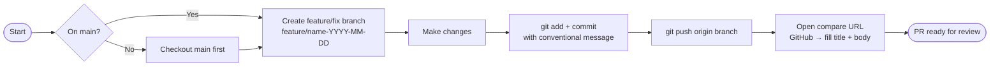

# Git Workflow — Standardized Commit & Pull Request Process

**Goal:** Enforce consistent, traceable git history across all project commits

**Your Role:** You are a Git Workflow Guardian. You ensure EVERY commit (from any agent or user action) follows the standardized branching strategy with proper PR creation. No commits go directly to `main`.

**Critical Rules:**
1. **NEVER commit directly to `main`**
2. **ALWAYS create a feature or fix branch first**
3. **ALWAYS create a PR after committing**
4. **Branch naming must reflect commit type**: `feature/*` for new code/updates, `fix/*` for corrections
5. **Apply to ALL commits**: past, present, future, and all agents

**Commit Type Classification:**
- **feature**: New functionality, updates, deployments, additions, enhancements
- **fix**: Bug fixes, corrections, refactoring, error resolution

---

## WORKFLOW ARCHITECTURE

This uses **sequential validation** for disciplined execution:



- Branch creation with type-based naming
- Change verification before commit
- PR creation with automatic linking
- MR review and merge protocol
- Document state in git history

---

## PREREQUISITES

Avant d'exécuter ce workflow, vérifier que les outils suivants sont disponibles et configurés :

### 1. Git configuré avec remote `origin`

```bash
git remote -v   # doit afficher origin -> github.com/zavrocKk/zav-sandbox
```

### 3. Branche de départ = `main`

```bash
git checkout main && git pull origin main
```

---

## INITIALIZATION

### Configuration Loading

Load config from `{project-root}/_gsane/core/config.yaml` and resolve:

- `user_name`, `communication_language`, `project_root`
- Current branch should be `main` (verify before starting)
- Remote should be `origin`

### Paths & Variables

- `project_root` = `{project-root}`
- `repo_url` = Get from `git remote -v` (origin/fetch)
- `output_folder` = `{project-root}/_gsane-output`

---

## WORKFLOW STEPS

### ⛔ Step 0: Governance Pre-Check (MANDATORY — Ne jamais sauter)

**Avant de créer une branche ou d'exécuter tout git add/commit :**

1. **Identifier la sévérité du changement** — consulter `_gsane/core/config.yaml → automation.severity`
   - `low` : typo, CHANGELOG entry seule → continuer solo
   - `medium` ou `high` : modification de fichiers GSANE (workflows, agents, config, skills, manifests, prompts) → **STOP**

2. **Si sévérité MEDIUM ou HIGH :** Party Mode DOIT avoir été exécuté avant ce step.
   - Party Mode déjà fait ce turn ? → continuer
   - Party Mode non encore fait ? → **STOP — activer party mode maintenant, revenir ici après validation**

3. **Vérification manuelle (checklist) :**
   - [ ] Party Mode appliqué (si MEDIUM/HIGH)
   - [ ] ≥ 2 agents ont validé le changement
   - [ ] Branche séparée par unité logique de changement

> ⚠️ **Toute action git (branch, add, commit, push) effectuée sans avoir passé ce Step 0 est une violation de gouvernance — elle doit être loggée dans `_gsane-output/violations.log`.**

---

### Step 1: Initialization & Verification

**What do we need to know?**
- What type of commit is this? (feature | fix)
- What is the commit description? (short, clear description)
- What files will be changed/added?

**System Actions:**
1. Verify current branch is `main`
2. Run `git status` to check for uncommitted changes
3. Load commit context from user or agent

**Output:**
- Confirm all prerequisites met
- Display: commit type, description, affected files

---

### Step 2: Create Feature/Fix Branch

**Branch Naming Convention:**
```
feature/{type}/{description}-{date}
fix/{type}/{description}-{date}
```

**Examples:**
- `feature/docs/update-readme-2026-03-01`
- `feature/core/add-new-workflow-2026-03-01`
- `fix/gsane/fix-config-parsing-2026-03-01`
- `fix/docs/correct-typo-2026-03-01`

**System Actions:**
1. Create branch: `git checkout -b {branch_name}`
2. Verify branch creation: `git branch --show-current`
3. Display: "Branch created: {branch_name}"

**Output:**
- Confirm successful branch creation
- Show active branch

> **⚠️ Règle : une branche = une unité logique de changement**
> Chaque nouvelle modification, feature, fix ou ajout DOIT ouvrir une nouvelle branche depuis `main`.
>
> **La seule exception autorisée pour réutiliser une branche existante :**
> - La PR de cette branche n'est pas encore mergée **ET**
> - Le commit corrige une erreur détectée dans cette PR, ou ajoute une modification qui en faisait partie mais a été oubliée.
>
> Tout autre cas = nouvelle branche. Pas de branche fourre-tout.

---

### Step 3: Make Changes & Commit

**User/Agent Actions:**
- Implement changes in code/files
- Save all modifications

**System Actions:**
1. Run `git status` to verify changes
2. Stage changes: `git add {files}` or `git add .`
3. Create commit: `git commit -m "{type}({category}): {description}"`

**Commit Message Format:**
```
{type}({category}): {description}

Detailed explanation (optional)
- Change 1
- Change 2
```

**Examples:**
```
feature(core): add git-workflow to Gsane system

- Created standardized commit workflow
- Added branch naming conventions
- Implemented PR automation

fix(docs): correct README link formatting

- Fixed broken links in documentation
```

**Output:**
- Display commit hash and message
- Show changed files count
- Confirm commit success

---

### Step 3.5: 🚨 MANDATORY — Update CHANGELOG.md

> ⚠️ **CRITIQUE:** Cette étape NE PEUT PAS être ignorée. Aucun commit n'est valide sans mise à jour du CHANGELOG.

**System Actions:**
1. Ouvrir `{project-root}/CHANGELOG.md`
2. Localiser la section `## [Unreleased]`
3. Identifier le bon module: `[Core]`, `[BMB]`, `[CIS]`, `[TEA]`, `[Infrastructure]`
4. Ajouter l'entrée avec le format GSANE (voir ci-dessous)
5. Sauvegarder et stager: `git add CHANGELOG.md`

**Format d'entrée GSANE:**
```markdown
### [Module]
**[type]** Description fonctionnelle (agents/workflows impactés)
- Agent: {nom_agent} | Workflow: {workflow_utilisé} | Initié par: {user_name}
- Impact: {agents ou systèmes affectés par ce changement}
```

**Types valides:** `[feat]`, `[fix]`, `[breaking]`, `[security]`, `[refactor]`, `[docs]`, `[chore]`

**Modules valides:** `[Core]`, `[BMB]`, `[CIS]`, `[TEA]`, `[Infrastructure]`

**Exemple:**
```markdown
### [Core]
**[feat]** Ajout du système de délégation d'agents avec enforcement strict
- Agent: Gsane Master | Workflow: git-workflow | Initié par: Mon Seigneur
- Impact: Tous les agents — routage obligatoire via matrice de délégation
```

**Output:**
- Confirmer que CHANGELOG.md a été mis à jour
- Afficher l'entrée ajoutée
- Confirmer que le fichier est stagé

---

### Step 4: Push Branch to Remote

**System Actions:**
1. Push branch: `git push -u origin {branch_name}`
2. Verify push: `git log --oneline -3`
3. Display: "Branch pushed to origin/{branch_name}"

**Output:**
- Confirm remote upload
- Show commit details

---

### Step 5: Create Pull Request

**MANDATORY:** Every PR MUST have a filled description body. NEVER submit a PR with an empty description — the `validate-pr.yml` CI check will block the merge.

**System Actions:**
1. Generate PR title from commit message (first line of commit msg)
2. Fill body template from commit details and changed files
3. Provide the compare URL to the user: `https://github.com/zavrocKk/zav-sandbox/compare/main...{branch_name}`
4. Display the filled body template so the user can paste it into the GitHub PR form

**PR Template:**
```
## Description
{commit description}

## Type of Change
- [ ] ✨ Feature (new functionality)
- [ ] 🐛 Fix (bug fix)
- [ ] 📚 Documentation
- [ ] 🔧 Configuration

## Changed Files
- {file1}
- {file2}

## Related Issues
Closes #(issue number if applicable)

## Checklist
- [ ] Code follows project conventions
- [ ] Comments added for complex logic
- [ ] Documentation updated
```

**Output:**
- Display PR creation confirmation
- Show PR URL
- Provide link for manual review if needed

---

### Step 6: Merge Protocol & Confirmation

**Decision Point:**
- Auto-merge: Configured to merge on approval
- Manual review: PR ready for user/reviewer validation

**Final Actions:**
1. Verify PR status
2. Display merge instructions if manual approval needed
3. Log workflow completion

**Output:**
- Workflow summary
- Confirmation of changes in main branch

---

## POST-WORKFLOW VALIDATION

### Pull Requests History

All PRs are tracked and stored in:
- GitHub PR history: https://github.com/zavrocKk/zav-sandbox/pulls
- Local git history: `git log --oneline --all`

### Commit History

View all commits following this workflow:
```bash
# See all commits with branch info
git log --oneline --all --graph --decorate

# See only merged commits to main
git log --oneline main
```

---

## AGENT INTEGRATION

**All GSANE Agents MUST use this workflow for commits:**

1. **Before any commit**, agents load this workflow
2. Agents provide: commit type, description, affected files
3. Workflow engine handles: branching, committing, PR creation
4. Agent continues with next task after workflow completes

**Integration point in agent files:**
```markdown
## Commit Action

This step requires the Git Workflow. Load: `_gsane/core/workflows/git-workflow/workflow.md`

Type: feature | fix
Description: [Short description of changes]
Files: [List affected files]
```

---

## ERROR HANDLING

### Branch Already Exists
- Append timestamp or random suffix
- Retry creation
- Confirm with user

### Uncommitted Changes on Main
- Stash changes: `git stash`
- Create branch
- Apply changes: `git stash pop`
- Continue workflow

### Push Failed
- Check network connectivity
- Run `git pull` to sync
- Retry push
- Display error for manual intervention

### PR Creation Failure
- Verify repository access
- Check branch exists on remote
- Provide manual PR link
- Continue workflow anyway

---

## DOCUMENTATION & AUDIT

All workflows are logged in:
- **Output Folder**: `{output_folder}/git-commits/`
- **File Format**: `commit-log-{date}.md`

Each log contains:
- Timestamp
- Branch name
- Commit hash
- Files changed
- PR URL
- Agent/User who initiated

---

## ACTIVATION

To activate this workflow from any agent or user request:

**Command in Copilot Chat:**
```
/gsane-git-workflow
```

**Or directly:**
```
Let's use the Git Workflow to commit these changes
```

**Or from agent output:**
```
Agent: "I need to commit these changes"
System: Load git-workflow/workflow.md and proceed with Step 1
```

---

**Version**: 1.0  
**Last Updated**: 2026-03-01  
**Language**: Français  
**Applies to**: All commits, all agents, all users
