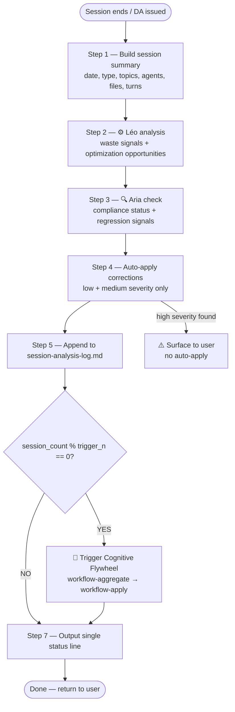

# Post-Session Analysis Workflow

**Goal:** Automatically capture session learnings AND apply low/medium severity corrections for continuous GSANE improvement. Runs without interrupting the user — silent, fast, and always-on.

**Your Role:** Gsane Master executes this workflow as a background analysis hook at session end. You embody both Léo and Aria briefly to produce their findings, apply eligible corrections, then log everything to persistent memory. The user is NOT prompted for low/medium corrections — only high-severity issues surface.

---

## RULES

- ⚡ SILENT by default — do NOT ask the user questions
- ⏱️ FAST — analysis targets under 7 reasoning steps total
- 📝 APPEND ONLY — never overwrite existing log entries, always append
- 🚫 DO NOT reload config — already resolved in session
- 🚫 DO NOT load any agent .md files — use in-context session knowledge only
- ✅ Log findings even if minimal — a clean session is a valid finding
- ✅ AUTO-APPLY corrections with severity "low" or "medium" — no user prompt needed
- ⚠️ HIGH severity findings → surface to user with single notification, do NOT auto-apply

## SEVERITY CLASSIFICATION

| Severity | Examples | Action |
|---|---|---|
| `low` | Missing CHANGELOG entry, manifest row out of sync, outdated comment | Auto-apply + log |
| `medium` | Deprecated path in workflow, agent description mismatch, stale memory file | Auto-apply + log |
| `high` | Rule violation (commit to main, delegation bypass), breaking schema change | Notify user, no auto-apply |

---

## EXECUTION SEQUENCE



### Step 1 — Build Session Summary (in-context, no file loads)

From the current session context, extract:

- `{session_date}` — today's date (YYYY-MM-DD)
- `{session_type}` — "gsane-master" | "party-mode" | "workflow:{name}"
- `{topics_discussed}` — 3-5 keywords summarizing what was worked on
- `{agents_invoked}` — which agents participated (from context)
- `{workflows_run}` — which workflows were executed (from context)
- `{files_loaded}` — approximate count of files loaded during session
- `{turns_count}` — approximate number of conversation turns

---

### Step 2 — ⚙️ Token & Optimization Analysis (critères objectifs)

> **NOTE ARCHITECTURALE** : Cette étape ne simule PAS Gsane Master "en tant que Léo". Elle applique des critères de détection *factuels et mesurables* sur les signaux de session. L'auto-évaluation biaisée est un anti-pattern documenté (FM-006).

**Détection par signaux objectifs :**
- Config rechargée plus d'une fois ? → `config-reload-waste` (medium)
- Fichiers `.md` d'agents chargés quand seul le CSV suffisait ? → `profile-overload` (medium)
- Fichiers chargés et jamais référencés ? → `unnecessary-load` (low)
- Même étape ou fichier chargé plusieurs fois ? → `redundant-step` (low)
- `files_loaded` > 20 pour une session de < 10 tours ? → `load-to-turn-ratio-high` (medium)

**Prompt improvement signals :**
- Utilisateur a commenté positivement ? → `prompt-quality-up`
- Session terminée en moins de tours que la même tâche historiquement ? → `prompt-efficiency-up`
- Output précis sans clarification supplémentaire ? → `prompt-precision-up`
- Une correction flywheel précédente s'est appliquée avec succès ? → `flywheel-prompt-confirmed`
- Un prompt n'a pas activé le bon agent ? → `prompt-regression`

**Format findings as:**
```
LEO_FINDINGS:
  waste_signals: [list or "none"]
  optimization_opportunities: [list or "none"]
  estimated_token_impact: "low | medium | high"
  top_recommendation: "[single most impactful change, or 'none this session']"
  prompt_improvement_signals: [list or "none"]
```

---

### Step 2b — 🏛️ Failure Museum Auto-Append (HIGH violations only)

If Léo or Aria found a **HIGH severity violation** in this session:

1. Load `{project-root}/_gsane/_memory/failure-museum.md`
2. Check if the violation already has an FM entry (scan titles for keyword match)
3. If **no existing entry** → append a new entry using the next FM-XXX number:
   ```markdown
   ## FM-XXX — {short title}
   - **Date**: {session_date}
   - **Sévérité**: high
   - **Agent(s) impliqué(s)**: {agents_invoked}
   - **Description**: {brief description of what happened}
   - **Cause racine**: {root cause if identifiable, else "unknown — requires investigation"}
   - **Correctif**: {correction applied or "pending"}
   - **Règle ajoutée**: {rule created, or "none yet"}
   ```
4. If **entry already exists** → skip (do not duplicate)
5. Log action in `AUTO_CORRECTIONS`: `"FM-XXX appended to failure-museum.md"`

---

### Step 3 — 🔍 Quality & Compliance Check (critères objectifs)

> **NOTE ARCHITECTURALE** : Cette étape ne simule PAS Gsane Master "en tant qu'Aria". Elle applique des conditions IF/THEN sur les données de session. L'auto-évaluation biaisée est un anti-pattern documenté (FM-006).

**Détection par conditions factuelles :**

```
SI file-write-tools utilisés cette session (create_file | replace_string_in_file | multi_replace_string_in_file | edit_notebook_file)
ET agents_invoked NE contient QUE "gsane-master" (aucun agent spécialiste : Bond, Wendy, Aria, Murat, Morgan, Léo, Paige)
ALORS solo-creep = HIGH → violations.append("solo-creep")
```

```
SI agents_invoked contient un agent spécialiste lassé à gsane-master sans être chargé via son .md
ALORS persona-substitution = HIGH → violations.append("persona-substitution")
```

```
SI party-mode-bypass : un write GSANE a eu lieu ET party-mode n'est pas dans workflows_run
ALORS party-mode-bypass = HIGH → violations.append("party-mode-bypass")
```

**Autres checks :**
- Chemins dépréciés utilisés ? → `deprecated-path` (medium)
- Manifests potentiellement désynchronisés ? → `manifest-sync` (medium)
- Commit direct sur main ? → `commit-to-main` (HIGH)
- Exception "triviale" invoquée sur un changement non-trivial ? → `trivial-abuse` (medium)

**Format findings as:**
```
ARIA_FINDINGS:
  compliance_status: "PASS | FAIL | WARNING"
  violations: [list or "none"]
  regression_signals: [list or "none"]
  top_finding: "[most urgent issue, or 'all clear']"
```

---

### Step 3b — 🔁 Détection HIGH Violations Récurrentes

Après avoir produit ARIA_FINDINGS, vérifier la récurrence des HIGH violations :

```
POUR CHAQUE violation de severity HIGH dans ARIA_FINDINGS.violations :
  1. Charger les 3 dernières entrées de session-analysis-log.md
  2. Vérifier si la même violation apparaît dans la session précédente
  3. SI oui : ajouter "repeated-high-violation:{type}" aux violations
     ET surface immédiatement — ne pas attendre le prochain cycle flywheel
     Message : "⚠️ VIOLATION RÉPÉTÉE [{type}] — détectée 2 sessions consécutives. Action requise de Mon Seigneur."
```

Ce seuil adaptatif court-circuite le délai flywheel (5 sessions) pour les violations comportementales systémiques.

---

### Step 4 — Auto-Apply Corrections (low + medium severity only)

Before logging, apply all eligible corrections identified in Steps 2 and 3:

**Eligible auto-corrections (apply silently):**

1. **Missing CHANGELOG entry** → Append entry under `[Unreleased]` in `CHANGELOG.md` with format:
   ```
   **[type]** {description of what was done this session}
   - Agent: Gsane Master | Workflow: post-session-analysis | Initié par: auto
   - Impact: {files affected}
   ```

2. **Manifest row out of sync** (agent or workflow added but not in CSV) → Append correct row to the relevant manifest CSV

3. **Deprecated path reference** (e.g., old `bmm` module path in any file) → Replace with correct `_gsane/core/` path

4. **Stale comment or outdated description** in manifest → Update in-place

**For each correction applied:**
- Note it in `AUTO_CORRECTIONS` list for logging
- Apply the file edit directly (no branch — these are minor housekeeping fixes)

**Do NOT auto-apply if:**
- The fix requires creating a new agent/workflow/module (route to Bond/Wendy/Morgan instead)
- The fix changes any rule, schema, or convention (severity = high)
- You are uncertain about the correct value

**High severity findings** → after completing all steps, display single line:
```
⚠️ [post-session] Problème détecté nécessitant ton attention : {finding}
```

---

### Step 5 — Append to Session Memory Log

Load path: `{project-root}/_gsane/_memory/session-analysis-log.md`

Append the following block to the END of the file (never overwrite):

```markdown
---
## Session: {session_date} | Type: {session_type} | Count: {session_count}
**Topics:** {topics_discussed}
**Agents invoked:** {agents_invoked}
**Workflows run:** {workflows_run}
**Files loaded (est.):** {files_loaded} | **Turns:** {turns_count}

### ⚙️ Léo — Token & Optimization
- Waste signals: {LEO_FINDINGS.waste_signals}
- Opportunities: {LEO_FINDINGS.optimization_opportunities}
- Token impact: {LEO_FINDINGS.estimated_token_impact}
- Top recommendation: {LEO_FINDINGS.top_recommendation}

### 🔍 Aria — Quality & Compliance
- Compliance: {ARIA_FINDINGS.compliance_status}
- Violations: {ARIA_FINDINGS.violations}
- Regression signals: {ARIA_FINDINGS.regression_signals}
- Top finding: {ARIA_FINDINGS.top_finding}

### � Prompt Signals (Léo)
- {LEO_FINDINGS.prompt_improvement_signals}

### �🔧 Auto-corrections appliquées
- {AUTO_CORRECTIONS list or "aucune"}
---
```

---

### Step 6 — Flywheel Counter & Trigger

After appending the log entry, count the total number of `## Session:` entries in `session-analysis-log.md` → `{session_count}`.

Load `flywheel.trigger_every_n_sessions` from config (already in session context) → `{trigger_n}`.

```
if {session_count} % {trigger_n} == 0 AND {session_count} > 0 AND flywheel.enabled == true:
  → Append FLYWHEEL TRIGGERED marker to session-analysis-log.md (BEFORE running aggregate):
      ---
      ## 🔄 FLYWHEEL TRIGGERED — Cycle {session_count / trigger_n}
      **Date:** {today_date}
      **Sessions analyzed:** {trigger_n}
      **Total sessions in log:** {session_count}
      **Status:** running → workflow-aggregate.md
      ---
  → Load and execute: {project-root}/_gsane/core/workflows/flywheel/workflow-aggregate.md
  → flywheel cycle runs BEFORE the final status line
else:
  → Skip flywheel, proceed to Step 7
  → Note: next flywheel at session {session_count + (trigger_n - session_count % trigger_n)}
```

This is the heartbeat of the Cognitive Flywheel. Every Nth session, the cycle fires automatically.

---

### Step 7 — Output Single Status Line

Display to user (in {communication_language}):

```
📊 Analyse post-session terminée — {AUTO_CORRECTIONS.count} correction(s) appliquée(s) — résultats dans _gsane/_memory/session-analysis-log.md
```

If flywheel was triggered this step, the flywheel workflow (`workflow-aggregate.md` → `workflow-apply.md`) already displayed its own `🔄` status line. Do not duplicate it.

Then return control to whatever triggered this workflow (DA dismiss or party-mode exit).

---

## SUCCESS METRICS

✅ Session summary extracted from context (no file loads)
✅ Léo findings produced with waste signals and recommendation
✅ Aria findings produced with compliance status
✅ Low/medium corrections auto-applied before logging
✅ Log entry appended to session-analysis-log.md with AUTO_CORRECTIONS section
✅ Session count checked — flywheel triggered if count % trigger_n == 0
✅ Single status line displayed with correction count, then silent exit
✅ Total workflow execution: ≤ 7 reasoning steps (+ flywheel if triggered)

## FAILURE MODES

❌ Asking the user questions during analysis (except high-severity notification)
❌ Auto-applying high-severity findings without user confirmation
❌ Reloading config or agent files already in context
❌ Overwriting existing log entries (append only)
❌ Generating a wall of text — this is a background hook, not a report
❌ Blocking the session exit — analysis failure must not prevent DA/exit
❌ Skipping the flywheel counter check — this is the heartbeat of the system
