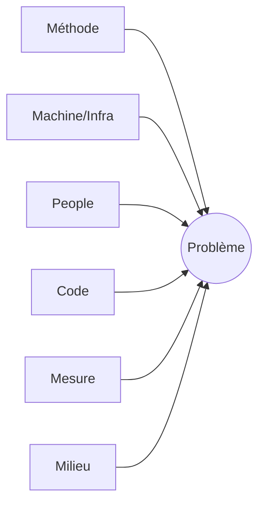

# Root Cause Analysis (RCA)

Méthode pour passer du **symptôme** (ce qu'on observe) à la **cause racine**
(le défaut systémique qui, corrigé, empêche la récurrence). Deux outils
complémentaires : **5 Pourquoi** (causes en chaîne) et **Ishikawa** (causes en
catégories). RCA blameless : on cherche un **défaut de système**, jamais un coupable.

## Quand utiliser quel outil

| Situation | Outil | Pourquoi |
|---|---|---|
| Cause unique et linéaire (un fil à dérouler) | **5 Pourquoi** | Rapide, suit une chaîne causale |
| Causes multiples / problème transverse | **Ishikawa** | Cartographie plusieurs familles de causes |
| Doute, ou problème complexe | **Les deux** | Ishikawa pour ouvrir, 5 Pourquoi sur chaque branche prometteuse |

## 5 Pourquoi (Toyota)

Partir du symptôme et demander « pourquoi ? » jusqu'à atteindre une cause
**actionnable systémique** (souvent 3 à 5 itérations, pas un dogme du chiffre 5).

Règles pour ne pas se tromper :

- **S'arrêter sur une cause qu'on peut corriger durablement**, pas sur « erreur
  humaine » (ce n'est presque jamais la vraie racine — demander pourquoi le système
  a permis l'erreur).
- **Chaque réponse doit être prouvée** par une donnée/un signal, pas supposée.
- **Une chaîne peut bifurquer** : si un « pourquoi » a deux réponses valides,
  ouvrir deux branches (ou basculer en Ishikawa).
- **Tester la logique à l'envers** : « parce que <cause> → donc <effet> » doit
  tenir.

Format de sortie :

```text
Symptôme : <ce qu'on observe>
1. Pourquoi ? → <cause directe>            [preuve : <signal/donnée>]
2. Pourquoi ? → <cause sous-jacente>       [preuve : …]
3. Pourquoi ? → <cause systémique>         [preuve : …]
…
Cause racine : <la cause actionnable>
Contre-mesure : <ce qui empêche la récurrence, pas juste le symptôme>
```

## Ishikawa (arêtes de poisson)

Classer les causes possibles par **famille**. Catégories de départ usuelles
(adapter au contexte, ne pas forcer les 6) :

- **Méthode / Process** — procédures, runbooks, étapes manquantes
- **Machine / Infra** — ressources, config, réseau, plateforme
- **Main-d'œuvre / People** — compétence, charge, communication
- **Matériel / Code** — dépendances, version, dette technique
- **Mesure / Observabilité** — métriques absentes, alertes manquantes
- **Milieu / Environnement** — contraintes externes, charge, timing



Pour chaque branche pertinente, lister les causes candidates, puis **dérouler un
5 Pourquoi** sur les plus probables. Marquer chaque cause : `confirmée` /
`probable` / `écartée` (avec la preuve).

## Workflow RCA (checklist à copier)

```text
RCA Progress:
- [ ] 1. Énoncer le symptôme précis (quoi, quand, périmètre, impact)
- [ ] 2. Rassembler les preuves (logs, métriques, timeline) AVANT d'hypothéser
- [ ] 3. Choisir l'outil (5 Pourquoi / Ishikawa / les deux)
- [ ] 4. Dérouler, chaque cause étayée par une preuve
- [ ] 5. Identifier la cause racine systémique (pas « erreur humaine »)
- [ ] 6. Définir la/les contre-mesure(s) durable(s) + owner + échéance
- [ ] 7. Distinguer mitigation (déjà faite) vs correction de fond (à faire)
```

## Livrable

La RCA **alimente le livrable du workflow en cours**, elle n'en crée pas de
nouveau :

- Dans un incident → section « Cause racine » + « Actions » du post-mortem
  ([template incident-report](../../templates/incident-report.md),
  fichier `docs/incidents/YYYY-MM-DD-slug.md`).
- Hors incident → la synthèse Scribe du workflow courant.

## Pièges à éviter

- ❌ Confondre **mitigation** (arrêter le saignement) et **cause racine**
  (comprendre pourquoi) — distinction héritée d'`incident-response`.
- ❌ S'arrêter à « erreur humaine » sans demander pourquoi le système l'a permis.
- ❌ Hypothèses non étayées présentées comme des causes.
- ❌ Tout reporter en cause racine unique quand le problème est multi-causal
  (→ Ishikawa).
- ❌ Cause racine sans contre-mesure actionnable (owner + échéance).
