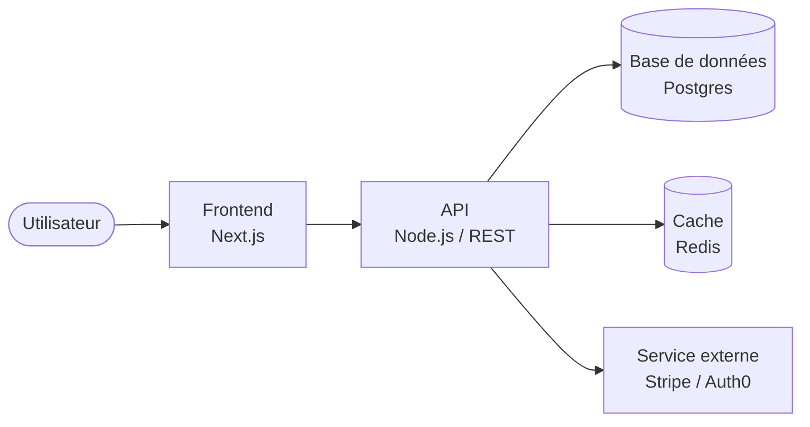
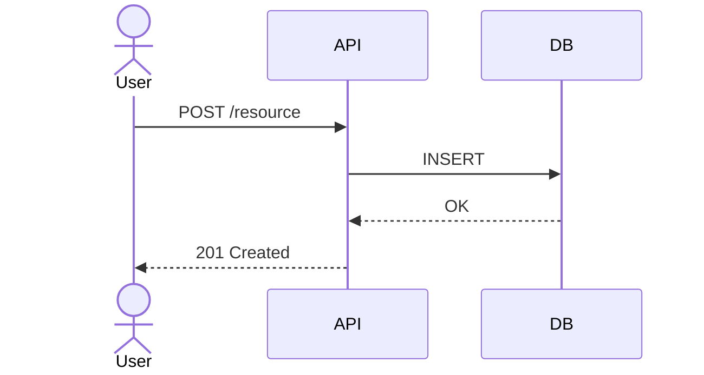

# Architecture — <nom du système / domaine>

<!-- Le titre doit identifier le périmètre sans ambiguïté. Ex: "Architecture — Service de paiement" -->

> **Usage :** document vivant. À mettre à jour à chaque décision structurante. Les ADRs liés sont la source de vérité pour les décisions individuelles.

---

## Vue d'ensemble

<!-- Quoi : description du système en 2-3 lignes. Pour qui : les utilisateurs ou consommateurs du système. Pourquoi : le problème qu'il résout. -->

**Système :** <!-- description courte -->
**Utilisateurs / consommateurs :** <!-- ex: équipe mobile, API externe, équipe analytics -->
**Problème résolu :** <!-- ex: centralisation de l'authentification, découplage des domaines métier -->

---

## Diagramme C4 — Niveau Container

<!-- Diagramme Mermaid représentant les principaux conteneurs (applications, bases de données, services externes) et leurs interactions. -->

<!-- Remplacer par le diagramme réel du système. Légende obligatoire si les flèches ont des sémantiques différentes. -->

---

## Composants

<!-- Décrire chaque conteneur / composant clé : rôle, technologies, équipe propriétaire. -->

| Composant | Rôle | Technologies | Propriétaire |
|---|---|---|---|
| <!-- ex: API Gateway --> | <!-- ex: point d'entrée, routing, auth --> | <!-- ex: nginx, Kong --> | <!-- ex: équipe Platform --> |
| <!-- ex: Service auth --> | <!-- ex: émission de tokens JWT --> | <!-- ex: Node.js, Auth0 --> | <!-- ex: équipe Sécurité --> |

---

## Flux principaux

<!-- Diagramme de séquence Mermaid pour les cas d'usage critiques (max 3). Choisir les flux qui révèlent le plus les contraintes architecturales. -->

### Flux 1 — <nom du flux critique>

---

## Décisions structurantes

<!-- Lister les ADRs qui ont façonné cette architecture. -->

| # | Décision | Statut | Fichier |
|---|---|---|---|
| <!-- ex: 0001 --> | <!-- ex: Choix JWT vs session cookies --> | <!-- ex: accepted --> | <!-- [0001-auth-strategy.md](../../docs/decisions/0001-auth-strategy.md) --> |

---

## Considérations transverses

### Sécurité

<!-- AuthN/AuthZ, secrets management, surface d'attaque, TLS, RBAC. -->
<!-- TODO: à compléter -->

### Performance

<!-- SLO/SLI, points de contention identifiés, stratégie de cache, limites de scaling. -->
<!-- TODO: à compléter -->

### Observabilité

<!-- Métriques clés, dashboards, alertes, traces distribuées, logging. -->
<!-- TODO: à compléter -->

### Coûts

<!-- Estimation des coûts d'exploitation, leviers de réduction, alertes budget. -->
<!-- TODO: à compléter -->
