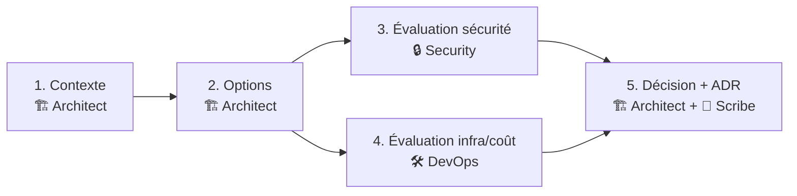

# Workflow — Architecture Design

Choix techno, refonte, design d'un nouveau composant ou système. Aboutit toujours à un ADR.

## Diagramme des phases

## Personas par étape

| # | Phase                       | Persona        | Sortie attendue                                                 |
| - | --------------------------- | -------------- | --------------------------------------------------------------- |
| 1 | Contexte & contraintes      | 🏗️ Architect   | Besoin, contraintes (perf, équipe, legacy, calendrier), risques |
| 2 | Options évaluées            | 🏗️ Architect   | 2-4 options avec description, pour, contre, coût, risque        |
| 3 | Évaluation sécurité         | 🔒 Security    | Surface d'attaque par option, contrôles à prévoir               |
| 4 | Évaluation infra & coût     | 🛠️ DevOps      | Faisabilité opé, coût d'exploitation, complexité de déploiement |
| 5 | Décision & ADR              | 🏗️ Architect → 📝 Scribe | Recommandation justifiée + ADR formalisé dans `docs/decisions/` |

## Règles spécifiques

- **Toujours ≥ 2 options.** Une seule option présentée = pas de choix, donc pas de décision documentable.
- Les évaluations sécurité et infra (phases 3 et 4) **se font en parallèle** sur les mêmes options ; le diagramme reflète cette parallélisation.
- L'ADR est créé en `proposed`, puis basculé en `accepted` après validation explicite de l'utilisateur.
- Le numéro d'ADR (`NNNN`) est séquentiel : prendre `max(existing) + 1`.

## Anti-patterns

- ❌ Une seule option (« voilà ce que je propose »).
- ❌ Comparer des options sur des critères implicites jamais énoncés.
- ❌ Décider sans évaluation sécurité quand le sujet le mérite.
- ❌ ADR sans `Consequences` négatives ou neutres (toute décision a un coût).
- ❌ ADR sans date ni statut.

## Livrable final

`docs/decisions/NNNN-<slug>.md` produit avec le template `agents/templates/adr.md`.
