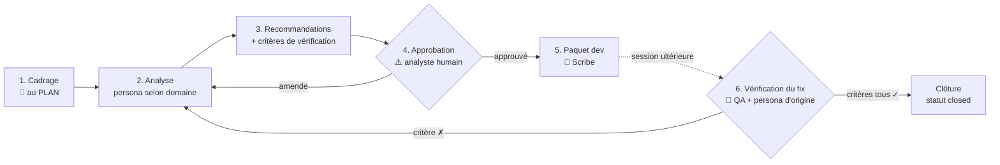

# Workflow — Bilan & Remédiation

Production d'un bilan d'analyse destiné à un développeur (correctif ou documentation),
approbation par l'analyste, remise, puis vérification du fix en session ultérieure.
Décision d'origine : [ADR-0014](../../docs/decisions/0014-workflow-bilan-remediation.md).

## Diagramme des phases

## Personas par étape

| # | Phase                     | Persona                          | Sortie attendue                                                                 |
| - | ------------------------- | -------------------------------- | ------------------------------------------------------------------------------- |
| 1 | Cadrage (au PLAN)         | 🎼 Orchestrateur                 | Destinataire, question à trancher, preuves disponibles, domaine → persona choisi |
| 2 | Analyse                   | 💻 / 🛠️ / 🔒 selon domaine       | Findings avec **raisonnement visible** (voir règle ci-dessous)                   |
| 3 | Recommandations           | même persona (+ 🏗️ si structurant) | 1 action recommandée par finding + **critère de vérification binaire**         |
| 4 | Approbation               | 👤 Analyste (humain)             | Bilan approuvé (statut `approved`) ou amendé → retour phase 2                    |
| 5 | Paquet dev                | 📝 Scribe                        | `docs/YYYY-MM-DD-bilan-<slug>.md` ticket-ready — statut `handed-off`             |
| 6 | Vérification (ultérieure) | 🧪 QA + persona d'origine        | Chaque critère coché ✓/✗ avec preuve ; tous ✓ → `closed`, sinon retour phase 2   |

## Règles spécifiques

- **Raisonnement visible (règle binaire)** : chaque finding expose les 4 champs
  `Signal → Hypothèse → Preuve → Conclusion`. Un finding auquel il manque un champ est
  **non conforme** — pas de passage en phase 3. Objectif : le bilan enseigne la méthode
  (trajectoire SRE de l'analyste), pas seulement le résultat. Pour structurer l'analyse,
  invoquer la skill [`root-cause-analysis`](../skills/root-cause-analysis/SKILL.md).
- **Critère de vérification écrit avant remise** : chaque recommandation porte un critère
  **binaire et observable** (« le endpoint X répond < 200 ms », « le log Y n'apparaît plus
  sur 24 h »). Pas de critère → pas de remise.
- **L'état vit dans le bilan lui-même** : statut en front-matter
  (`draft → approved → handed-off → closed`), document committé. La phase 6 se déclenche
  quand l'utilisateur cite le bilan (« le dev a livré le fix du bilan X ») : on **relit le
  bilan et on coche ses critères** — aucun checkpoint requis, on ne refait pas l'analyse.
- **Phase 4 — le bilan est le livrable de l'analyste, pas celui de l'IA** : aucune remise
  (phase 5) sans approbation humaine explicite, même en session fluide.
- **Hors mode playbook pendant la validation terrain** : CONFIRM obligatoire
  (ADR-0014 ; levée conditionnée aux critères §3 du protocole de test 2026-07-01).
- **Désambiguïsation du routage** : incident en cours à mitiger → `incident-response` ;
  audit complet d'un module → `code-analysis` ; ici le **livrable est un bilan destiné à
  un tiers** ou la **vérification d'un fix remis**.
- **Format ticket générique** (markdown copiable) — pas d'intégration JIRA/ServiceNow
  (exclusion explicite du projet).
- Inputs bruts (logs, exports, dumps) → `docs/_scratch/inputs/` (git-ignoré, jamais committé).

## Anti-patterns

- ❌ Conclusion sans chaîne signal → hypothèse → preuve (« c'est probablement X »).
- ❌ Recommandation sans critère de vérification binaire (« améliorer la performance »).
- ❌ Remettre au dev sans approbation humaine (phase 4 sautée).
- ❌ Vérifier un fix en re-analysant tout — la phase 6 coche les critères du bilan, elle ne refait pas la phase 2.
- ❌ Clore avec un critère ✗ « parce que le dev dit que c'est bon ».
- ❌ Bilan sans section « Hors périmètre » — un bilan qui prétend tout couvrir n'est pas crédible.

## Livrable final

`docs/YYYY-MM-DD-bilan-<slug>.md` produit avec le template
[`agents/templates/bilan.md`](../templates/bilan.md).

**Cycle de vie du statut :** `draft` → `approved` (phase 4) → `handed-off` (phase 5) → `closed` (phase 6, tous critères ✓).

> Si le bilan révèle une décision structurante (refonte, changement d'outil) →
> l'Architect ouvre un ADR dans `docs/decisions/NNNN-slug.md` en complément.
> ❌ Les plans de correctifs détaillés → `docs/_scratch/YYYY-MM-DD-plan-<slug>.md` — le bilan
> reste le contrat de vérification, pas la todo-list du dev.
