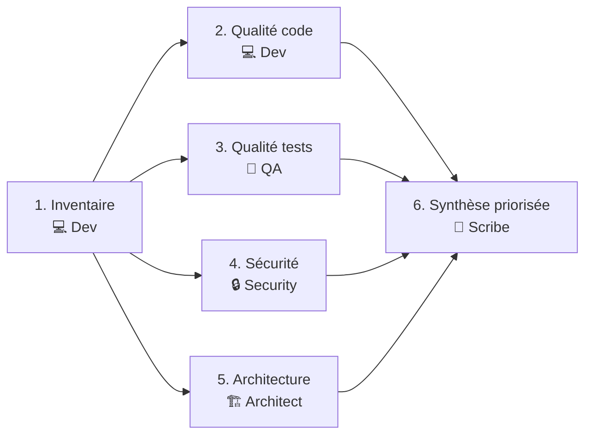

# Workflow — Code Analysis

Audit / review d'un module, d'un repo ou d'un domaine fonctionnel existant.

## Diagramme des phases

> Les phases 2 à 5 sont des **angles indépendants** sur le même code — en Party mode (sous-agents),
> régime **divergent** : chaque persona ne lit que `context.md`, seul le Scribe confronte
> les angles. Voir [`.github/agents/modules/party-mode.md`](../../.github/agents/modules/party-mode.md).

## Personas par étape

| # | Phase                | Persona       | Sortie attendue                                                         |
| - | -------------------- | ------------- | ----------------------------------------------------------------------- |
| 1 | Inventaire           | 💻 Developer  | Cartographie du module : entrées, sorties, dépendances, fichiers clés |
| 2 | Qualité code         | 💻 Developer  | Smells, complexité, dette, couplages excessifs                          |
| 3 | Qualité tests        | 🧪 QA         | Couverture réelle, cas manquants, test data, fiabilité de la suite      |
| 4 | Sécurité             | 🔒 Security   | Surface d'attaque, vulnérabilités classées, secrets, dépendances      |
| 5 | Architecture         | 🏗️ Architect  | Cohérence du design, couplages, frictions, options d'évolution        |
| 6 | Synthèse priorisée   | 📝 Scribe     | Top findings classés par impact/effort, plan d'attaque, livrable doc   |

## Règles spécifiques

- **Phase 4 (Sécurité) — utiliser la checklist** `agents/checklists/security-review.md` comme grille de lecture. Couvrir chaque section avant de produire les findings.

- L'**inventaire** précède tout jugement : on ne critique pas ce qu'on n'a pas lu.
- **Developer (phase 2)** : qualité du code — smells, complexité cyclomatique, dette, couplage.
- **QA (phase 3)** : qualité des tests — différent ! On évalue la **suite de tests existante** : taux de couverture réel sur les chemins critiques, fiabilité (flaky tests), cas limites absents, test data artificielle vs réaliste.
- Chaque finding doit citer **fichier:ligne**.
- La synthèse du Scribe **classe par impact × effort** (matrice 2×2 ou table priorisée).

## Anti-patterns

- ❌ Audit « ressenti » sans chiffres ni références code.
- ❌ Confondre qualité du code (Developer) et qualité des tests (QA) — deux angles distincts.
- ❌ Tout reporter en P0 (rien n'est P0 si tout est P0).
- ❌ Recommander une refonte totale sans étape intermédiaire.
- ❌ Oublier la dimension sécurité pour un module qui manipule de l'I/O ou de l'auth.

## Livrable final

`docs/YYYY-MM-DD-code-analysis-<module>.md` avec sections :
- Résumé exécutif (5 lignes)
- Findings priorisés (table)
- Plan d'attaque proposé (3 horizons : quick wins / court terme / fond)
- Annexes (cartographie, métriques)

> Si l'audit révèle une décision structurante (refonte, choix d'outil), l'Architect crée un ADR dans `docs/decisions/` en complément. Le rapport d'analyse lui-même **n'est pas un ADR**.
> Un plan de correctifs découlant de l'audit va dans `docs/_scratch/YYYY-MM-DD-plan-<slug>.md` — pas dans `docs/decisions/`.
