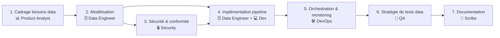

# Workflow — Data Pipeline

Tâches data : ETL/ELT, migration de schéma, modélisation BI, nouveau pipeline d'ingestion, data contract entre équipes.

## Diagramme des phases

> Les phases 3 et 4 démarrent en parallèle dès la fin de la modélisation.

## Personas par phase

| # | Phase                        | Persona principal        | Personas secondaires   | Sortie attendue                                                         |
| - | ---------------------------- | ------------------------ | ---------------------- | ----------------------------------------------------------------------- |
| 1 | Cadrage besoins data         | 📊 Product Analyst       | —                      | Qui consomme, à quelle fraîcheur, pour quelle décision, SLA attendu     |
| 2 | Modélisation                 | 🗄️ Data Engineer         | —                      | Schéma source/cible (DDL), transformations, data contracts              |
| 3 | Sécurité & conformité        | 🔒 Security              | 🗄️ Data Engineer       | PII identifiée, plan de masquage, RGPD, contrôles d'accès               |
| 4 | Implémentation pipeline      | 🗄️ Data Engineer         | 💻 Developer           | DAG/dbt models, intégration applicative, idempotence, gestion erreurs   |
| 5 | Orchestration & monitoring   | 🛠️ DevOps                | —                      | Scheduling, alertes sur SLA, observabilité (freshness, row count, drift) |
| 6 | Stratégie de tests data      | 🧪 QA                    | 🗄️ Data Engineer       | Tests de qualité, contrôles de cohérence, tests de régression           |
| 7 | Documentation                | 📝 Scribe                | —                      | Data dictionary, runbook du pipeline, `docs/YYYY-MM-DD-data-<slug>.md` |

## Règles spécifiques

- **Phase 1 obligatoire** : on ne modélise pas sans savoir qui consomme quoi et à quelle fréquence. Un pipeline sans consommateur identifié est un candidat à la suppression.
- **PII** : dès la phase 2, toute colonne susceptible de contenir un PII est **flaggée**. La phase 3 valide le traitement (masquage, pseudonymisation, droit à l'effacement).
- **Idempotence obligatoire** : tout pipeline doit pouvoir être re-exécuté sur la même fenêtre sans dupliquer les données.
- **Plan de rollback** : toute migration de schéma doit documenter les étapes de rollback avant d'être appliquée.
- **Confirmation utilisateur requise** pour : `DROP TABLE`, `TRUNCATE`, modification d'une colonne utilisée en prod, suppression d'un DAG actif.

## Anti-patterns

- ❌ Transformation dans le BI (Tableau, Looker, PowerBI) au lieu d'amont dans le pipeline — la logique métier doit vivre dans dbt ou le pipeline, pas dans un dashboard.
- ❌ Pipeline non idempotent : un re-run duplique les lignes.
- ❌ Pas de monitoring de fraîcheur / volume : on découvre les données manquantes en prod quand un utilisateur se plaint.
- ❌ PII non masquée dans les environnements de dev/test/staging.
- ❌ Schéma sans contraintes (`VARCHAR(MAX)`, tout nullable) : migration douloureuse garantie.
- ❌ Data contracts implicites : le producteur change de schéma silencieusement, le consommateur casse.
- ❌ Construire sans cadrage (phase 1) : pipeline inutile ou avec le mauvais grain de données.

## Livrable final

- `docs/YYYY-MM-DD-data-<slug>.md` avec :
  - Résumé : source → transformations → destination → consommateurs
  - Schéma final (DDL)
  - Data dictionary (table des colonnes, types, descriptions, PII flag)
  - Runbook d'exploitation (relance, monitoring, SLA, alertes)
  - Plan de rollback de la migration (si applicable)
