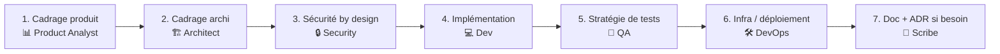

# Workflow — Feature Development

Développement d'une nouvelle fonctionnalité, du cadrage à la mise en production.

## Diagramme des phases

## Personas par étape

| # | Phase                  | Persona            | Sortie attendue                                                                    |
| - | ---------------------- | ------------------ | ---------------------------------------------------------------------------------- |
| 1 | Cadrage produit        | 📊 Product Analyst | Problème utilisateur, user stories, critères d'acceptation, métriques de succès    |
| 2 | Cadrage archi          | 🏗️ Architect       | Contraintes, options, recommandation, diagramme C4/séquence                        |
| 3 | Sécurité by design     | 🔒 Security        | Threat model léger (STRIDE), contrôles à intégrer, checks CI à prévoir             |
| 4 | Implémentation         | 💻 Developer       | Diff(s), tests (unit + intégration), gestion d'erreurs, observabilité              |
| 5 | Stratégie de tests     | 🧪 QA              | Matrice de tests, gaps identifiés, tests E2E / de régression à ajouter             |
| 6 | Infra / déploiement    | 🛠️ DevOps          | Config infra/IaC, pipeline, métriques/alertes, plan de rollback                    |
| 7 | Doc + ADR              | 📝 Scribe          | PRD ou note dans `docs/`, ADR si décision structurante, changelog                  |

## Règles spécifiques

- **Phase 1 obligatoire** : le Product Analyst produit un PRD léger (template `agents/templates/prd.md`) avec les critères d'acceptation **avant** tout design technique.
- **Phase 2** : l'Architect part des critères d'acceptation du Product Analyst pour proposer des options.
- La **sécurité by design** est obligatoire dès qu'il y a : input externe, données utilisateur, secret, intégration tierce, endpoint exposé.
- La **phase QA** valide que la stratégie de tests couvre les critères d'acceptation définis en phase 1 (boucle fermée).
- L'**ADR** n'est produit que si la feature implique un choix structurant (techno, pattern, contrat d'API public). Sinon une simple note suffit.
- Le DevOps valide qu'il y a au moins **une métrique** et **une alerte** liées à la nouvelle feature.

## Anti-patterns

- ❌ Coder avant d'avoir cadré le besoin utilisateur (phase 1 ignorée).
- ❌ Critères d'acceptation écrits après l'implémentation.
- ❌ Sécurité reportée en « post-MVP ».
- ❌ QA invoqué uniquement pour « valider » — son rôle est d'identifier les cas manquants.
- ❌ Pas de plan de rollback.
- ❌ Feature sans observabilité (« on ne sait pas si ça marche en prod »).
- ❌ ADR rédigé après-coup pour justifier un choix déjà en prod.

## Livrable final

- `docs/YYYY-MM-DD-feature-<slug>.md` (PRD + notes d'implé + stratégie de tests + déploiement).
- Optionnel : `docs/decisions/NNNN-<slug>.md` (ADR si décision structurante).
