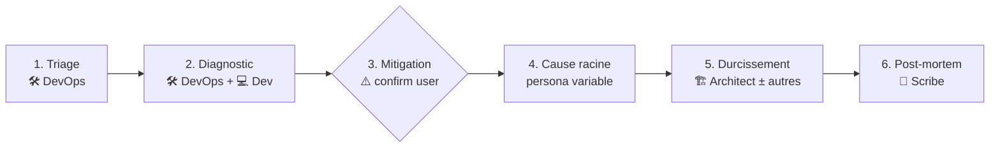

# Workflow — Incident Response

Réponse à un incident en production : panne, alerte, dégradation, comportement anormal.

## Diagramme des phases

## Personas par étape

| # | Phase           | Persona principal     | Personas secondaires      | Sortie attendue                                          |
| - | --------------- | --------------------- | ------------------------- | -------------------------------------------------------- |
| 1 | Triage          | 🛠️ DevOps             | —                         | Sévérité, périmètre impacté, timeline initiale           |
| 2 | Diagnostic      | 🛠️ DevOps             | 💻 Developer              | Hypothèses classées, signal/preuve associé(e)            |
| 3 | Mitigation      | 🛠️ DevOps             | 💻 Developer              | Action(s) appliquée(s) **après confirmation utilisateur**|
| 4 | Cause racine    | variable (voir ci-dessous) | autres au besoin    | Explication causale (pas seulement symptôme)             |
| 5 | Durcissement    | 🏗️ Architect          | 🔒 Security, 🛠️ DevOps     | Contre-mesures durables, ADR si décision structurante    |
| 6 | Post-mortem     | 📝 Scribe             | —                         | `docs/incidents/YYYY-MM-DD-slug.md` (blameless)          |

## Règles spécifiques

- **Phase 1 (Triage) — utiliser la checklist** `agents/checklists/incident-triage.md` dès le déclenchement. Couvrir les 2 premières minutes avant tout diagnostic.

- **Phase 3 (Mitigation) bloque sur confirmation utilisateur** dès que l'action est destructive ou irréversible (rollback, restart de service en prod, purge de cache, modification de config live).
- Le DevOps ouvre toujours, le Scribe ferme toujours.
- **Phase 4 (Cause racine) — choix du persona** selon la nature des hypothèses qualifiées en phase 2 :
  - Hypothèses applicatives (logique, memory leak, query) → 💻 Developer
  - Hypothèses infra/plateforme (config, ressources, réseau) → 🛠️ DevOps
  - Hypothèses sécurité (intrusion, exfiltration, IAM anormal) → 🔒 Security + **escalade utilisateur immédiate**
- Si la cause racine est applicative → handoff explicite vers Developer.
- Si la cause est sécurité (intrusion, exfiltration suspecte) → handoff vers Security et **escalade utilisateur immédiate**.

## Anti-patterns

- ❌ Sauter le triage et plonger directement dans le code.
- ❌ Appliquer une mitigation destructive sans confirmation.
- ❌ Confondre mitigation (arrêter le saignement) et cause racine (comprendre pourquoi).
- ❌ Conclure sans post-mortem (« on verra plus tard »).
- ❌ Post-mortem accusatoire (nommer une personne plutôt qu'un défaut systémique).
- ❌ Action items sans owner ni échéance.

## Livrable final

`docs/incidents/YYYY-MM-DD-<slug-court>.md` produit avec le template `agents/templates/incident-report.md`.
