# 🧙 BMAD Framework — Guide Complet de Reproduction

> **Destinataire :** Tout projet souhaitant reproduire le framework BMAD Multi-Agent  
> **Source :** Projet `test esign` — Banque Nationale du Canada  
> **Date :** 2 mai 2026  
> **Version :** 6.0.0-Beta.5  
> **Rédaction initiale :** 🧙 BMad Master (orchestration solo — v1)  
> **Revue Party Mode :** 📚 Paige (structure/clarté) · 🤖 Bond (compliance BMAD) · 🔄 Wendy (workflows) · 🏗️ Winston (architecture) · 📋 John (utilisabilité)

---

## ⚡ QUICK START — TL;DR en 5 minutes

> *Tu n'as pas le temps de lire 1400 lignes ? Voici l'essentiel.*

### Qu'est-ce que BMAD ?

Un framework qui transforme GitHub Copilot en **équipe de 23 agents spécialisés** avec personnalités, protocoles et traçabilité. Un orchestrateur (BMad Master) route le travail vers des experts virtuels au lieu de tout faire lui-même.

### Les 5 concepts clés

| # | Concept | En une phrase |
|---|---------|---------------|
| 1 | **BMad Master** | Orchestrateur pur — il ne code/écrit/analyse jamais. Il route vers l'agent expert. |
| 2 | **Party Mode** | Collaboration multi-agents sur un sujet. Smart (2-8 agents) ou Full (tous). |
| 3 | **Solo Gate** | Mécanisme de sécurité : avant chaque réponse, BMad Master vérifie s'il doit router. |
| 4 | **Mandatory Resources** | Fichiers de protocoles chargés à chaque activation pour éviter le drift. |
| 5 | **Session Artifacts** | Journal horodaté de chaque action agent — traçabilité totale. |

### Pour reproduire BMAD dans votre projet

```
1. Installer la structure _bmad/ (§3 + §18)
2. Configurer config.yaml avec votre nom et langue (§7)
3. Créer vos agents dans _bmad/{module}/agents/ (§5 + Annexe D)
4. Les enregistrer dans agent-manifest.csv (§18 étape 4)
5. Créer le mode bmad-master dans VS Code Copilot (§18 étape 5)
6. Lancer et tester avec [PM] Party Mode
```

### Qui maintient le framework ?

Une **personne humaine** doit comprendre les protocoles et servir de référent. L'ajout d'agents et de skills nécessite de suivre les checklists (`NEW_AGENT_CHECKLIST.md`). Le framework n'est pas "install and forget" — il évolue avec le projet.

### Limitations connues

- **Context window :** Max ~6 agents actifs en Smart Party Mode avant saturation tokens
- **Pas de persistance inter-sessions :** Les agents oublient tout entre les conversations (sauf `_memory/` sidecars)
- **Dépendance Copilot :** Le framework est conçu pour GitHub Copilot — portabilité limitée vers d'autres LLM
- **Coût tokens :** Full Party Mode (24 agents) = ~40K tokens de contexte. À utiliser rarement.

---

## ⚠️ COMMENT LIRE CE DOCUMENT

Ce document est rédigé **comme si vous le receviez de zéro**, sans connaissance préalable du framework. Il est volontairement exhaustif. Lisez-le dans l'ordre : chaque section s'appuie sur la précédente.

**Si vous simulez ce document comme un nouveau projet qui reçoit ce guide :** vous aurez tout ce qu'il faut pour installer, configurer et faire fonctionner le framework BMAD avec ses 23 agents, ses workflows, ses skills, et son Party Mode sur GitHub Copilot.

---

## TABLE DES MATIÈRES

1. [Qu'est-ce que BMAD ?](#1-quest-ce-que-bmad)
2. [Architecture globale](#2-architecture-globale)
3. [Structure des dossiers](#3-structure-des-dossiers)
4. [Les modules BMAD](#4-les-modules-bmad)
5. [Le roster complet des agents (23 agents)](#5-le-roster-complet-des-agents)
6. [Le système de personnalisation agents (.customize.yaml)](#6-le-système-de-personnalisation-agents-customizeyaml)
7. [Le système de configuration](#7-le-système-de-configuration)
8. [Les ressources obligatoires (Mandatory Resources)](#8-les-ressources-obligatoires)
9. [Le cycle de vie d'une session](#9-le-cycle-de-vie-dune-session)
10. [Le Party Mode en profondeur](#10-le-party-mode-en-profondeur)
11. [Le protocole Solo Gate (Anti-Solo)](#11-le-protocole-solo-gate)
12. [Le système de Skills](#12-le-système-de-skills)
13. [Les workflows disponibles](#13-les-workflows-disponibles)
14. [Le système CHANGELOG](#14-le-système-changelog)
15. [Le système de mémoire persistante (_memory/)](#15-le-système-de-mémoire-persistante-_memory)
16. [La structure de sortie (bmad-output/)](#16-la-structure-de-sortie)
17. [Invocation des agents dans VS Code Copilot](#17-invocation-des-agents)
18. [Guide de reproduction étape par étape](#18-guide-de-reproduction)
19. [Pièges à éviter](#19-pièges-à-éviter)

---

## 1. Qu'est-ce que BMAD ?

**BMAD** (_BMAD Method for AI-Driven Development_) est un **framework d'orchestration multi-agents** conçu pour fonctionner dans GitHub Copilot (VS Code). Il transforme un seul contexte de conversation en une équipe complète de spécialistes virtuels, chacun avec sa propre personnalité, ses compétences, et ses protocoles.

### Philosophie fondamentale

```
BMAD = Orchestration > Exécution
```

Le principe de base : **BMad Master est un pur orchestrateur**. Il ne code jamais, n'écrit jamais de SPL, n'analyse jamais de données. Il pense, route, et synthétise. Tout le travail spécialisé est délégué à un agent expert.

### Pourquoi BMAD ?

| Problème traditionnel | Solution BMAD |
|---|---|
| Un seul "assistant" généraliste | 23 agents spécialisés avec des personnalités distinctes |
| Réponses génériques sans contexte métier | Agents ancrés dans le contexte spécifique du projet |
| Travail séquentiel et lent | Party Mode : travail collaboratif multi-agents |
| Aucune traçabilité des actions | Session artifacts + CHANGELOG obligatoire |
| Gaspillage de tokens | Smart Party Mode : 50-85% de réduction de tokens |
| Drift de comportement entre sessions | Mandatory Resources chargées à chaque activation |

---

## 2. Architecture globale

### Vue d'ensemble macro

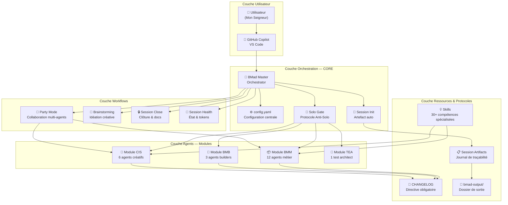

### Flux de décision lors d'une demande

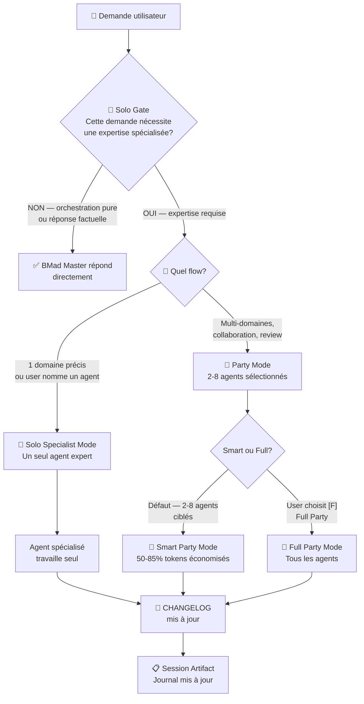

---

## 3. Structure des dossiers

Voici la structure exacte du projet. Tout le framework BMAD est dans `_bmad/`.

```
projet/
├── _bmad/                          ← TOUT le framework BMAD ici
│   ├── _config/                    ← Manifestes et registres globaux
│   │   ├── manifest.yaml           ← Modules installés + versions
│   │   ├── agent-manifest.csv      ← Roster complet (tous les agents)
│   │   ├── agent-manifest-slim.csv ← Roster allégé (pour Smart Party Mode)
│   │   ├── skill-registry.yaml     ← Registre canonique des skills
│   │   ├── task-manifest.csv       ← Liste des tâches disponibles
│   │   ├── workflow-manifest.csv   ← Liste des workflows
│   │   ├── tool-manifest.csv       ← Liste des outils
│   │   ├── bmad-help.csv           ← Base de connaissance aide BMAD
│   │   └── agents/                 ← Fichiers .customize.yaml par agent
│   │       ├── bmm-analyst.customize.yaml
│   │       ├── bmm-dev.customize.yaml
│   │       └── ...
│   │
│   ├── core/                       ← Module central (obligatoire)
│   │   ├── config.yaml             ← ⚙️ Configuration maître de l'installation
│   │   ├── module-help.csv         ← Index d'aide contextuelle pour /bmad-help
│   │   ├── agents/
│   │   │   └── bmad-master.md      ← 🧙 Agent orchestrateur principal
│   │   ├── resources/              ← Protocoles et standards obligatoires
│   │   │   ├── AGENT_OPERATING_MANUAL.md
│   │   │   ├── CHANGELOG_DIRECTIVE.md
│   │   │   ├── CHANGELOG_GOVERNANCE.md
│   │   │   ├── DASHBOARD_STANDARDS.md
│   │   │   ├── TOKEN_CONTEXT_GUIDE.md
│   │   │   ├── no-solo-protocol.md
│   │   │   ├── parallel-block-spec.md
│   │   │   ├── session-artifact-template.md
│   │   │   └── NEW_AGENT_CHECKLIST.md
│   │   ├── tasks/                  ← Tâches réutilisables
│   │   └── workflows/              ← Workflows centraux
│   │       ├── party-mode/         ← 🎉 Workflow principal
│   │       │   ├── workflow.md
│   │       │   ├── agent-selection-matrix.md
│   │       │   └── steps/
│   │       │       ├── step-01-agent-loading.md
│   │       │       ├── step-01b-smart-selection.md
│   │       │       ├── step-02-discussion-orchestration.md
│   │       │       └── step-03-graceful-exit.md
│   │       ├── brainstorming/
│   │       ├── session-init/
│   │       ├── session-close/
│   │       ├── session-health/
│   │       ├── feedback-loop/
│   │       ├── skill-fence/
│   │       └── advanced-elicitation/
│   │
│   ├── bmm/                        ← Module BMM (agents métier)
│   │   ├── config.yaml
│   │   ├── agents/                 ← 12 agents spécialisés
│   │   ├── workflows/              ← Workflows métier
│   │   └── data/                   ← Données métier
│   │
│   ├── bmb/                        ← Module BMB (builders)
│   │   ├── config.yaml
│   │   └── agents/                 ← 3 agents builders
│   │
│   ├── cis/                        ← Module CIS (créatifs)
│   │   ├── config.yaml
│   │   └── agents/                 ← 6 agents créatifs
│   │
│   ├── tea/                        ← Module TEA (test architect)
│   │   ├── config.yaml
│   │   └── agents/                 ← 1 test architect
│   │
│   ├── _memory/                    ← Mémoire persistante des agents
│   │   ├── config.yaml
│   │   ├── storyteller-sidecar/
│   │   └── tech-writer-sidecar/
│   │
│   └── docs/                       ← Documentation interne BMAD
│       ├── AGENT_QUICK_START.md
│       └── ANALYSE_AGENTS_BMAD_OPTIMISATION.md
│
├── .github/
│   └── skills/                     ← 30+ skills GitHub Copilot
│       ├── splunk-expert/
│       ├── debug-helper/
│       ├── post-mortem/
│       ├── bnc-design-system/
│       └── ... (30 autres skills)
│
├── bmad-output/                    ← Dossier de sortie (généré par les agents)
│   ├── sessions/                   ← Artefacts session-init
│   ├── party-mode/                 ← Artefacts Party Mode
│   ├── planning-artifacts/         ← PRD, Architecture, Epics
│   ├── implementation-artifacts/   ← Stories, Sprint Status
│   ├── docs/                       ← Documentation générée
│   ├── dashboard/                  ← Dashboards Splunk
│   ├── data/                       ← Données projet
│   └── rapport/                    ← Rapports et incidents
│
├── CHANGELOG.md                    ← Journal de toutes les modifications
├── README.md                       ← Documentation du projet
└── INDEX_DOCUMENTATION.md          ← Index de la documentation
```

---

## 4. Les modules BMAD

BMAD est organisé en **5 modules** distincts, chacun avec une responsabilité claire :

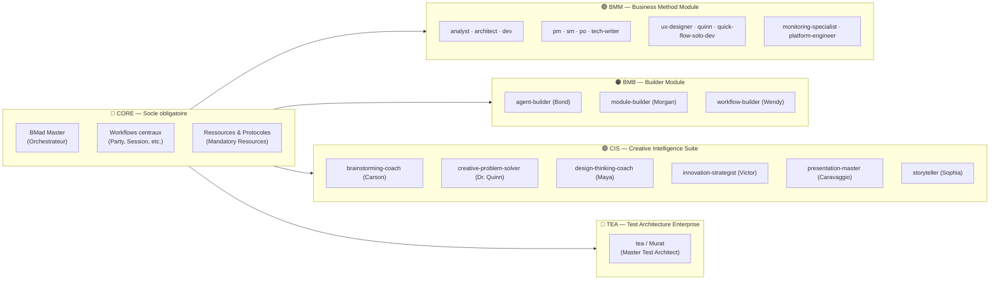

### Matrice d'installation des modules

| Module | Version | Source | npm Package | Agents |
|--------|---------|--------|-------------|--------|
| `core` | 6.0.0-Beta.5 | built-in | — | 1 (bmad-master) |
| `bmm` | 6.0.0-Beta.5 | built-in | — | 12 |
| `bmb` | 0.1.5 | external | `bmad-builder` | 3 |
| `cis` | 0.1.4 | external | `bmad-creative-intelligence-suite` | 6 |
| `tea` | 0.1.1-beta.3 | external | `bmad-method-test-architecture-enterprise` | 1 |

---

## 5. Le roster complet des agents

### Tableau de synthèse

| # | Nom interne | Prénom | Titre | Icône | Module |
|---|-------------|--------|-------|-------|--------|
| 1 | `bmad-master` | BMad Master | Orchestrateur Principal | 🧙 | core |
| 2 | `analyst` | Mary | Business Analyst | 📊 | bmm |
| 3 | `architect` | Winston | Architecte Système | 🏗️ | bmm |
| 4 | `dev` | Amelia | Developer Agent | 💻 | bmm |
| 5 | `pm` | John | Product Manager | 📋 | bmm |
| 6 | `sm` | Bob | Scrum Master | 🏃 | bmm |
| 7 | `po` | Victoria | Product Owner | 👔 | bmm |
| 8 | `quick-flow-solo-dev` | Barry | Quick Flow Solo Dev | 🚀 | bmm |
| 9 | `quinn` | Quinn | QA Engineer | 🧪 | bmm |
| 10 | `monitoring-specialist` | Tupac | Monitoring Specialist | 📡 | bmm |
| 11 | `platform-engineer` | Biggy | Platform Engineer & SRE | 🏗️ | bmm |
| 12 | `tech-writer` | Paige | Technical Writer | 📚 | bmm |
| 13 | `ux-designer` | Sally | UX Designer | 🎨 | bmm |
| 14 | `agent-builder` | Bond | Agent Building Expert | 🤖 | bmb |
| 15 | `module-builder` | Morgan | Module Creation Master | 🏗️ | bmb |
| 16 | `workflow-builder` | Wendy | Workflow Building Master | 🔄 | bmb |
| 17 | `brainstorming-coach` | Carson | Elite Brainstorming Specialist | 🧠 | cis |
| 18 | `creative-problem-solver` | Dr. Quinn | Master Problem Solver | 🔬 | cis |
| 19 | `design-thinking-coach` | Maya | Design Thinking Maestro | 🎨 | cis |
| 20 | `innovation-strategist` | Victor | Disruptive Innovation Oracle | ⚡ | cis |
| 21 | `presentation-master` | Caravaggio | Visual Communication Expert | 🎨 | cis |
| 22 | `storyteller` | Sophia | Master Storyteller | 📖 | cis |
| 23 | `tea` | Murat | Master Test Architect | 🧪 | tea |

### Profils détaillés des agents clés

#### 🧙 BMad Master — L'Orchestrateur

> *"Orchestrate first: route analysis to Analyst, technical design to Architect/Dev, and domain execution to specialists."*

- **Rôle :** Orchestrateur pur. Ne produit jamais de livrable spécialisé.
- **Capacités solo autorisées :** Afficher le menu, expliquer BMAD, sélectionner des agents, synthétiser des outputs, router `/bmad-help`, confirmer des actions.
- **Interdit :** Coder, écrire du SPL, analyser des données, créer de la documentation, concevoir une architecture.
- **Activation :** Déclenché via le mode `bmad-master` dans VS Code Copilot.

#### 📡 Tupac — Monitoring Specialist

> *"Every feature ships with dashboards, metrics, and alerts day-1."*

- **Domaine :** Splunk SPL, dashboards, alertes, métriques, observabilité.
- **Skill associé :** `splunk-expert`
- **Trigger Party Mode :** `splunk`, `query`, `dashboard`, `alert`, `metric`, `log`

#### 💻 Amelia — Developer Agent

> *"Ultra-succinct. Speaks in file paths and AC IDs — every statement citable."*

- **Domaine :** Implémentation, correction de code, tests unitaires.
- **Règle :** Tous les tests doivent passer à 100% avant de marquer une story complète.
- **Trigger Party Mode :** `code`, `bug`, `fix`, `implement`, `script`, `python`

#### 📋 John — Product Manager

> *"Asks 'WHY?' relentlessly like a detective on a case."*

- **Domaine :** PRD, découverte des besoins, analyse de marché.
- **Rôle spécial :** Steward CHANGELOG (responsable des rotations mensuelles).

#### 📚 Paige — Technical Writer

> *"Every Technical Document I touch helps someone accomplish a task."*

- **Domaine :** Documentation, runbooks, guides, CHANGELOG.
- **Rôle spécial :** Responsable Session Close + validation documentation.

#### 🤖 Bond — Agent Builder

> *"Every agent must follow BMAD Core standards and best practices."*

- **Domaine :** Création et modification d'agents BMAD, compliance BMAD Core.
- **Rôle spécial :** Propriétaire du protocole Solo Gate + Skill Registry.

---

## 6. Le système de personnalisation agents (`.customize.yaml`)

Chaque agent possède un fichier de personnalisation optionnel dans `_bmad/_config/agents/`. Ce fichier permet de **modifier un agent sans toucher à son fichier source**.

### Convention de nommage

```
_bmad/_config/agents/{module}-{agent-name}.customize.yaml

Exemples :
  bmm-analyst.customize.yaml
  bmm-monitoring-specialist.customize.yaml
  bmb-agent-builder.customize.yaml
  cis-brainstorming-coach.customize.yaml
```

### Structure du fichier

```yaml
# Agent Customization — Toutes les sections sont OPTIONNELLES

# Remplacer le nom affiché de l'agent
agent:
  metadata:
    name: "Nouveau Nom"

# Remplacer la persona entière (NON fusionné — remplace tout)
persona:
  role: "Nouveau rôle"
  identity: "Nouvelle identité"
  communication_style: "Nouveau style"
  principles:
    - "Principe custom 1"
    - "Principe custom 2"

# Actions critiques ajoutées APRÈS le chargement standard de config.yaml
critical_actions:
  - "Toujours vérifier X avant de commencer"

# Mémoires persistantes injectées à chaque activation
memories:
  - "Ce projet utilise React et TypeScript"
  - "L'utilisateur préfère les réponses courtes"

# Items de menu ajoutés au menu de base de l'agent
menu:
  - trigger: mon-workflow
    workflow: "{project-root}/custom/mon-workflow.yaml"
    description: Mon workflow personnalisé

# Prompts personnalisés (pour les handlers action="#id")
prompts:
  - id: mon-prompt
    content: |
      Instructions personnalisées pour ce prompt...
```

### Règles importantes

- **Tous les champs sont optionnels** — un fichier vide est valide
- **`persona` remplace** — il ne fusionne pas. Si vous modifiez `role`, vous devez aussi re-déclarer `identity`, `communication_style` et `principles`
- **`memories` et `menu` s'ajoutent** — ils sont append après les données de base
- **Le fichier est chargé par le framework au runtime** — pas besoin de modifier l'agent `.md` source

---

## 7. Le système de configuration

### config.yaml — La configuration maître

Le fichier `_bmad/core/config.yaml` est **le cerveau de l'installation**. Chaque agent le charge obligatoirement à l'activation.

```yaml
# _bmad/core/config.yaml — Template commenté

# Identité utilisateur
user_name: "Mon Seigneur"              # Nom affiché par tous les agents
communication_language: "Français"    # Langue de TOUTES les interactions
document_output_language: "Français"  # Langue des documents produits
output_folder: "{project-root}/bmad-output"  # Dossier de sortie centralisé

# Ressources obligatoires chargées à chaque activation
mandatory_resources:
  - path: "{project-root}/_bmad/core/resources/CHANGELOG_DIRECTIVE.md"
    description: "Directive CHANGELOG - obligatoire après chaque modification"
  
  - path: "{project-root}/_bmad/core/resources/DASHBOARD_STANDARDS.md"
    description: "Standards dashboard"
    lazy: true   # ← Charger SEULEMENT si dashboard.json impliqué
  
  - path: "{project-root}/_bmad/core/resources/CHANGELOG_GOVERNANCE.md"
    description: "Gouvernance CHANGELOG"
    lazy: true   # ← Charger SEULEMENT si rôle steward ou review
  
  - path: "{project-root}/_bmad/core/resources/TOKEN_CONTEXT_GUIDE.md"
    description: "Guide optimisation tokens"
    lazy: true   # ← Charger SEULEMENT si context window warning
  
  - path: "{project-root}/_bmad/core/resources/no-solo-protocol.md"
    description: "🚫 GATE ANTI-SOLO bmad-master"
    # PAS lazy — chargé TOUJOURS
  
  - path: "{project-root}/_bmad/core/resources/AGENT_OPERATING_MANUAL.md"
    description: "Manuel opérationnel agents"
    # PAS lazy — chargé TOUJOURS
  
  - path: "{project-root}/_bmad/core/resources/session-artifact-template.md"
    description: "Template artefact de session"
    lazy: true   # ← Chargé uniquement par session-init
```

### Variables de configuration résolues à l'activation

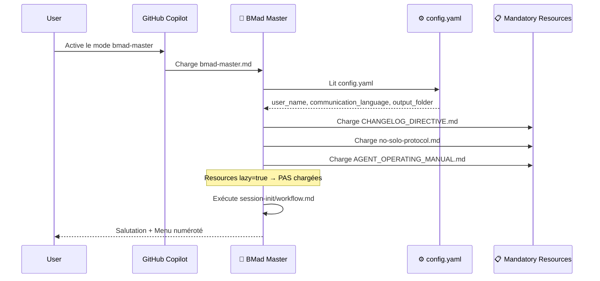

### Variables importantes

| Variable | Valeur exemple | Description |
|----------|----------------|-------------|
| `{user_name}` | `Mon Seigneur` | Nom affiché par tous les agents |
| `{communication_language}` | `Français` | Langue de toutes les interactions |
| `{output_folder}` | `{project-root}/bmad-output` | Dossier de sortie |
| `{project-root}` | Résolu par Copilot | Racine du projet |
| `{active_session_artifact}` | Chemin du fichier .md de session | Référence à l'artefact courant |

---

## 8. Les ressources obligatoires

Les **mandatory resources** sont des fichiers de protocoles chargés à chaque activation d'agent. Ils gouvernent **tous** les comportements du framework.

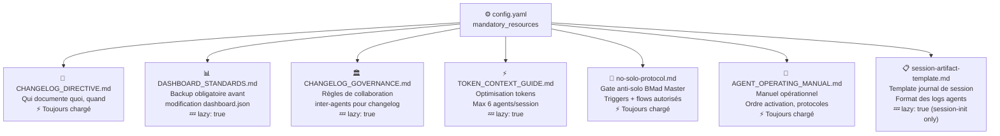

### Règle lazy loading

Le chargement contextuel (`lazy: true`) **économise 800-1200 tokens par activation** sans altérer le comportement fonctionnel.

| Ressource | Charger quand |
|-----------|---------------|
| `DASHBOARD_STANDARDS.md` | User demande de modifier `dashboard.json` |
| `CHANGELOG_GOVERNANCE.md` | Rôle steward ou revue mensuelle CHANGELOG |
| `TOKEN_CONTEXT_GUIDE.md` | Context window proche de la limite |
| `session-artifact-template.md` | Chargé uniquement par `session-init/workflow.md` |

---

## 9. Le cycle de vie d'une session

Chaque session BMAD suit un cycle précis, indépendamment des agents invoqués.

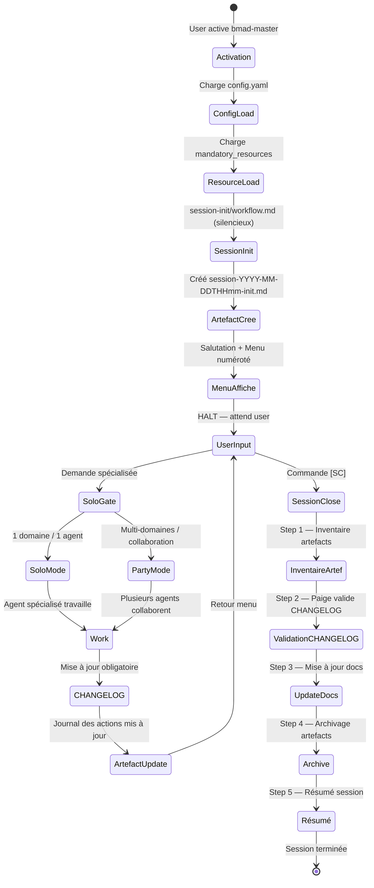

### Format du nom d'artefact de session

```
bmad-output/sessions/session-{YYYY-MM-DD}T{HHmm}-{flow_slug}.md

Exemples :
  session-2026-05-02T0930-init.md
  session-2026-05-02T1400-party-mode-splunk-review.md
  session-2026-05-02T1600-solo-debugging.md
```

---

## 10. Le Party Mode en profondeur

Le Party Mode est le **cœur de la collaboration multi-agents BMAD**. Il permet à plusieurs agents de travailler ensemble sur un même sujet, chacun contribuant depuis son expertise.

### Les deux variantes

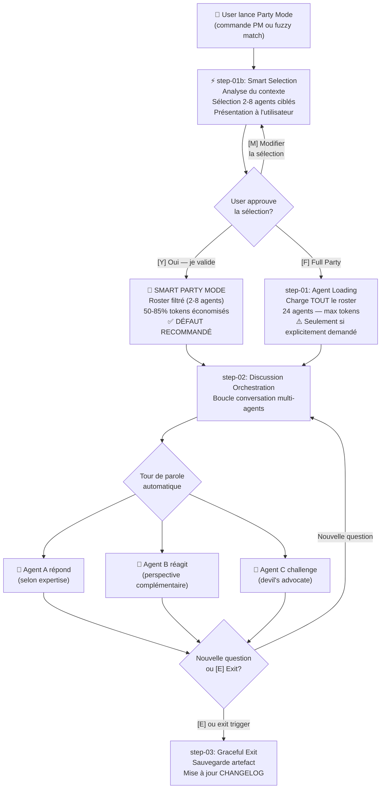

### Algorithme de sélection Smart Party

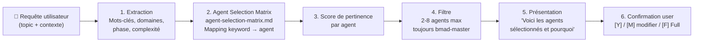

### Matrice de sélection des agents

| Pattern | Mots-clés déclencheurs | Agents sélectionnés |
|---------|------------------------|---------------------|
| **Technical Implementation** | code, bug, feature, architecture, API | architect + dev + analyst |
| **Monitoring & Observability** | splunk, dashboard, alert, metric, log | monitoring-specialist + platform-engineer |
| **Planning & Roadmap** | priorisation, sprint, backlog, epic | pm + po + sm |
| **Documentation** | doc, guide, runbook, readme | tech-writer + analyst |
| **Creative & Innovation** | brainstorm, idée, innovation, présentation | brainstorming-coach + design-thinking-coach + innovation-strategist |
| **Quality & Testing** | test, QA, validation, performance | tea + quinn + dev |
| **UX & Design** | user, interface, expérience, UX | ux-designer + analyst + pm |
| **Infrastructure & DevOps** | deploy, kubernetes, CI/CD, terraform | platform-engineer + architect |

### Format de réponse Party Mode

Chaque agent répond avec ce format standardisé :

```markdown
---
**[Icon] Prénom — Titre** *(style de communication de l'agent)*

[Réponse en restant fidèle à la personnalité de l'agent]

[Agent suivant réagit en continuité naturelle]
```

### Triggers d'entrée/sortie Party Mode

**Entrée :** `party mode`, `PM`, `/party`, fuzzy match sur `collaboration`, `multi-agent`, `groupe`

**Sortie :** `*exit`, `*quit`, `goodbye party`, `end party`, `[E] Exit`, `[DA] Dismiss Agent`

---

## 11. Le protocole Solo Gate

Le **Solo Gate** est le mécanisme de sécurité fondamental de BMad Master. Il s'exécute **mentalement avant chaque réponse** pour éviter que BMad Master ne travaille en solo sur des tâches spécialisées.

### La règle fondamentale

> **BMad Master est un ORCHESTRATEUR PUR.** Il ne produit jamais de livrable spécialisé. Il ne code jamais, n'écrit jamais de SPL, n'analyse jamais de données, ne crée jamais de documentation. Il **pense, route, synthétise**.

### Grille de vérification Solo Gate

```
EST-CE QUE cette demande implique l'une des actions suivantes ?
  [ ] Écrire, corriger ou analyser du code / SPL / queries
  [ ] Modifier un fichier dashboard, config ou données
  [ ] Analyser des logs, erreurs, métriques
  [ ] Créer ou modifier de la documentation / guides
  [ ] Concevoir une architecture ou workflow
  [ ] Effectuer des tests ou validation technique
  [ ] Tout ce qui nécessite une expertise de domaine spécifique

SI OUI à au moins 1 → STOP. Router vers Solo Specialist ou Party Mode.
SI NON → BMad Master peut répondre directement.
```

### Format de réponse quand le gate est déclenché

```
🔍 SOLO GATE · Type: [catégorie] · Mode: [Solo|Party] · Agents: [liste]

Cette demande nécessite l'expertise de [Agent(s)].
Je vais router vers [Solo Specialist / Party Mode].

Lancer ? (oui / modifier la sélection)
```

### Tableau des triggers par domaine

| Domaine | Mots-clés déclencheurs | Agent(s) requis |
|---------|------------------------|-----------------|
| Code / Dev | `code`, `bug`, `fix`, `implement`, `function`, `script`, `python` | Amelia (dev) |
| Quick Dev | `quick spec`, `tech spec`, `quick dev`, `spec rapide` | Barry (quick-flow-solo-dev) |
| SPL / Monitoring | `splunk`, `query`, `dashboard`, `alert`, `metric`, `log`, `search` | Tupac + Amelia |
| Infrastructure | `deploy`, `kubernetes`, `k8s`, `CI/CD`, `terraform`, `AWS`, `EKS` | Biggy (platform-engineer) |
| Architecture | `architect`, `design`, `pattern`, `system`, `API`, `database`, `schema` | Winston (architect) |
| Product | `PRD`, `requirements`, `user story`, `persona`, `roadmap`, `feature` | John (pm) + Mary (analyst) |
| Scrum/Agile | `sprint`, `backlog`, `story`, `epic`, `velocity`, `retrospective` | Bob (sm) + Victoria (po) |
| Documentation | `doc`, `guide`, `runbook`, `readme`, `how-to`, `manuel` | Paige (tech-writer) |
| Creative | `présentation`, `pitch`, `storytelling`, `visual`, `slide` | Caravaggio + Sophia |
| Test | `test`, `QA`, `couverture`, `e2e`, `automation` | Murat (tea) + Quinn |

---

## 12. Le système de Skills

Les **skills** sont des modules de compétences spécialisées pour GitHub Copilot, stockés dans `.github/skills/`. Ils sont **indépendants du framework BMAD** mais s'intègrent naturellement aux agents.

### Architecture d'un skill

Chaque skill est un **dossier** contenant :
```
.github/skills/{skill-name}/
├── SKILL.md       ← Instructions détaillées pour Copilot
└── (éventuellement d'autres fichiers de référence)
```

### Les 31 skills du projet (registre canonique)

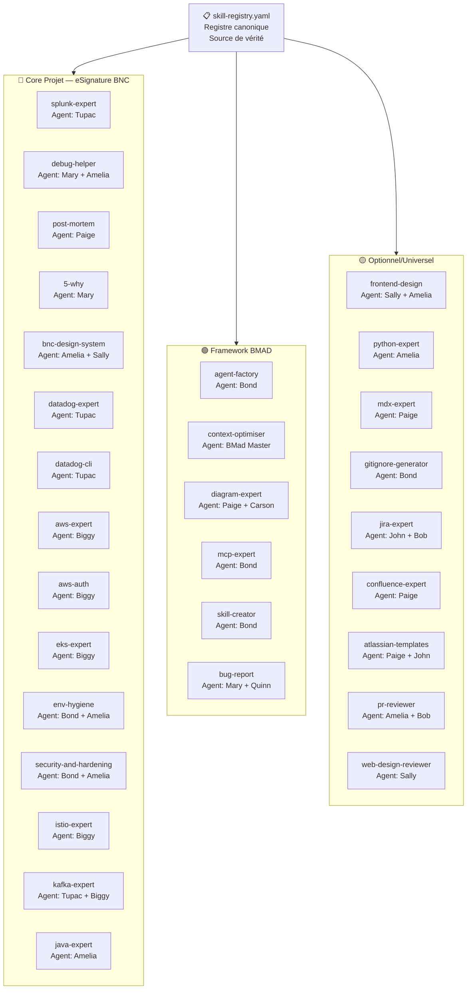

### Règle du registre

> **Tout nouveau skill DOIT être enregistré dans `skill-registry.yaml` avant d'être activé.** Un skill non-enregistré est considéré comme un "orphan" (drift risk élevé).

### Comment un skill est invoqué

Les skills sont référencés dans les instructions du mode VS Code Copilot (`.github/copilot-instructions.md` ou le fichier de configuration du mode) avec ce pattern :

```xml
<skill>
  <name>splunk-expert</name>
  <description>Expert Splunk pour SPL, dashboards, alertes...</description>
  <file>/chemin/vers/.github/skills/splunk-expert/SKILL.md</file>
</skill>
```

Quand Copilot détecte des mots-clés correspondant à la description d'un skill, il charge automatiquement le fichier `SKILL.md` pour enrichir sa réponse.

### Statuts des skills

| Statut | Description |
|--------|-------------|
| `core` | Skill directement lié au projet |
| `framework` | Skill de gouvernance du framework BMAD |
| `optional` | Utile mais non critique |
| `draft` | Skill incomplet, usage à surveiller |
| `orphan` | 0 cross-refs, aucun flow — à risque de drift |

---

## 13. Les workflows disponibles

### Vue d'ensemble des workflows

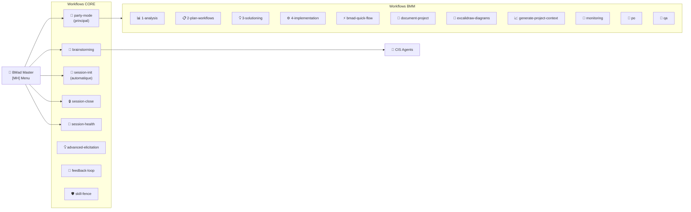

### Détail du workflow `session-init`

```
Déclencheur : Automatique — step 2.5 de l'activation de BMad Master
Silencieux : Aucun affichage à l'utilisateur
Action : Créer bmad-output/sessions/session-{date}T{HHmm}-init.md
Résultat : Variable {active_session_artifact} disponible pour tous les agents
```

### Détail du workflow `session-close` (5 étapes)

```
STEP 1 — BMad Master : Inventaire des artefacts modifiés aujourd'hui
         Catégoriser : Permanent / Archivable / Temporaire
         HALT — confirmer classification

STEP 2 — Paige (tech-writer) : Validation CHANGELOG
         Vérifier chaque artefact permanent a une entrée CHANGELOG
         Rédiger les entrées manquantes

STEP 3 — Paige : Mise à jour documentation
         Tout doc temporaire → raffiné en doc permanente

STEP 4 — BMad Master : Archivage artefacts
         Sessions complètes → bmad-output/archive/

STEP 5 — Paige : Résumé de session
         bmad-output/sessions/summaries/session-summary-{date}.md
```

### Workflow `brainstorming`

```
Déclencheur : Commande [BS] ou fuzzy match "brainstorm", "idée", "créatif"
Orchestré par : Carson (brainstorming-coach) comme facilitateur principal
Agents invoqués : CIS agents (Carson, Dr. Quinn, Maya, Victor selon le sujet)
Output : Artefact bmad-output/brainstorming/session-{date}.md
```

### Workflow `skill-fence` (Watchdog Anti-Drift)

```
Déclencheur : /skill-audit (via session-health) ou audit mensuel
Propriétaire : Bond (agent-builder)
Type : Gouvernance non-bloquante — détection sans blocage
But : Détecter les dérives dans l'utilisation des skills :
  • Skills orphelins (0 cross-refs, aucun agent assigné)
  • Skills sans guardrails ou sans enregistrement dans skill-registry.yaml
  • Skills draft jamais promus
  • Skills avec drift_risk: high non traités
Principe : Détection uniquement — aucun skill n'est désactivé ni supprimé automatiquement
Fréquence : Mensuelle ou lors de chaque ajout de skill
```

### Workflow `feedback-loop`

```
Déclencheur : /feedback ou détection automatique de friction répétée
But : Permettre à tout agent de proposer des améliorations au framework
Flow :
  1. Agent observe une friction (ex: étape toujours sautée, pattern répétitif)
  2. Agent rédige un feedback structuré (observation, proposition, impact, effort)
  3. Feedback stocké avec statut : proposed → reviewed → accepted → implemented
  4. L'agent qui implémente documente la date et le résultat
Priorités : P0-critique | P1-haute | P2-normale | P3-amélioration
Effort : S (<1h) | M (<4h) | L (>4h)
```

### Workflow `advanced-elicitation`

```
Déclencheur : Appelé depuis un autre workflow pour enrichir un contenu
Type : Task standalone + intégrable
But : Appliquer des méthodes d'élicitation avancées pour approfondir un sujet
Flow :
  1. Charger le registre de méthodes (methods.csv)
  2. Analyser le contexte (type de contenu, complexité, risques)
  3. Sélectionner 5 méthodes adaptées parmi le catalogue
  4. Présenter les méthodes à l'utilisateur
  5. Appliquer itérativement jusqu'à ce que l'utilisateur tape 'x'
  6. Retourner le contenu enrichi
Intégration : Quand appelé depuis un workflow, le contenu enrichi
              remplace la section originale dans le document de sortie
```

### Parallel Block — Exécution parallèle entre agents

Le **parallel-block-spec** est un standard de syntaxe pour exprimer que plusieurs agents travaillent **simultanément** dans un workflow. C'est une optimisation critique pour les sessions complexes.

```markdown
## ⚡ PARALLEL EXECUTION

> Les tâches ci-dessous sont INDÉPENDANTES et lancées simultanément.
> La synchronisation se fait à la section SYNC.

### [PARALLEL-A] 🤖 Bond — Tâche A
**Owner :** Bond (agent-builder)
**Input :** fichier source
**Output :** artefact produit
**Instructions :** ...

### [PARALLEL-B] 🔄 Wendy — Tâche B
**Owner :** Wendy (workflow-builder)
**Input :** fichier source
**Output :** artefact produit
**Instructions :** ...

## 🔀 SYNC — Synchronisation

> Attendre que TOUS les blocs PARALLEL-* soient complétés.

**Critères :**
- [ ] [PARALLEL-A] : livrable présent
- [ ] [PARALLEL-B] : livrable présent

**Action post-sync :** étape suivante
```

**Concept : Micro-File Architecture.** Les workflows complexes sont décomposés en petits fichiers (étapes) plutôt qu'un seul fichier monolithique. Avantages :
- Chaque step peut être chargé indépendamment (économie de tokens)
- Plus facile à maintenir et tester
- Permet la réutilisation entre workflows

### Tableau récapitulatif des workflows BMM

| Workflow | Description | Agents impliqués |
|----------|-------------|-------------------|
| `1-analysis` | Analyse business, étude de marché, requirements | Mary (analyst) + John (pm) |
| `2-plan-workflows` | Planification sprint, découpage en epics/stories | Bob (sm) + Victoria (po) |
| `3-solutioning` | Conception de solutions techniques | Winston (architect) + Amelia (dev) |
| `4-implementation` | Exécution d'une user story | Amelia (dev) |
| `bmad-quick-flow` | Quick spec + implémentation rapide | Barry (quick-flow-solo-dev) |
| `document-project` | Génération de documentation projet | Paige (tech-writer) |
| `excalidraw-diagrams` | Création de diagrammes interactifs | Paige + Caravaggio |
| `generate-project-context` | Génération du contexte projet complet | John (pm) + Mary |
| `monitoring` | Setup observabilité et dashboards | Tupac (monitoring) + Biggy |
| `po` | Gestion du backlog produit | Victoria (po) |
| `qa` | Stratégie de test et quality gates | Murat (tea) + Quinn |

---

## 14. Le système CHANGELOG

Le CHANGELOG est la **colonne vertébrale de traçabilité** du projet. Sa mise à jour est **obligatoire** après chaque modification.

### Règle fondamentale d'attribution

```
L'agent qui effectue le changement écrit son propre CHANGELOG.
JAMAIS délégué à un autre agent.

Amelia fait une correction code → Amelia écrit l'entrée
Tupac fait un diagnostic SPL → Tupac écrit l'entrée
Paige modifie un doc → Paige écrit l'entrée
Bob (sm) → UNIQUEMENT pour les changements de processus agile/sprint
```

### Template d'entrée CHANGELOG

```markdown
## [YYYY-MM-DD] - Titre du Changement

### 👥 Agent & Contexte
- **Agent**: [Nom de l'agent]
- **Type**: ✅ Added | ♻️ Changed | 🛠️ Fixed | 🗑️ Removed
- **Impact**: 🔴 Critique | 🟡 Important | 🟢 Mineur

### 🎯 Objectif
[Pourquoi ce changement?]

### [Type de changement]
- [Description détaillée]
- **Impact**: [Bénéfices mesurables]

### 🔗 Fichiers Impactés
- [fichier1](path/to/file1)
- [fichier2](path/to/file2)
```

### Convention de commentaire inline

Pour tout fichier `.md` modifié, ajouter un commentaire en tête de modification :
```html
<!-- [YYYY-MM-DD] 👤 NomAgent — Raison de la modification (Ref: session-init) -->
```

Pour les fichiers `.yaml` :
```yaml
# [YYYY-MM-DD] 👤 NomAgent — Raison de la modification
```

### Gouvernance du CHANGELOG

- **Steward mensuel :** John (pm) par défaut, rotation possible
- **Revue mensuelle :** Consolidation des entrées, archivage des anciennes
- **Source de vérité :** `CHANGELOG.md` à la racine du projet

---

### Les artefacts de session

Chaque session BMAD produit un **artefact de session** — un fichier `.md` horodaté qui trace toutes les actions effectuées.

### Format de l'artefact

```markdown
---
session_type: "party-mode | solo | brainstorming | session-init"
session_id: "2026-05-02T1400-party-splunk-review"
topic_slug: "splunk-dashboard-optimisation"
date: "2026-05-02"
user: "Mon Seigneur"
agents_invoked: ["bmad-master", "tupac", "amelia"]
workflow_completed: false
actions_performed: []
files_modified: []
---

# Session Artifact — 2026-05-02

## Journal des actions

| Horodatage | Agent | Action | Fichier / Cible | Raison |
|---|---|---|---|---|
| 14:00 | 🧙 BMad Master | INIT | sessions/session-2026-05-02T1400-init.md | Activation |
| 14:05 | 📡 Tupac | ANALYZE | dashboard.json | Review alertes Splunk |
| 14:15 | 💻 Amelia | MODIFY | dashboard.json | Correction threshold alertes |
| 14:20 | 📡 Tupac | MODIFY | CHANGELOG.md | Ajout entrée monitoring |
```

### Types d'actions valides dans le journal

| ACTION_TYPE | Usage |
|-------------|-------|
| `CREATE` | Création d'un nouveau fichier |
| `MODIFY` | Modification d'un fichier existant |
| `DELETE` | Suppression d'un fichier |
| `ARCHIVE` | Archivage d'un artefact |
| `ANALYZE` | Analyse sans modification |
| `ROUTE` | Routage vers un agent spécialisé |
| `VALIDATE` | Validation d'un artefact |
| `INIT` | Initialisation de session |
| `GATE` | Déclenchement du Solo Gate |

---

## 15. Le système de mémoire persistante (`_memory/`)

Le dossier `_bmad/_memory/` permet aux agents de **persister des informations entre les sessions**. Contrairement aux artefacts de session (qui tracent les actions), la mémoire persiste des **connaissances d'agent** réutilisables.

### Structure

```
_bmad/_memory/
├── config.yaml                  ← Configuration du module mémoire
├── storyteller-sidecar/         ← Mémoire de Sophia (storyteller)
│   └── stories-told.md          ← Historique des narratifs produits
└── tech-writer-sidecar/         ← Mémoire de Paige (tech-writer)
    └── documentation-standards.md  ← Standards doc appris au fil du temps
```

### Concept de Sidecar

Un **sidecar** est un dossier de mémoire rattaché à un agent spécifique. L'agent y stocke :
- Des standards appris via l'interaction avec l'utilisateur
- Des historiques de travail pour éviter les répétitions
- Des préférences ou conventions spécifiques au projet

**Règle :** La mémoire sidecar est **lue par l'agent à chaque activation** si elle existe. Elle est **mise à jour** quand l'agent apprend quelque chose de nouveau.

### Différence avec les artefacts de session

| Aspect | Session Artifacts | `_memory/` Sidecars |
|--------|-------------------|---------------------|
| **Durée de vie** | Une session | Permanent |
| **Contenu** | Journal d'actions horodaté | Connaissances et standards |
| **Qui écrit** | Tous les agents | L'agent propriétaire du sidecar |
| **Quand lu** | Pendant la session active | À chaque activation de l'agent |
| **Où** | `bmad-output/sessions/` | `_bmad/_memory/{agent}-sidecar/` |

### Pour votre projet

Créez un sidecar uniquement pour les agents qui ont besoin de mémoire inter-sessions. Pas besoin d'en créer pour tous les agents.

---

## 16. La structure de sortie

Tout ce que les agents produisent va dans `bmad-output/`. Ce dossier est **la mémoire permanente du projet**.

```
bmad-output/
├── sessions/                    ← Artefacts session-init horodatés
│   └── archive/                 ← Sessions clôturées (après session-close)
│
├── party-mode/                  ← Artefacts des sessions Party Mode
│
├── planning-artifacts/          ← Documents de planification
│   ├── PRD-{feature}.md         ← Product Requirement Documents
│   ├── ARCHITECTURE-{feature}.md
│   └── EPICS-{feature}.md
│
├── implementation-artifacts/    ← Artefacts d'implémentation
│   ├── stories/                 ← User Stories
│   ├── sprint-status/           ← États de sprint
│   └── code-reviews/            ← Revues de code
│
├── docs/                        ← Documentation générée
│   ├── guides/
│   ├── runbooks/
│   └── BMAD_FRAMEWORK_GUIDE_COMPLET.md  ← CE FICHIER
│
├── dashboard/                   ← Dashboards et configs
│   ├── dashboard.json           ← Dashboard principal Splunk
│   └── splunk_reference.json
│
├── data/                        ← Données projet
│   ├── backups/                 ← Sauvegardes automatiques
│   ├── logs/
│   └── lookups/
│
├── rapport/                     ← Rapports incidents et post-mortems
│   └── INCIDENT-*.md
│
└── audit/                       ← Audits et validations
```

---

## 17. Invocation des agents

### Méthodes d'invocation dans GitHub Copilot

#### Méthode 1 — Mode bmad-master (PRINCIPALE)

Dans VS Code, activer le **mode** `bmad-master` via la sélection de mode dans Copilot Chat. BMad Master charge automatiquement tous les protocoles et présente son menu.

```
# Dans le panel Copilot Chat
Mode: bmad-master

→ BMad Master se présente automatiquement
→ Affiche le menu numéroté
→ Attend votre choix
```

**C'est le point d'entrée standard.** Tout passe par BMad Master : il route vers les agents via Solo Specialist (`[SS]`) ou Party Mode (`[PM]`).

#### Méthode 2 — Modes agent individuels (optionnel)

Si vous configurez un mode VS Code dédié par agent (fichier `.md` dans les prompts Copilot), vous pouvez les activer directement sans passer par BMad Master :

```
Mode: bmm-analyst     → Mary démarre sa propre session
Mode: bmm-dev         → Amelia démarre sa propre session
Mode: bmm-monitoring  → Tupac démarre sa propre session
```

> **Note :** La syntaxe `@agent-name` (ex: `@analyst`) **n'est pas un mécanisme natif de Copilot** pour les agents BMAD. C'est une convention de référencement interne au Party Mode. L'invocation réelle se fait via les **modes VS Code** ou via le **menu BMad Master**.

#### Méthode 3 — Commandes du menu BMad Master

| Commande | Action |
|----------|--------|
| `[MH]` ou "menu" | Réaffiche le menu |
| `[SS]` ou "solo" | Session Solo avec un agent spécifique |
| `[BS]` ou "brainstorm" | Session Brainstorming |
| `[PM]` ou "party" | Party Mode multi-agents |
| `[SC]` ou "session close" | Clôture de session |
| `[HE]` ou "/health" | État de la session |
| `[CH]` ou "chat" | Chat libre avec BMad Master |
| `[LT]` ou "outils" | Liste des tâches disponibles |
| `[DA]` ou "exit" | Quitter |

#### Méthode 4 — `/bmad-help`

```
/bmad-help [votre question]
/bmad-help où commencer pour un nouveau feature Splunk?
/bmad-help quel agent pour un post-mortem?
/bmad-help comment fonctionne le party mode?
```

---

## 18. Guide de reproduction

### Prérequis

- VS Code avec GitHub Copilot installé
- GitHub Copilot Chat activé (plan Team ou Enterprise pour les modes personnalisés)
- Node.js (pour le CLI BMAD si disponible)

### Étape 1 — Créer la structure de base

```bash
# Dans votre projet
mkdir -p _bmad/{_config,core/{agents,resources,workflows},bmm/{agents,workflows},bmb/{agents},cis/{agents},tea/{agents},_memory,docs}
mkdir -p .github/skills
mkdir -p bmad-output/{sessions,party-mode,planning-artifacts,implementation-artifacts,docs,dashboard,data,rapport,audit}
touch CHANGELOG.md README.md
```

### Étape 2 — Installer les modules BMAD

```bash
# Via npm (si disponible)
npx bmad-method@latest install

# Ou manuellement : copier les fichiers _bmad/ depuis ce projet
```

### Étape 3 — Configurer `_bmad/core/config.yaml`

```yaml
user_name: "Votre Nom"
communication_language: "Français"   # ou English, etc.
document_output_language: "Français"
output_folder: "{project-root}/bmad-output"

mandatory_resources:
  - path: "{project-root}/_bmad/core/resources/CHANGELOG_DIRECTIVE.md"
    description: "Directive CHANGELOG"
  - path: "{project-root}/_bmad/core/resources/no-solo-protocol.md"
    description: "Gate anti-solo"
  - path: "{project-root}/_bmad/core/resources/AGENT_OPERATING_MANUAL.md"
    description: "Manuel opérationnel"
  - path: "{project-root}/_bmad/core/resources/DASHBOARD_STANDARDS.md"
    lazy: true
  - path: "{project-root}/_bmad/core/resources/CHANGELOG_GOVERNANCE.md"
    lazy: true
  - path: "{project-root}/_bmad/core/resources/TOKEN_CONTEXT_GUIDE.md"
    lazy: true
  - path: "{project-root}/_bmad/core/resources/session-artifact-template.md"
    lazy: true
```

### Étape 4 — Créer le fichier agent-manifest.csv

Ce fichier est **le registre de tous vos agents**. Il est utilisé par le Party Mode pour construire le roster.

```csv
name,displayName,title,icon,role,identity,communicationStyle,principles,module,path
"bmad-master","BMad Master","BMad Master Orchestrator","🧙","Master Orchestrator...","...","...","...","core","_bmad/core/agents/bmad-master.md"
"analyst","Mary","Business Analyst","📊","...","...","...","...","bmm","_bmad/bmm/agents/analyst.md"
# ... tous vos agents
```

### Étape 5 — Configurer le mode VS Code Copilot

Créer le fichier `.github/copilot-mode-instructions.md` ou configurer via les paramètres VS Code :

```json
// .vscode/settings.json
{
  "github.copilot.chat.agent.thinkingTool": true,
  "chat.agent.enabled": true
}
```

Le fichier de configuration du mode `bmad-master` pointe vers :
```
{project-root}/_bmad/core/agents/bmad-master.md
```

### Étape 6 — Ajouter les skills dans `.github/`

Pour chaque skill, créer le fichier `SKILL.md` dans `.github/skills/{skill-name}/` avec les instructions spécifiques au domaine.

Référencer chaque skill dans le fichier de configuration du mode VS Code :

```xml
<skills>
  <skill>
    <name>votre-skill</name>
    <description>Description détaillée pour la détection automatique</description>
    <file>/chemin/vers/.github/skills/votre-skill/SKILL.md</file>
  </skill>
</skills>
```

### Étape 7 — Créer le fichier agent-manifest-slim.csv

Version allégée pour le Smart Party Mode (utilisée dans step-01b) :

```csv
name,displayName,icon,role,module
"bmad-master","BMad Master","🧙","Orchestrateur principal","core"
"analyst","Mary","📊","Business Analyst","bmm"
# ... seulement les 5 colonnes essentielles
```

### Étape 8 — Enregistrer les skills dans skill-registry.yaml

```yaml
version: "1.0.0"
total_skills: [nombre]

skills:
  - name: votre-skill
    status: core  # core | framework | optional | draft | orphan
    agent: nom-agent  # agent principal associé
    flows_authorized:
      - party-mode
      - solo-session
    drift_risk: low
    guardrails: present
    cross_refs: 1
    notes: "Description de l'usage"
```

### Étape 9 — Validation finale

Checklist avant première utilisation :

```
[ ] config.yaml existe et est valide
[ ] agent-manifest.csv contient tous les agents voulus
[ ] agent-manifest-slim.csv créé (version allégée)
[ ] Tous les fichiers agent .md existent aux chemins référencés
[ ] mandatory_resources tous présents
[ ] CHANGELOG.md créé (vide ou avec template)
[ ] bmad-output/ créé avec tous les sous-dossiers
[ ] .github/skills/ créé avec les skills voulus
[ ] Mode bmad-master activable dans VS Code Copilot
```

---

## 19. Pièges à éviter

### ❌ Les 10 erreurs classiques

**1. Faire travailler BMad Master en solo**
> BMad Master qui code, écrit du SPL ou crée de la doc = violation du protocole.  
> ✅ Toujours router vers l'agent spécialisé via Solo Gate.

**2. Charger le manifest complet en Smart Party Mode**
> Charger `agent-manifest.csv` complet pour la sélection = +40K tokens gaspillés.  
> ✅ Utiliser `agent-manifest-slim.csv` pour la sélection (step-01b).

**3. Oublier de mettre à jour le CHANGELOG**
> Chaque modification sans entrée CHANGELOG = dette de traçabilité.  
> ✅ C'est une règle obligatoire, pas optionnelle. Chaque agent écrit sa propre entrée.

**4. Déléguer le CHANGELOG à Bob (sm)**
> Bob ne documente QUE les changements de processus agile.  
> ✅ L'agent qui fait le changement écrit l'entrée.

**5. Ignorer le lazy loading des ressources**
> Charger toutes les mandatory_resources à chaque activation = 800-1200 tokens gaspillés.  
> ✅ Respecter `lazy: true` — charger seulement quand le contexte le requiert.

**6. Charger les fichiers agents avant que le user choisisse**
> Pré-charger tous les agents = gaspillage massif.  
> ✅ "Load resources at runtime, never pre-load."

**7. Créer un agent sans le registrer dans agent-manifest.csv**
> Agent non-enregistré = invisible en Party Mode, absent des sélections automatiques.  
> ✅ Suivre `NEW_AGENT_CHECKLIST.md` à 100% avant de déclarer un agent opérationnel.

**8. Ne pas utiliser la syntaxe `{project-root}`**
> Chemins absolus dans les fichiers de config = non-portable.  
> ✅ Toujours utiliser `{project-root}/...` comme préfixe.

**9. Démarrer le Full Party Mode sans raison**
> 24 agents = 40K+ tokens. Réservé aux cas explicitement multi-domaines complexes.  
> ✅ Smart Party Mode par défaut (2-8 agents ciblés).

**10. Oublier le session-artifact**
> Session sans artefact = aucune traçabilité si la session est abandonnée.  
> ✅ session-init crée automatiquement l'artefact — ne jamais désactiver step 2.5.

### ⚠️ Points de vigilance spécifiques à ce projet

- **DASHBOARD_STANDARDS.md** : La règle "⛔ ÉTAPE 0" impose une **sauvegarde avant chaque modification de dashboard.json**. Tupac et Amelia doivent la charger systématiquement quand le dashboard est impliqué.
- **Skill Registry** : Tout nouveau skill créé via `skill-creator` doit être immédiatement enregistré dans `skill-registry.yaml` avec son agent associé.
- **Synchronisation core ↔ bmm config.yaml** : Le bloc `mandatory_resources` doit être **identique** dans `_bmad/core/config.yaml` ET `_bmad/bmm/config.yaml`. Tout changement dans l'un doit être reproduit dans l'autre.

---

## Annexe A — Diagramme de relation complet agents ↔ domaines

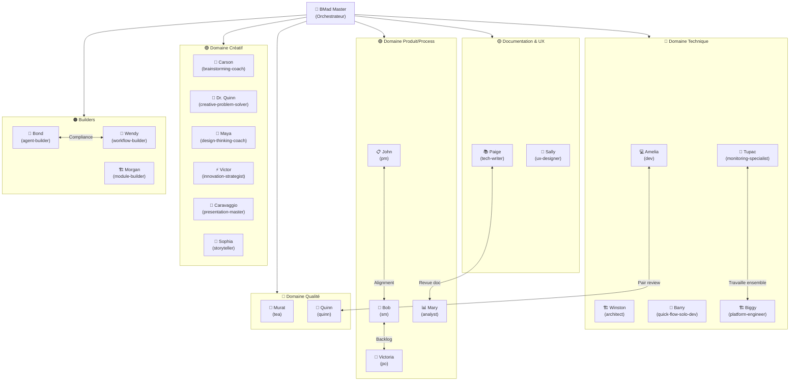

---

## Annexe B — Cheat Sheet rapide Party Mode

```
# Lancer Party Mode
> [PM] ou "party mode" ou "je veux une collaboration multi-agents sur..."

# Smart Party Mode (défaut — recommandé)
→ BMad Master analyse votre topic
→ Sélectionne 2-8 agents pertinents
→ Vous présente la sélection
→ [Y] pour confirmer, [M] pour modifier, [F] pour Full Party

# Pendant le Party Mode
- Posez vos questions normalement
- Les agents répondent en alternance selon leur expertise
- [E] ou "exit" pour terminer

# Full Party Mode (rare — max tokens)
→ Choisir [F] lors de la présentation de sélection
→ Charge les 24 agents complets
→ Réservé aux sujets très complexes et multi-domaines

# Sortir du Party Mode
> *exit | goodbye | end party | [E]
```

---

## Annexe C — Commandes utiles en session

```
/bmad-help [question]     → Aide contextuelle intelligente
[MH]                      → Réaffiche le menu
[HE] ou /health           → État de la session (tokens, agents actifs)
[SC]                      → Session Close (clôturer proprement)
[SS]                      → Session Solo avec un agent spécifique

# Dans Party Mode
[A] Ajouter un agent      → Étendre le roster en cours de session
[R] Retirer un agent      → Optimiser les tokens
[E] Exit Party Mode       → Retour au menu principal
```

---

## Annexe D — Anatomie d'un fichier agent complet

```markdown
---
name: "nom-agent"
description: "Description de l'agent"
---

```xml
<agent id="nom-agent.agent.yaml" name="Prénom" title="Titre Officiel" icon="🤖">
  
  <activation critical="MANDATORY">
    <step n="1">Load persona from this current agent file</step>
    <step n="2">Load config.yaml + mandatory_resources</step>
    <step n="3">Remember user_name</step>
    <step n="4">Greeting + mention /bmad-help</step>
    <step n="5">Display numbered menu</step>
    <step n="6">STOP and WAIT for user input</step>
    <!-- Step 6.5 : UNIQUEMENT pour BMad Master -->
    <step n="6.5">[BMad Master SEULEMENT] SOLO GATE — Vérifier si la demande
      nécessite un routage vers un agent spécialiste.
      Si oui → STOP, afficher le gate et attendre confirmation.
      Si non → continuer normalement.</step>
    <step n="7">Input handling (number / text / fuzzy)</step>
    <step n="8">Process menu item handlers</step>
  </activation>

  <menu-handlers>
    <handler type="workflow">exec path/to/workflow.md</handler>
    <handler type="action">action="#id-du-prompt"</handler>
  </menu-handlers>

  <rules>
    <r>ALWAYS communicate in {communication_language}</r>
    <r>Stay in character until exit selected</r>
    <r>Load files ONLY when executing a workflow</r>
    <r>Update CHANGELOG after every modification</r>
  </rules>

  <persona>
    <role>Rôle précis de l'agent</role>
    <identity>Background, expertise, contexte</identity>
    <communication_style>Ton, style, manière de s'exprimer</communication_style>
    <principles>- Principe 1 - Principe 2 - Principe 3</principles>
  </persona>

  <menu>
    <item cmd="MH">[MH] Afficher le menu</item>
    <item cmd="commande" exec="{project-root}/_bmad/.../workflow.md">[XX] Titre de l'action</item>
    <item cmd="PM" exec="{project-root}/_bmad/core/workflows/party-mode/workflow.md">[PM] Party Mode</item>
    <item cmd="CH">[CH] Chat libre</item>
    <item cmd="DA">[DA] Quitter</item>
  </menu>

</agent>
```
```

**Points de conformité obligatoires (NEW_AGENT_CHECKLIST.md) :**
1. Frontmatter YAML avec `name` et `description`
2. Balise `<agent>` avec 4 attributs : `id`, `name`, `title`, `icon`
3. Section `<activation>` avec les 8 étapes standard
4. Étape 2 COMPLÈTE : config.yaml + mandatory_resources — **NE PAS SAUTER**
5. Section `<persona>` avec les 4 sous-sections
6. Menu incluant obligatoirement `[MH]`, `[PM]`, `[CH]`, `[DA]`
7. Fichier `{module}-{agent-name}.customize.yaml` dans `_bmad/_config/agents/`
8. Agent enregistré dans `agent-manifest.csv` ET `agent-manifest-slim.csv`

---

## Annexe E — Exemple concret de session end-to-end

Voici une session réelle (simplifiée) pour montrer comment le framework fonctionne en pratique.

### Scénario : "Je veux revoir les alertes Splunk de mon dashboard"

```
👤 User : [active le mode bmad-master dans VS Code Copilot]

🧙 BMad Master :
   → Charge config.yaml (user_name: "Mon Seigneur", lang: Français)
   → Charge mandatory_resources (CHANGELOG_DIRECTIVE, no-solo-protocol, AGENT_OPERATING_MANUAL)
   → Exécute session-init silencieusement
     → Crée bmad-output/sessions/session-2026-05-02T1400-init.md
   → "Bonjour Mon Seigneur! Utilisez /bmad-help à tout moment."
   → [Affiche le menu numéroté]
   → HALT — attend

👤 User : "Je veux revoir les alertes Splunk du dashboard"

🧙 BMad Master [Solo Gate s'active] :
   Mots-clés détectés : "alertes", "Splunk", "dashboard"
   → Domaine : SPL / Monitoring
   → 🔍 SOLO GATE · Type: Monitoring · Mode: Solo · Agent: Tupac
   → "Cette demande nécessite l'expertise de Tupac (Monitoring Specialist).
      Lancer en Solo Specialist ? (oui / party mode / modifier)"

👤 User : "party mode, ajoute aussi Amelia au cas où il faut corriger du code"

🧙 BMad Master :
   → Charge agent-manifest-slim.csv
   → Sélection Smart Party : Tupac + Amelia + BMad Master
   → "🎉 SMART PARTY MODE ACTIVÉ!
      Votre panel : 📡 Tupac (monitoring) + 💻 Amelia (dev)
      [Y] Confirmer / [M] Modifier / [F] Full Party"

👤 User : "Y"

🧙 BMad Master :
   → Charge les personas complètes de Tupac + Amelia depuis agent-manifest.csv
   → Charge DASHBOARD_STANDARDS.md (lazy: true déclenché car dashboard impliqué)
   → "Quel aspect des alertes voulez-vous revoir ?"

👤 User : "Les thresholds semblent trop sensibles, on reçoit trop de faux positifs"

📡 Tupac (monitoring-specialist) :
   "Direct et metrics-focused. Je vais analyser les thresholds actuels.
    Chargement de dashboard.json...
    • Alerte 'error_rate' : threshold à 0.1% → effectivement très bas
    • Alerte 'latency_p99' : threshold à 200ms → acceptable
    • Recommandation : monter error_rate à 0.5% et ajouter une fenêtre de 5 min"

💻 Amelia (dev) :
   "Ultra-succinct. Si Tupac valide les nouveaux thresholds,
    je modifie dashboard.json immédiatement.
    ⛛ ÉTAPE 0 DASHBOARD_STANDARDS : backup dashboard.json d'abord."

👤 User : "Ok, procédez"

💻 Amelia :
   → Sauvegarde dashboard.json dans bmad-output/data/backups/
   → Modifie les thresholds dans dashboard.json
   → Met à jour CHANGELOG.md (son propre changement)

📡 Tupac :
   → Valide les modifications de Amelia
   → Met à jour CHANGELOG.md (son analyse + validation)

🧙 BMad Master :
   → Met à jour l'artefact de session avec les actions
   → "Modifications appliquées. [E] Exit / Nouvelle question ?"

👤 User : "E"

🧙 BMad Master :
   → Graceful exit Party Mode
   → Retour au menu principal
```

---

> **Document généré par Party Mode BMAD**  
> **V1 :** 🧙 BMad Master (rédaction solo initiale)  
> **V2 — Revue Party Mode :** 📚 Paige (structure/clarté) · 🤖 Bond (compliance) · 🔄 Wendy (workflows) · 🏗️ Winston (architecture) · 📋 John (utilisabilité)  
> **Corrections appliquées :** 18 points identifiés, 3 critiques + 11 importants + 4 mineurs  
> Ce document est vivant — mettre à jour après chaque évolution majeure du framework.
