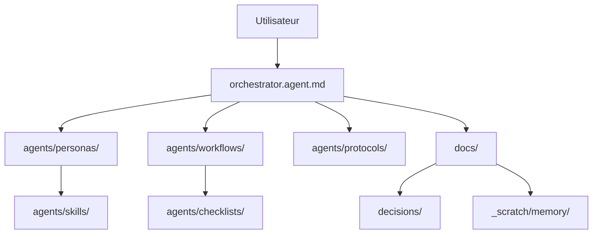

# Plan d'action — Audit exhaustif v0.1.4

> **Source** : Audit zav-sandbox v0.1.4 — 2026-05-30  
> **Décision architecturale** : voir [ADR-0006](../decisions/0006-modulariser-orchestrator.md)  
> **Périmètre** : 15 problèmes identifiés, regroupés en 3 phases  
> **Règle** : les phases 1 et 2 précèdent l'ouverture publique (Phase 9).

---

## Vue d'ensemble

| Phase | Items | Condition |
|---|---|---|
| **Phase 1 — Bloquants ouverture** | P1, P2, P4, P5, P6 | Obligatoire avant Phase 9 |
| **Phase 2 — Améliorations majeures** | P3, P7, P8, P9, P10, P11, P12 | Souhaitable avant Phase 9 |
| **Phase 3 — Nice-to-have** | P13, P14, P15 | Post-Phase 9 acceptable |

> Note : P3 a été reclassé de "Phase 1" à "Phase 2" — la politique de rétention est importante mais non bloquante immédiatement.

---

## Phase 1 — Bloquants ouverture publique

### P1 — Modulariser orchestrator.agent.md *(Critique)*

**Problème** : 310 lignes, ~3K tokens chargés systématiquement. Chaque phase ajoute des sections.  
**Décision** : ADR-0006 → extraire Party Mode + Skills + Memory en modules.

| Action | Fichier(s) | Critère |
|---|---|---|
| Créer `.github/agents/modules/party-mode.md` | nouveau | Contient toute la section Party Mode (Panel + Débat) |
| Créer `.github/agents/modules/skills.md` | nouveau | Contient règles progressive disclosure + tableau skills |
| Créer `.github/agents/modules/memory.md` | nouveau | Contient toute la section Mémoire persistante |
| Remplacer les 3 sections dans l'orchestrator par des références courtes | `.github/agents/orchestrator.agent.md` | orchestrator ≤ 180 lignes |
| Session test 3 scénarios (incident / feature / question simple) | — | Zéro régression comportementale |

**Dépendances** : aucune  
**Effort estimé** : 2–3 h

---

### P2 — Créer le workflow Onboarding *(Critique)*

**Problème** : aucun parcours guidé pour un nouvel utilisateur. Le README explique le concept, pas la pratique.  
**Cible** : un guide "5 minutes" avec séquence pas à pas, premier cas d'usage, résultat attendu.

| Action | Fichier(s) | Critère |
|---|---|---|
| Créer `agents/workflows/onboarding.md` | nouveau | Guide ≤ 3 étapes, 1 cas d'usage concret, 5 min max |
| Ajouter lien dans `README.md` (section "Démarrage") | `README.md` | Lien visible avant le fold |
| Ajouter entrée dans le mapping workflow → personas de l'orchestrator | `orchestrator.agent.md` | Type "Découverte du framework" → onboarding.md |

**Dépendances** : P1 (si on modifie l'orchestrator, autant grouper)  
**Effort estimé** : 1–2 h

---

### P4 — Ajouter SECURITY.md *(Élevé)*

**Problème** : repo public sans canal de signalement de vulnérabilité. GitHub affiche un avertissement. Standard requis.

| Action | Fichier(s) | Critère |
|---|---|---|
| Créer `SECURITY.md` à la racine | nouveau | Sections : politique de divulgation responsable, contact, versions supportées |
| Créer `.github/ISSUE_TEMPLATE/bug_report.md` | nouveau | Template GitHub Issues pour bug report framework |

**Dépendances** : aucune  
**Effort estimé** : 30 min

---

### P5 — Rendre les hooks visibles dans le README *(Élevé)*

**Problème** : `security-guard.ps1` et `memory-nudge.ps1` sont des features de sécurité invisibles. Un utilisateur peut travailler 6 mois sans les connaître.

| Action | Fichier(s) | Critère |
|---|---|---|
| Ajouter section "Fonctionnalités optionnelles" dans README | `README.md` | Description hooks + lien vers `agents/hooks/README.md` + commande d'installation |

**Dépendances** : P6 (si on unifie les hooks d'abord, le README pointe vers la bonne implémentation)  
**Effort estimé** : 20 min

---

### P6 — Clarifier la relation entre agents/hooks/ et scripts/hooks/ *(Élevé)*

**Problème** : double implémentation sans mention croisée. `agents/hooks/` (PS1 + SH) vs `scripts/hooks/pre-push` + `scripts/install-hooks.sh`. Risque de divergence silencieuse.

**Investigation préalable requise** :
- Lire `agents/hooks/README.md` et `scripts/hooks/pre-push` pour comparer les logiques
- Vérifier si `agents/hooks/hooks.json` référence `scripts/hooks/`

| Action | Fichier(s) | Critère |
|---|---|---|
| Auditer les deux implémentations (logique identique ou divergente ?) | lecture seule | Constat documenté |
| **Si identiques** : supprimer `scripts/hooks/` et pointer `scripts/install-hooks.sh` vers `agents/hooks/` | `scripts/install-hooks.sh`, éventuellement `scripts/hooks/` | Une seule source de vérité |
| **Si divergentes** : documenter la différence et le use case de chacune | `agents/hooks/README.md` | Clarté sur lequel installer selon le contexte |
| Mettre à jour `agents/hooks/hooks.json` si nécessaire | `agents/hooks/hooks.json` | Cohérence |

**Dépendances** : aucune  
**Effort estimé** : 1 h (audit) + 30 min (correction)

---

## Phase 2 — Améliorations majeures

### P3 — Politique de rétention pour docs/_scratch/memory/ *(Élevé)*

**Problème** : aucun cycle de vie défini pour les checkpoints. À 10+ threads sur 3 mois, la règle "charger UN SEUL checkpoint" devient manuellement infaisable.

| Action | Fichier(s) | Critère |
|---|---|---|
| Définir une politique de rétention (ex. checkpoint `closed` → archivé après 30 jours) | `agents/protocols/preflight.md` ou `orchestrator.agent.md` | Règle écrite et testable |
| Créer `docs/_scratch/memory/README.md` avec index des fils actifs + politique de nommage | nouveau | Index lisible, mis à jour par le Scribe lors de `/checkpoint` |
| Documenter la commande `/memory-list` dans l'orchestrator (liste les fils actifs) | `orchestrator.agent.md` | Commande listée dans la section "Commandes spéciales" |

**Dépendances** : P1 (si on modifie l'orchestrator, autant grouper)  
**Effort estimé** : 1 h

---

### P7 — Lint CI sur les conventions de nommage Markdown *(Moyen)*

**Problème** : le CI ne valide pas `YYYY-MM-DD-slug.md`, les frontmatters requis, ni les conventions de dossier. Un contributeur peut créer `docs/incidents/incident_du_14mai.md` sans alerte.

| Action | Fichier(s) | Critère |
|---|---|---|
| Créer `.github/workflows/lint-markdown.yml` | nouveau | S'exécute sur PR, vérifie nommage + markdownlint |
| Ajouter `.markdownlint.json` de configuration | nouveau | Règles alignées sur les conventions du projet |
| Ajouter validation de pattern de nommage (script ou action) | nouveau | Bloque si un fichier dans `docs/` ne respecte pas `YYYY-MM-DD-slug.md` ou `NNNN-slug.md` |

**Dépendances** : aucune  
**Effort estimé** : 1–2 h

---

### P8 — Rappel contextuel de /quick dans le PLAN *(Moyen)*

**Problème** : la friction CONFIRM est un goulot d'étranglement invisible. `/quick` existe mais est enfoui dans 310 lignes. Lors d'un incident P1, l'utilisateur ne s'en souvient pas.

| Action | Fichier(s) | Critère |
|---|---|---|
| Ajouter dans la section CONFIRM de l'orchestrator une note : « Urgence ? Réponds `/quick` pour sauter cette confirmation. » | `orchestrator.agent.md` | Note visible dans la section CONFIRM du flux obligatoire |

**Dépendances** : P1 (modification de l'orchestrator)  
**Effort estimé** : 5 min

---

### P9 — Alléger IDEAS.md (972 lignes, ~60% archives) *(Moyen)*

**Problème** : les idées 🟢 traitées (~600 lignes) polluent potentiellement le context window sur sessions longues.

| Action | Fichier(s) | Critère |
|---|---|---|
| Déplacer la section archives (idées 🟢) vers `docs/_scratch/2026-05-30-ideas-archives.md` | `IDEAS.md`, nouveau | IDEAS.md ≤ 200 lignes actives (idées 🟡 + 🔴 uniquement) |
| Ajouter en tête de IDEAS.md un lien vers l'archive | `IDEAS.md` | Traçabilité conservée |

**Dépendances** : aucune  
**Effort estimé** : 30 min

---

### P10 — Traiter les 3 fichiers orphelins de docs/_reference/ *(Moyen)*

**Problème** : `BMAD_FRAMEWORK_GUIDE_COMPLET.md`, `howtoprompt.md`, `phase-4-test-notes.md` — aucun fichier actif ne les référence. Bruit documentaire.

| Action | Fichier(s) | Critère |
|---|---|---|
| **Confirmer** : aucun fichier actif ne pointe vers `docs/_reference/` (grep) | lecture seule | Vérification objective |
| **Si confirmé orphelin** : déplacer vers `docs/_scratch/` (valeur historique) ou supprimer après confirmation utilisateur | `docs/_reference/` | Dossier vide ou supprimé |

> ⚠️ Suppression irréversible → confirmation utilisateur requise avant exécution.

**Dépendances** : aucune  
**Effort estimé** : 15 min (+ confirmation)

---

### P11 — Diagramme d'architecture du framework dans le README *(Moyen)*

**Problème** : un nouveau contributeur GitHub n'a pas de vue d'ensemble visuelle. Le README décrit les pièces sans les montrer connectées.

| Action | Fichier(s) | Critère |
|---|---|---|
| Ajouter un diagramme Mermaid dans `README.md` (section "Architecture") | `README.md` | Diagramme flowchart : orchestrator → personas → protocols → skills → docs/ → checkpoints |

Ébauche du diagramme :

**Dépendances** : P1 (si l'architecture change avec les modules, le diagramme doit en tenir compte)  
**Effort estimé** : 30 min

---

### P12 — Documenter l'usage en équipe (multi-utilisateurs) *(Moyen)*

**Problème** : checkpoints conflictuels, ADRs aux mêmes numéros, états ROADMAP divergents — cas réel non documenté.

| Action | Fichier(s) | Critère |
|---|---|---|
| Ajouter une section "Usage en équipe" dans `README.md` | `README.md` | Conventions : nommage checkpoints avec initiales/user, réservation de plage ADR, workflow de synchronisation minimal |
| Ou créer `docs/architecture/2026-05-30-multi-user-coordination.md` si contenu > 1 page | nouveau | Section README avec lien vers le doc détaillé |

**Dépendances** : aucune  
**Effort estimé** : 1 h

---

## Phase 3 — Nice-to-have (post Phase 9 acceptable)

### P13 — Créer l'index des Skills *(Faible)*

| Action | Fichier(s) | Critère |
|---|---|---|
| Créer `agents/skills/README.md` | nouveau | Tableau : skill / description / when to use / auteur / date ajout + critères pour contribuer une nouvelle skill |

**Effort estimé** : 20 min

---

### P14 — Standardiser le message de saturation de contexte *(Faible)*

**Problème** : chaque session formule le signal de saturation différemment. L'utilisateur ne sait pas si c'est normal.

| Action | Fichier(s) | Critère |
|---|---|---|
| Ajouter dans `agents/protocols/preflight.md` un template de message type | `agents/protocols/preflight.md` | Template exact, copiable, avec les 2 options (checkpoint + session neuve / continuer) |

**Effort estimé** : 15 min

---

### P15 — Créer CONTRIBUTING.md *(Faible — bloquant avant Phase 9)*

| Action | Fichier(s) | Critère |
|---|---|---|
| Créer `CONTRIBUTING.md` à la racine | nouveau | Sections : comment contribuer une persona / un skill / un workflow, conventions de nommage, processus PR, lien vers ADR-template |

**Effort estimé** : 1 h

---

## Suivi d'avancement

| ID | Titre | Phase | Statut |
|---|---|---|---|
| P1 | Modulariser orchestrator.agent.md | 1 | ⬜ À faire |
| P2 | Workflow Onboarding | 1 | ⬜ À faire |
| P4 | SECURITY.md + template bug report | 1 | ⬜ À faire |
| P5 | Hooks visibles dans README | 1 | ⬜ À faire |
| P6 | Unifier/clarifier double implémentation hooks | 1 | ⬜ À faire |
| P3 | Politique rétention memory/ | 2 | ⬜ À faire |
| P7 | Lint CI nommage Markdown | 2 | ⬜ À faire |
| P8 | Rappel /quick dans PLAN | 2 | ⬜ À faire |
| P9 | Alléger IDEAS.md | 2 | ⬜ À faire |
| P10 | Supprimer/déplacer docs/_reference/ | 2 | ⬜ À faire |
| P11 | Diagramme architecture README | 2 | ⬜ À faire |
| P12 | Section usage en équipe | 2 | ⬜ À faire |
| P13 | Index des Skills | 3 | ⬜ À faire |
| P14 | Template saturation contexte | 3 | ⬜ À faire |
| P15 | CONTRIBUTING.md | 3 | ⬜ À faire |

---

## Points à confirmer avant action

1. **P10 (docs/_reference/)** : supprimer ou déplacer dans `docs/_scratch/` ? Demander confirmation avant toute action irréversible.
2. **P6 (hooks)** : audit préalable requis pour choisir entre unification et documentation de la divergence.
3. **docs/_scratch/mvp-inputs/** : ces fichiers (`datadog-snapshot.md`, `splunk-extract.md`, `runtime-config.md`) ne sont **pas dans `.gitignore`**. Ils sont committés avec des données fictives qui ressemblent à du réel. Décision requise : les marquer clairement comme fixtures (`# FIXTURE — données synthétiques`) ou les déplacer dans un dossier `.gitignore`-é.
