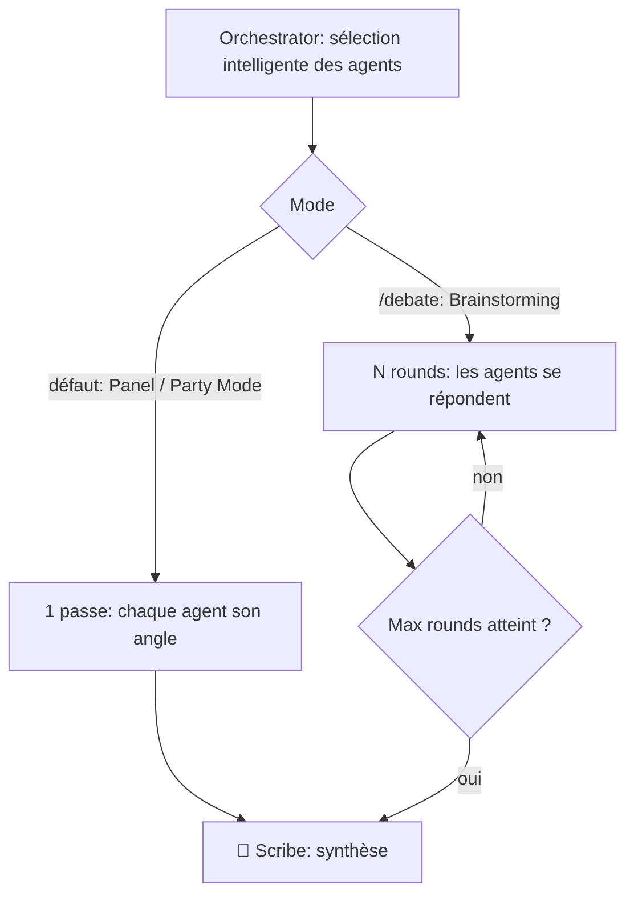
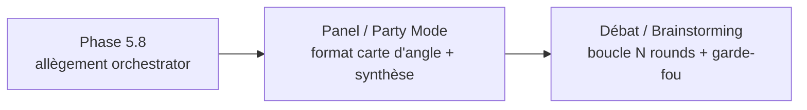

# Architecture — Party Mode : Panel (défaut) vs Débat (sur invocation)

> **Usage :** document de décision qui **fige la sémantique** du Party Mode et
> corrige la définition antérieure de la ROADMAP Phase 6. Source de vérité pour
> toute implémentation des modes multi-personas.

---

## Vue d'ensemble

**Système :** mécanique d'orchestration multi-personas du framework Agentic Team.
**Utilisateurs / consommateurs :** l'orchestrateur (custom agent) et l'utilisateur
qui mène une session (analyste technique, DevOps/SRE).
**Problème résolu :** clarifier ce qui est *par défaut* vs *sur invocation* dans la
coordination de plusieurs personas, et borner le coût en tokens par construction.

---

## Décision

Le **Party Mode est le mode nominal du framework**, toujours actif. Il se décline
en **deux réglages de la même mécanique** (sélection intelligente des agents par
l'orchestrateur), qui ne diffèrent que par le nombre de passes :

| | **Panel** — Party Mode (défaut) | **Débat** — Brainstorming (sur invocation) |
|---|---|---|
| Statut | Mode nominal, **toujours actif** | Activé explicitement par l'utilisateur (`/debate`) |
| Nature du problème | **Fermé** : il y a une réponse à trouver | **Ouvert** : on bloque ou on explore |
| Travail type | Incident, analyse, doc, design | Brainstorming, arbitrage, idéation |
| Valeur de la friction | Coûteuse → on l'évite | Productive → on la cherche |
| Mécanique | Chaque expert → son angle **une fois** → synthèse Scribe | Les experts se répondent sur **N rounds** → synthèse Scribe |
| Sélection des agents | Intelligente, contextuelle (orchestrateur) | Intelligente, contextuelle (orchestrateur) |
| Coût tokens | Borné par construction (1 passe) | Volontairement plus élevé (assumé) |
| Garde-fou | Aucun nécessaire (borné) | Max rounds avant synthèse forcée |

**Brique centrale commune** : la sélection intelligente des agents par
l'orchestrateur. Panel et Débat ne sont que deux réglages — *une passe* vs
*N rounds* — de cette même brique.

---

## Correction de la définition antérieure (ROADMAP Phase 6)

La ROADMAP définissait jusqu'ici le Party Mode comme un **mode délibératif**
(« plusieurs personas débattent en direct… »). Cette décision **renomme** :

| Concept | Ancienne définition (ROADMAP avant 2026-05-30) | Nouvelle définition (cette note) |
|---|---|---|
| **Party Mode** | Mode délibératif (débat en direct) | **Panel par défaut** : sélection intelligente + 1 angle chacun + synthèse |
| **Mode délibératif** | = Party Mode | **Débat** : brique séparée, sur invocation, fusionnée avec le brainstorming |
| **Auto-détection exploratoire/exécutable** | À construire (morceau dur) | **Hors scope** — remplacée par l'invocation manuelle `/debate` |

**Pourquoi ce changement est plus sûr :**

- L'**auto-détection** « exploratoire vs exécutable » était le seul vrai morceau
  risqué (piège classique des systèmes multi-agents : sur-déclenchement →
  gaspillage de tokens). En rendant le Débat **explicitement invocable**, on la
  supprime du scope.
- Le **Panel** devient quasi-immédiatement constructible : c'est le comportement
  nominal enrichi (sélection d'agents déjà faite par l'orchestrateur + format
  « un angle chacun » + synthèse Scribe).
- Le **Débat** se réduit à un incrément maîtrisé : boucle de réaction +
  compteur de rounds. Plus aucune heuristique fragile.

---

## Règle binaire de séparation (pour le protocole)

> **Panel** : aucun persona ne réagit à un autre. **Une passe**, puis Scribe synthétise.
> **Débat** : les personas réagissent entre eux, **max N rounds**, puis Scribe force la synthèse.

Le garde-fou anti-saturation (max rounds) ne s'applique **qu'au Débat** — le Panel
est borné par construction.

---

## Flux



---

## Format des contributions (carte d'angle)

En Panel, chaque persona émet **une carte d'angle au format contraint** (inspirée
du « handoff packet » du référentiel agentique, version allégée). Plafond strict
3 lignes — double bénéfice : concision multi-perspectives **et** discipline tokens
(sert la Phase 5.8) :

```
─── 🛠️ DevOps — Angle ───
Position : <1 ligne>
Risque clé : <1 ligne>
Reco : <1 ligne>
```

Synthèse du Scribe, format fixe :

```
─── 📝 Scribe — Synthèse panel ───
Convergences : …
Divergences : …
Options dégagées : …
Reco / question ouverte : …
```

---

## Alignement VISION

| Filtre VISION | Respect |
|---|---|
| 1. Pour qui ? | ✅ Sert l'analyste/DevOps : multi-perspectives sans surcoût |
| 2. Configuration markdown ? | ✅ Protocole + commande, 100% markdown |
| 3. VSCode + Copilot natif ? | ✅ Aucune dépendance nouvelle |
| 4. Pas de dev senior requis ? | ✅ Une commande (`/debate`), un protocole lisible |
| 5. Anti-drift / session longue ? | ✅ Panel borné par construction ; carte d'angle limite la verbosité |
| 6. Produit un livrable ? | ✅ Panel et Débat se closent **toujours** par une synthèse Scribe committée |

---

## Séquence d'implémentation recommandée



1. **Phase 5.8 d'abord** (allègement de `orchestrator.agent.md`) — la note IDEAS
   2026-05-09 l'exige : construire le multi-personas sur un orchestrateur trop
   lourd amplifierait le drift.
2. **Panel (Party Mode)** — format carte d'angle + synthèse Scribe. Faible risque.
3. **Débat (Brainstorming)** — boucle de réaction + garde-fou max rounds. Incrément
   maîtrisé, plus d'auto-détection.

---

## Points à trancher à l'implémentation (pas avant)

- Format exact de la carte d'angle adapté aux phases « persona variable » des
  workflows existants (ex. phase 4 Cause racine d'`incident-response.md`).
- Valeur de `N` (max rounds) du Débat avant synthèse forcée.
- Emplacement du livrable du Débat : `docs/decisions/` si ça débouche sur un ADR,
  `docs/_scratch/` ou `docs/brainstorming/` si exploratoire — à aligner sur la
  table de localisation de `copilot-instructions.md`.
- Orthogonalité des commandes : `/quick` (saute CONFIRM), `/light` (allège format,
  Phase 5.8), `/debate` (bascule Panel → Débat) doivent rester **cumulables**.

---

## Références

- `ROADMAP.md` — Phase 6 (réalignée par cette note)
- `IDEAS.md` — 2026-05-02 « Brainstorming : workflow standalone ou phase ? » (le
  Débat en est le moteur), 2026-05-09 « Orchestrator.agent.md trop lourd »
- `agents/workflows/incident-response.md` — phase 4 « persona variable », point
  d'ancrage naturel du Panel
- `VISION.md` — boussole de décision (6 filtres)
