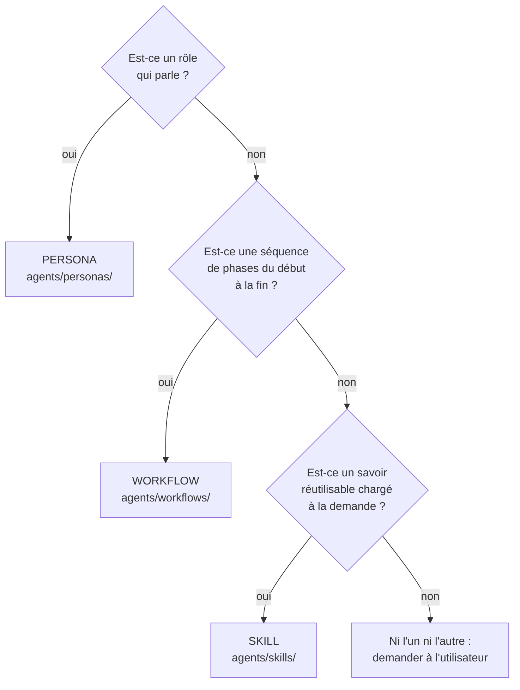
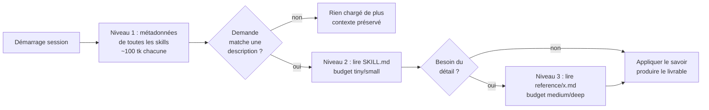

# Architecture — Phase 8 : Skills techniques (modules de connaissance invocables)

> **Usage :** note de **cadrage** qui fige la frontière, le format, la mécanique
> d'invocation et le critère de création des « skills » **avant** toute
> implémentation. Source de vérité pour les sous-phases 8.x. Cette note **ne crée
> AUCUNE skill** — elle cadre. La création de la 1ʳᵉ skill est différée et soumise
> à la règle anti-bloat (cf. §6).

---

## Vue d'ensemble

**Système :** couche de **skills** du framework Agentic Team — des modules
markdown de connaissance/méthodologie qu'un persona peut invoquer dans n'importe
quel workflow, **sans dupliquer** les workflows existants.

**Utilisateurs / consommateurs :** l'orchestrateur (qui décide quand charger une
skill) et les personas (qui appliquent son contenu pendant l'EXECUTE).

**Problème résolu :** aujourd'hui, le savoir technique spécialisé (Helm, Terraform,
5 Pourquoi, format pentest report…) n'a **pas de place dédiée**. Soit il pollue un
persona (qui devient un fourre-tout), soit il force la création d'un workflow
quasi-dupliqué. Les **skills** sont le bon réceptacle : du savoir **transversal**,
chargé **à la demande**, **réutilisable** par tout persona dans tout workflow.

**Promesse VISION servie :** ambition moyen terme — « framework adopté par d'autres
équipes, avec des **skills métier spécifiques** (Helm, K8s, Terraform, AWS,
observabilité) » (VISION.md, section Ambition).

---

## Contraintes de cadrage (filtres VISION — non négociables)

| Filtre | Conséquence directe sur la conception |
|---|---|
| 1 — Pour DevOps/SRE/analyste | Skills = savoir **opérationnel** (IaC, observabilité, RCA), pas académique. |
| 2 — Markdown lisible non-dev | Une skill est un **fichier markdown**, pas du code à exécuter. |
| 3 — VSCode + Copilot natif, rien à installer | **Aucune dépendance, aucun runtime, aucun MCP requis** pour qu'une skill fonctionne (cf. §7). |
| 4 — Pas de dev senior pour configurer | Écrire une skill = remplir un `SKILL.md` en langage naturel. |
| 5 — Anti-drift session longue | Chargement **à la demande** → pas de surcharge de contexte permanente. |
| 6 — Livrables markdown dans `docs/` | Une skill **oriente la production** d'un livrable `docs/` ; elle n'invente aucun artefact. |

---

## 1. Frontière nette : skill vs workflow vs persona

Les trois objets répondent à **trois questions différentes**. C'est la frontière
canonique de la Phase 8 :

| Objet | Répond à… | Nature | Exemple |
|---|---|---|---|
| **Persona** | **QUI** parle ? | Un **rôle** avec un ton, un périmètre, des anti-patterns | 🔒 Security, 🛠️ DevOps |
| **Workflow** | **DANS QUEL ORDRE** ? | Une **séquence** de phases × personas, du début à la fin | `incident-response`, `code-analysis` |
| **Skill** | **AVEC QUEL SAVOIR** ? | Un **module de connaissance/méthode** transversal, invocable ponctuellement | Helm, Terraform, 5 Pourquoi, format pentest report |

**Tests de frontière (binaire) :**

- Si c'est un **rôle qui prend la parole** avec un en-tête `─── emoji Nom ───` →
  **persona** (jamais une skill).
- Si ça **orchestre plusieurs personas en séquence du début à la fin** →
  **workflow** (jamais une skill).
- Si c'est un **savoir réutilisable** qu'**un seul** persona consulte **à un
  moment** d'un workflow, sans imposer d'ordre global → **skill**.



### Test de la frontière sur les 3 cas-tests IDEAS

Ces cas valident la robustesse de la définition. **Trancher ne crée aucune skill**
— c'est un test conceptuel.

| Cas IDEAS | Frontière testée | Verdict | Justification |
|---|---|---|---|
| **Personas → skills ?** (2025-05-02) | persona ↔ skill | **Reste persona.** Pas de promotion. | Un persona répond à « QUI parle ». Le transformer en skill ferait perdre le rôle/ton/handoff qui structure le Party Mode. La *découvrabilité* observée (un agent lit `scribe.md`) est un effet de bord acceptable, pas un besoin de skill. |
| **pentest-remediation** (2026-05-02) | workflow ↔ skill | **= skill.** | C'est une **séquence préfabriquée** des workflows existants (`code-analysis` + `security-review` + `feature-development`…) + un savoir (format CVSS/CWE, priorisation impact×exploitabilité×effort, patterns OWASP). En faire un workflow dupliquerait l'existant. Le savoir s'attache au persona 🔒 Security. |
| **problem-resolution / 5 Pourquoi / Ishikawa** (2026-05-02) | méthode ↔ skill | **= skill méthodologique**, PAS un workflow. | La méthode RCA (5 Pourquoi, Ishikawa) est un **savoir transversal** applicable dans `incident-response` (phase Cause racine) comme hors incident. La faire en workflow créerait un chevauchement explicite (déjà flaggé dans IDEAS). Une skill `root-cause-analysis` invocable dans n'importe quel contexte résout la tension. |

**Conclusion :** la frontière tient sur les 3 cas limites. Aucune ambiguïté
résiduelle. Ces 3 entrées IDEAS peuvent passer au statut « tranchée (cadrage
Phase 8) » — la **création** reste soumise à la règle §6.

---

## 2. Format d'un fichier skill (standard de marché : Agent Skills)

> **Décision (validée utilisateur) :** adopter le **standard de fait du marché IA**
> — les **Agent Skills** d'Anthropic (oct. 2025), repris par Claude Code et
> cohérents avec le bloc `<skills>` natif VS Code Copilot (qui expose déjà
> `name` / `description` / `file`). **Zéro format maison à inventer.**

### Structure : 1 dossier par skill (validé utilisateur)

```
agents/
  skills/
    <skill-slug>/
      SKILL.md            # métadonnées + corps (chargé quand déclenché)
      reference/          # (optionnel) fichiers annexes chargés à la demande
        <topic>.md
```

- **Un dossier par skill**, contenant un `SKILL.md` obligatoire — conforme au
  standard Agent Skills et au choix utilisateur.
- Fichiers annexes optionnels (`reference/*.md`) pour le détail volumineux,
  **référencés à un seul niveau de profondeur** depuis `SKILL.md` (règle Anthropic :
  pas de référence imbriquée, sinon lecture partielle).

### Front-matter YAML (champs obligatoires + versioning)

```yaml
---
name: <skill-slug>          # lowercase, chiffres, tirets uniquement ; ≤ 64 car. ; pas de mot réservé
version: "1.0.0"             # SemVer — obligatoire depuis Phase 9 (audit 2026-05-30)
description: <quoi + quand>  # 3ᵉ personne, ≤ 1024 car. ; c'est CE champ qui déclenche la skill
---
```

**Politique de versioning (SemVer)** :

| Changement | Incrément |
|---|---|
| Correction mineure (typo, lien) | `PATCH` (ex. 1.0.0 → 1.0.1) |
| Ajout de contenu sans rupture (nouvelle section, exemple) | `MINOR` (ex. 1.0.0 → 1.1.0) |
| Refonte ou changement de comportement (suppression de section, renommage) | `MAJOR` (ex. 1.0.0 → 2.0.0) |

- Le champ `version` est **obligatoire** dans toute skill créée ou modifiée.
- Les skills antérieures à Phase 9 démarrent à `"1.0.0"`.
- La version est incrémentée **dans le même commit** que le changement de contenu.

- `name` : minuscules/chiffres/tirets, ≤ 64 car. Forme recommandée : **gérondif ou
  nom d'activité** (`analyzing-stack-traces`, `helm-charts`, `root-cause-analysis`).
- `description` : décrit **ce que la skill fait ET quand l'utiliser**, à la
  **3ᵉ personne** (« Analyse les stack traces Java… À utiliser quand… »). C'est le
  seul texte chargé en permanence → il doit suffire à décider du déclenchement.

### Corps du `SKILL.md`

- **< 500 lignes** (règle de performance Anthropic). Au-delà → scinder en
  `reference/*.md`.
- Sections libres mais **concises** : on n'explique pas ce que le LLM sait déjà
  (« qu'est-ce qu'un PDF »), seulement le savoir **spécifique** (conventions,
  patterns, pièges, format de livrable attendu).
- Pas d'info datée (« avant août 2025… ») → section « patterns hérités » si besoin.
- Chemins en **slash avant** (`reference/guide.md`), jamais d'antislash Windows.

### Pourquoi ce format (et pas la convention front-matter repo habituelle)

Les personas/workflows/templates du repo utilisent un front-matter `type:` maison.
Les skills **dérogent volontairement** pour coller au standard `name`/`description` :
c'est ce couple précis que les moteurs (Copilot, Claude Code) lisent pour la
**découverte automatique**. S'en écarter casserait l'interopérabilité. C'est la
seule entorse, assumée et documentée ici.

---

## 3. Mécanique d'invocation — progressive disclosure ↔ budgets tiny→deep

Le cœur du « ne pas surcharger le contexte ». Le standard Agent Skills définit
**3 niveaux de chargement**, qui **mappent directement** les budgets de contexte
hérités de la Phase 6/7 :

| Niveau Agent Skills | Quand chargé | Coût | Budget Agentic Team |
|---|---|---|---|
| **1 — Métadonnées** (`name`+`description`) | **Toujours** (au démarrage) | ~100 tk / skill | socle permanent |
| **2 — Corps `SKILL.md`** | **Quand la skill est déclenchée** | < 5k tk | `tiny` / `small` |
| **3 — Fichiers annexes** (`reference/*`) | **À la demande**, fichier par fichier | borné au besoin | `medium` / `deep` |



**Règle d'invocation pour l'orchestrateur (à câbler en 8.x) :**

1. L'orchestrateur ne charge le **corps** d'une skill que si la `description`
   matche la demande **et** que le persona courant en a besoin **maintenant**.
2. Budget variable : tâche `tiny` → souvent les métadonnées suffisent ; tâche
   `deep` → corps + fichiers `reference/` pertinents.
3. **Scoping** (même discipline que la mémoire Phase 7) : on ne charge **que** les
   skills pertinentes pour le fil courant, jamais « toutes les skills ». En cas de
   doute sur la pertinence → ne pas charger.

> **Cohérence Phase 7 :** la progressive disclosure des skills est le **pendant
> spatial** (par profondeur de fichier) de la lecture-à-budget-variable de la
> mémoire (par profondeur de rubrique). Même principe, zéro nouveau concept.

---

## 4. Sécurité & provenance — anti-injection (préoccupation utilisateur)

> **Préoccupation utilisateur (2026-05-30) :** « ne pas simplement copier des
> skills en ligne = risque d'infiltration de sécurité ; les hackers utilisent ça
> comme *bait* pour l'injection via des repos GitHub. » **Intuition correcte et
> confirmée par Anthropic** (doc Agent Skills, section *Security considerations*).

Une skill = des **instructions** (et potentiellement du code) qu'un agent **exécute
ou suit**. C'est donc un **vecteur de prompt-injection / exfiltration** de premier
ordre. Règles **non négociables** pour la Phase 8 :

| Règle | Détail |
|---|---|
| **Sources de confiance uniquement** | N'adopter que des skills écrites en interne **ou** auditées ligne par ligne. « Trouvée sur GitHub » ≠ « sûre ». |
| **Audit fichier par fichier avant adoption** | Lire `SKILL.md` **et** chaque annexe : repérer appels réseau inattendus, accès fichiers hors périmètre, instructions qui ne correspondent pas au but annoncé. |
| **S'inspirer de la structure, jamais copier le contenu** | Les repos matures (ex. `anthropics/skills`) servent de **modèle de structure** ; on **réécrit** le savoir nous-mêmes, on n'importe pas de blocs opaques. |
| **Méfiance sur les sources externes** | Une skill qui *fetch* une URL externe est un risque majeur (contenu distant = instructions potentiellement malveillantes, mutables dans le temps). À proscrire dans le socle (cf. §7). |
| **Traiter comme l'installation d'un logiciel** | Même niveau de prudence qu'ajouter une dépendance tierce à un système avec accès à des données sensibles. |

> **Conséquence de design :** dans Agentic Team, une skill du socle est **100 %
> markdown statique, sans appel réseau, sans script exécuté**. Cela neutralise par
> construction la majorité du vecteur d'injection (filtre VISION 3 = allié sécurité).

---

## 5. Articulation avec l'existant (pas de duplication)

| Brique existante | Rôle vis-à-vis des skills |
|---|---|
| **Personas** | Une skill est **invoquée par** un persona, jamais l'inverse. Le persona reste « qui parle ». |
| **Workflows** | Une skill est chargée **à une phase** d'un workflow (ex. RCA à la phase Cause racine d'`incident-response`). Elle n'orchestre rien. |
| **Checklists** | Proches mais distinctes : une checklist = grille de vérification figée (`security-review.md`) ; une skill = savoir + méthode + format de livrable. Une skill *peut référencer* une checklist. |
| **Templates** | Une skill peut imposer un **format de sortie** qui réutilise un template `docs/`. Elle n'invente pas d'artefact. |
| **Party Mode (Panel/Débat)** | Orthogonal : une skill alimente l'angle d'un persona dans un Panel, sans changer la mécanique. |

---

## 6. Liste priorisée + critère de sélection de la 1ʳᵉ skill

### ⛔ Règle de création (binaire, anti-bloat)

> **Ne créer AUCUNE skill par anticipation.** Avant chaque skill, **demander à
> l'utilisateur quel outil il utilise réellement** dans son contexte, et ne créer
> que celles confirmées. Pas de skill « au cas où ».

### Candidates (ROADMAP Phase 8) — classées par valeur × fréquence DevOps/SRE

| Rang | Skill candidate | Catégorie | Pourquoi ce rang |
|---|---|---|---|
| 1 | **Observabilité** (Prometheus / Datadog / Splunk) | Technique | Cœur du quotidien SRE ; déjà des inputs réels dans `docs/_scratch/mvp-inputs/` (datadog, splunk). |
| 2 | **Root-cause-analysis** (5 Pourquoi / Ishikawa) | Méthodologie | Transversale, sert `incident-response` ; ferme le débat workflow-vs-skill (cf. §1). |
| 3 | **Terraform / IaC** | Technique | Production YAML/HCL quotidienne, forte valeur livrable. |
| 4 | **Helm / Kubernetes** | Technique | Cible explicite VISION (ambition moyen terme). |
| 5 | **CI/CD** (GitHub Actions / GitLab CI) | Technique | Production de pipelines, proche du persona DevOps. |
| 6 | **pentest-remediation** | Sécurité | Tranchée « = skill » (§1) ; dépend d'un format de remediation report à définir. |
| 7 | **AWS** (EKS/ECS/IAM) ; **analyse stack traces** Java/Python | Technique | Utiles mais larges → à découper finement quand confirmés. |

### Critère de sélection de la 1ʳᵉ skill (à appliquer, pas à deviner)

La 1ʳᵉ skill créée sera celle qui maximise :

1. **Outil réellement utilisé** par l'utilisateur (réponse explicite requise — règle anti-bloat).
2. **Fréquence d'usage** dans ses workflows DevOps/SRE.
3. **Disponibilité d'un cas concret** dans le repo pour tester (ex. inputs
   `datadog-snapshot.md` / `splunk-extract.md` favorisent **Observabilité**).
4. **Conformité aux 6 filtres** sans introduire de dépendance/install.

> **Recommandation (non décisionnelle) :** sur ces critères, **Observabilité** ou
> **root-cause-analysis** sont les meilleures 1ʳᵉˢ candidates (cas de test déjà
> présents). **Décision différée** : à confirmer avec l'utilisateur en ouverture de
> la sous-phase 8.2, conformément à la règle anti-bloat.

---

## 7. F5 — Connexion native aux outils (MCP/APIs) : limite cadrée

> Entrée IDEAS F5 (2026-05-09) : « Connexion native aux outils (MCP/APIs) ».
> Question : une skill doit-elle cadrer l'usage d'outils externes ?

**Position retenue :** une skill du **socle** ne dépend **jamais** d'un MCP ou d'un
appel API pour fonctionner — sinon elle casse le filtre VISION 3 (« rien à
installer ») et rouvre le vecteur d'injection (§4).

- Le **savoir** d'une skill (patterns, méthodes, formats) est **statique et
  autosuffisant**.
- Si un outil externe (MCP/API) est disponible dans l'environnement de
  l'utilisateur, une skill **peut le mentionner comme option** (avec nom d'outil
  pleinement qualifié, ex. `ServerName:tool_name`), mais **jamais l'exiger**.
- **Conséquence :** MCP/APIs restent **hors socle**, documentés comme *limite* et
  *amélioration optionnelle*, pas comme prérequis. F5 ne déclenche pas de skill
  dédiée en Phase 8.

---

## 8. Décisions de cadrage (synthèse)

| # | Question | Décision |
|---|---|---|
| 1 | Frontière skill/workflow/persona | Persona = QUI · Workflow = ORDRE · Skill = SAVOIR. Testée OK sur 3 cas IDEAS. |
| 2 | Format & emplacement | Standard **Agent Skills** : `agents/skills/<slug>/SKILL.md`, front-matter `name`+`description`, 1 dossier/skill. |
| 3 | Invocation sans surcharge | Progressive disclosure 3 niveaux ↔ budgets tiny→deep ; chargement scopé à la demande. |
| 4 | Sécurité provenance | Sources de confiance only ; audit fichier par fichier ; structure inspirée, contenu réécrit ; socle = markdown statique sans réseau. |
| 5 | 3 cas IDEAS | persona reste persona · pentest-remediation = skill · 5 Pourquoi/Ishikawa = skill méthodo. |
| 6 | Création 1ʳᵉ skill | Différée, règle anti-bloat ; critère = outil réel × fréquence × cas de test × 6 filtres. |
| 7 | F5 MCP/APIs | Hors socle ; mentionnable en option, jamais requis. |
| 8 | Versioning skills | SemVer obligatoire dans front-matter (`version:`) ; PATCH/MINOR/MAJOR selon niveau de changement ; version incrémentée dans le même commit. |

---

## Questions ouvertes (sous-phases 8.x)

- **8.2** : confirmer l'outil réel de la 1ʳᵉ skill avec l'utilisateur, puis la créer.
- Câblage orchestrateur : section « Skills » dans `orchestrator.agent.md` (règle de
  chargement scopé) + éventuelle commande `/skill <nom>` (à trancher — ou
  découverte 100 % auto par `description` ?).
- Format du **remediation report** pour `pentest-remediation` (`docs/security/…` ?
  → nécessitera une ligne dans la table de localisation de `copilot-instructions.md`).
- Politique d'audit pour toute skill d'origine externe (checklist dédiée ?).
